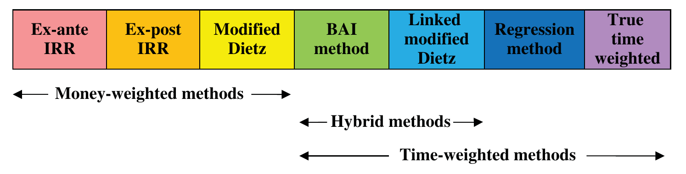

# The Mathematics of Portfolio Return (continued)

## APPROXIMATIONS TO THE TIME-WEIGHTED RETURN {#a}

Asset managers without the capability or willingness to pay the cost of achieving accurate valuations on the date of each cash flow may still wish to use a time-weighted methodology and can use methodologies that approximate to the "true" time-weighted return by estimating portfolio values on the date of cash flow, such as the following methodologies.

### Index substitution {#b}

Assuming an accurate valuation is not available, an index return may be used to estimate the valuation on the date of the cash flow, thus approximating the "true" time-weighted return as demonstrated in Exhibit 3.18.

### Exhibit 3.18 &emsp; Index substitution {#c}

Given an assigned benchmark performance of $-10.68\%$ up to the point of cash flow and using the data from Exhibit 3.11, the estimated valuation at the date of the cash flow is:

$$74.2 \times (1 - 10.68\%) = 66.28$$

Therefore, the approximate time-weighted return is:

$$\frac{66.28}{74.2} \times \frac{104.4}{66.28 + 37.1} - 1 = 0.8932 \times 1.0099 - 1 = -9.79\%$$

In Exhibit 3.18 the index is a good estimate of the portfolio value and therefore the resultant return is a good estimate of the true time-weighted rate of return. However, if the index is a poor estimate of the portfolio value (see Exhibit 3.19), then the resultant return may be inaccurate, although in this case may be a better estimate of underlying return than, say, the modified Dietz or IRR.

### Exhibit 3.19 &emsp; Index substitution (poor estimate) {#d}

Using an index return of $-7.90\%$ to estimate the portfolio value at the point of cash flow:

$$74.2 \times (1 - 7.9\%) = 68.34$$

Therefore, the approximate time-weighted return is:

$$\frac{68.34}{74.2} \times \frac{104.4}{68.34 + 37.1} - 1 = 0.9210 \times 0.9901 - 1 = -8.81\%$$

### Regression method (or $\beta$ method) {#e}

The regression method is an extension of the index substitution method. A theoretically more accurate estimation of portfolio value can be calculated adjusting for the systematic risk (as represented by the portfolio's beta) shown in Exhibit 3.20.

### Exhibit 3.20 &emsp; Regression method {#f}

Assuming a portfolio beta of 1.05 in comparison with the benchmark, the revised estimated valuation at the time of cash flow is:

$$74.2 \times (1 - 10.68\% \times 1.05) = 65.88$$

Therefore, the approximate time-weighted return is:

$$\frac{65.88}{74.2} \times \frac{104.4}{65.88 + 37.1} - 1 = 0.8879 \times 1.3789 - 1 = -9.99\%$$

The index substitution method is only as good as the resultant estimate of portfolio value; making further assumptions about portfolio beta need not improve accuracy.

### Analyst's test {#g}

A more accurate approximation was proposed by a working group of the UK's Society of Investment Analysts. (SIA, "The Measurement of Portfolio Performance for Pension Funds: A Report Prepared by the Working Group Set Up by the Society of Investment Analysts" (1972).) They demonstrated that the ratio of the money-weighted return of the portfolio against the money-weighted return of the notional fund (portfolio market values and cash flows invested in the benchmark) approximates to the ratio of the time-weighted return of the portfolio with the time-weighted return of the notional fund, mathematically:

$$\frac{(1 + MWA)}{(1 + MWN)} = \frac{V_A - (C_T - C_W)}{V_N - (C_T - C_W)} \cong \frac{(1 + TWA)}{(1 + TWN)} \tag{3.28}$$

where:

- $MWA$ = money-weighted return of actual portfolio
- $MWN$ = money-weighted return of notional fund
- $V_A$ = value of portfolio at end of period
- $V_N$ = value of notional fund at end of period
- $C_T$ = total external cash flow in period
- $C_W$ = weighted external cash flow in period
- $TWA$ = time-weighted return of actual portfolio
- $TWN$ = time-weighted return of notional fund

Rearranging Equation 3.28,

$$TWA \cong \frac{(1 + MWA)}{(1 + MWN)} \times (1 + TWN) - 1 \tag{3.29}$$

or

$$TWA \cong \frac{V_A - (C_T - C_W)}{V_N - (C_T - C_W)} \times (1 + TWN) - 1 \tag{3.30}$$

In other words, the time-weighted return of the portfolio can be approximated by the ratio of the money-weighted return of the portfolio divided by the money-weighted return of notional fund and then multiplied by the notional fund time-weighted rate of return. Since all commercial indexes are time-weighted (they don't suffer cash flows and are therefore useful for comparative purposes) we can use an index return for the time-weighted notional fund. The analyst's test method, using standard example data, is shown in Exhibit 3.21.

### Exhibit 3.21 &emsp; Analyst's test {#h}

| Item | Date | Value |
| --- | --- | --- |
| Market start value | 31 December | \$74.2m |
| Market end value | 31 January | \$104.4m |
| External cash flow | 14 January | \$37.1m |
| | | |
| Index return in January | | $-7.92\%$ |
| Index return 31/12 to 14/01 | | $-10.68\%$ |
| Index return 14/01 to 31/01 | | $+3.09\%$ |

Final value of notional fund:

$$V_N = (74.2 \times (1 - 0.1068) + 37.1) \times 1.0309 = 106.57$$

$$C_T = 37.1$$

$$C_W = 37.1 \times \left(\frac{31 - 14}{31}\right) = 20.35$$

$$TWA = \frac{104.4 - (37.1 - 20.35)}{106.57 - (37.1 - 20.35)} \times (1 - 0.0792) - 1$$

$$TWA = \frac{82.86}{85.03} \times 0.9208 - 1 = -10.14\%$$

The advantage of these three approximation methods is that a time-weighted return may be estimated even without sufficient data to calculate an accurate valuation and hence an accurate time-weighted return. The disadvantages are clear: if the index, regression and notional fund assumptions respectively are incorrect or inappropriate the resultant return calculated will also be incorrect. Additionally, the actual portfolio return appears to change if a different index is applied which is counterintuitive (surely the portfolio return ought to be unique) and is very difficult to explain to asset owners.

> **Note**
>
> The index substitution, regression and analyst's test method are all dated and unlikely to be encountered today. They represent approximations to the time-weighted return.

## HYBRID METHODOLOGIES {#i}

In practice, many asset managers use neither true time-weighted nor money-weighted calculations exclusively but rather a hybrid combination of both.

If the standard period of measurement is monthly, it is far easier and quicker to calculate the modified (or even simple) Dietz return for the month and then chain-link the resulting monthly returns. This approach treats each monthly return with equal weight and is therefore a version of time-weighting. All of the methods mentioned previously can be calculated for a specific time period and then chain-linked to create a time-weighted type of return for that time period.

### Linked modified Dietz {#j}

Currently the standard approach for institutional asset managers is to chain-link monthly modified Dietz returns. Often described as a time-weighted methodology, in fact it is a hybrid chain-linked combination of monthly money-weighted returns. Each monthly time period is given equal weight and therefore time-weighted, but within the month the return is money-weighted.

### BAI method (or linked IRR) {#k}

The US Bank Administration Institute (Bank Administration Institute, "Measuring the Investment Performance of Pension Funds for the Purpose of Inter Fund Comparison" (1968).) proposed an alternative hybrid approach, (First proposed by Fisher, "An Algorithm for Finding Exact Rates of Return" (1966).) which essentially links simple internal rates of return rather than linking modified Dietz returns.

Because of the difficulties in calculating internal rates of return this is not a popular method and is virtually unknown outside the US.

For clarification, both the BAI method and the linked modified Dietz methods can be described as a type of time-weighted methodology because each standard period (normally monthly) is given equal weight. True time-weighting requires the calculation of performance between each cash flow.

The index substitution, regression and analyst's test methods are approximations to the true time-weighted rate of return. The simple Dietz, modified Dietz and ICAA methods are approximations of the internal rate of return and are therefore money-weighted. Perhaps the best way to illustrate the relationship of these methodologies is the spectrum shown in Figure 3.1.

