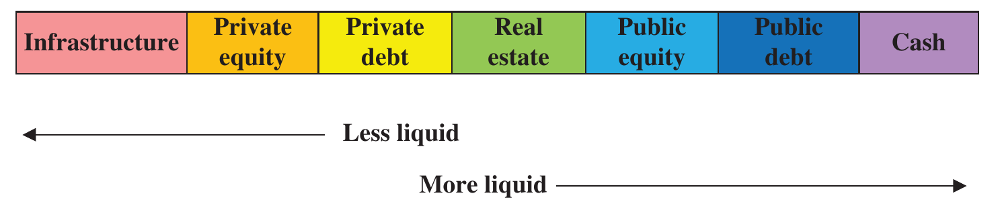

# The Mathematics of Portfolio Return (continued)

## WHICH METHOD TO USE? {#a}

Determining which methodology to use will ultimately depend on the requirements of the asset owner, the degree of accuracy required, the type and liquidity of assets, availability of accurate valuations, operational constraints and capabilities, cost, and convenience factors.

Time-weighted returns neutralise the impact of cash flow. If the purpose of the return calculation is to measure and compare the asset manager's return against those of other managers and commercially published indexes, then time-weighting is the most appropriate. On the other hand, if there is no requirement for comparison and only the return of the asset owner's assets is to be analysed then money-weighting may be more appropriate.

As demonstrated in Exhibit 3.16 a time-weighted return, which does not depend on the amount of money invested, may lead to a positive rate of return over the period in which the asset owner may have lost money. This may be difficult to present to the ultimate asset owner, although in truth the absolute loss of money in this example is due to the asset owner giving the asset manager more money to manage prior to a period of poor performance in the markets. If there had been no cash flows the asset owner would have made money.

Confidence in the accuracy of asset valuation is crucial in determining which method to use. If accurate valuations are available only on a monthly basis, then a linked monthly modified Dietz methodology may well be the most appropriate. The liquidity of assets is also a key determinant of methodology. If securities are illiquid, it may be difficult to establish an accurate valuation at the point of cash flow. For illiquid assets such as private assets any perceived accuracy in the true time-weighted return could be quite spurious.

Internal rates of return are traditionally used for private asset categories for a number of reasons:

1. The initial investment appraisal for non-quoted investments often uses an ex-ante IRR approach.
2. Private assets are difficult to value accurately and are illiquid.
3. Private asset managers often control the timing of cash flow.

It is interesting to note that, like private equity, real estate performance has been traditionally calculated using a money-weighted methodology; however, with increased frequency of property valuations (albeit not independent) real estate has strived to be treated with equivalence to other assets and more recently time-weighted approaches have become more common. In essence there is also a spectrum of liquidity; see Figure 3.2.

It is often said that private equity asset managers use a money-weighted methodology because the asset manager has more control of the timing of cash flows; that may well be true, but I believe the more likely reason historically is that accurate valuations at the time of cash flows are simply not available, and therefore a time-weighted methodology cannot be applied.

**Figure 3.2** Spectrum of liquidity

Money-weighted rates of return are often used for private clients to avoid the difficulty of explaining why a loss could possibly lead to a positive time-weighted rate of return. Perhaps the most significant advantage of money-weighted returns is that if the portfolio generates a profit, the rate of return will be positive (and vice versa) regardless of the pattern of cash flows.

Because the recognised advantage of time-weighted returns is that they neutralise the impacts of cash flows they are clearly favoured when the asset manager does not influence the timing of cash flows. This does not imply that if the asset manager influences the timing of cash flows, then money-weighted returns should be preferred; the resultant return is simply the constant force of return required when applied to the pattern of cash flow that results in the end market value of the portfolio. This return is unique and not really comparable with other portfolios enjoying a different pattern of cash flow or indeed benchmark indexes; there are other ways of measuring the impact of timing, notably attribution analysis.

> **⚠ Caution**
>
> Control over the timing of external cash flow is not a sufficient reason to use a money-weighted return. Return calculation is about comparison, and time-weighted returns are better for comparative analysis than money-weighted rates of return. The management impact of the timing of cash flow can be measured in other ways.

Although it is often suggested that asset owners should use money-weighted returns, I argue that it is not automatically appropriate or desirable because:

1. Comparability is damaged. With benchmarks, other asset owners and asset managers.
2. Profit and loss is an alternative measure.
3. Asset owners are not fully in control of their own cash flow (contributions and benefit payments). In any event, cash flows at the total fund level are unlikely to be large enough to cause a significant difference between money-weighted and time-weighted returns.
4. Attribution and risk analysis are more difficult. Total fund attribution requires the use of a consistent methodology. Risk analysis requires more frequent return calculations.
5. Increased cost and complexity. Asset managers will continue to use time-weighted returns and there will be continual discussion and confusion comparing results using different methodologies.

In effect money-weighted returns are appropriate only when time-weighted returns are not appropriate. Being an asset owner or in control of timing of external cash flows are not sufficient conditions. Time-weighted returns are potentially not appropriate when the assets being measured are largely illiquid (infrastructure, private assets and potentially real estate) because:

1. Accurate valuations are not available at the time of cash flow.
2. Benchmarks are typically not time-weighted for these categories.
3. Asset managers are more likely to control the timing of cash flow (drawdown or return of capital).

To allow more detailed analysis, balanced strategies, including liquid and illiquid assets, are best measured consistently using a time-weighted methodology.

### Late trading and market timing {#b}

Mutual funds suffer a particular performance problem caused by using backdating unit prices, as illustrated in Exhibit 3.22.

### Exhibit 3.22 Late timing {#c}

| | |
| --- | --- |
| Start portfolio value | \$5,000,000 |
| Units in issue | 10,000,000 |
| Start unit price | 0.50 |
| | |
| End portfolio value | \$5,250,000 |
| Units in issue | 10,000,000 |
| End period unit price | 0.525 |

Assume because of administrative error that \$500,000 should have been allocated at the start of the period. The administrator determines the client should not suffer and allocates the \$500,000 for 1,000,000 units at 0.50.

The final price is now

| | |
| --- | --- |
| | \$5,750,000 |
| Units in issue | 11,000,000 |
| Erroneous unit price | 0.5227 |

In effect existing unit holders have been diluted by 0.44%.
Units should only be issued at the current price, 1,000,000 at 0.525 = \$525,000.
The administrator should inject \$25,000 to correct the error.

This is in effect what happened in the "late trading and market timing" scandal in US mutual funds revealed in 2003. (Braceras, "Late Trading and Market Timing" (2004).) Privileged investors were allowed to buy or sell units in international funds at slightly out-of-date prices with the knowledge that overseas markets had risen or fallen significantly already, resulting in small but persistent dilution of performance for existing unit holders.
