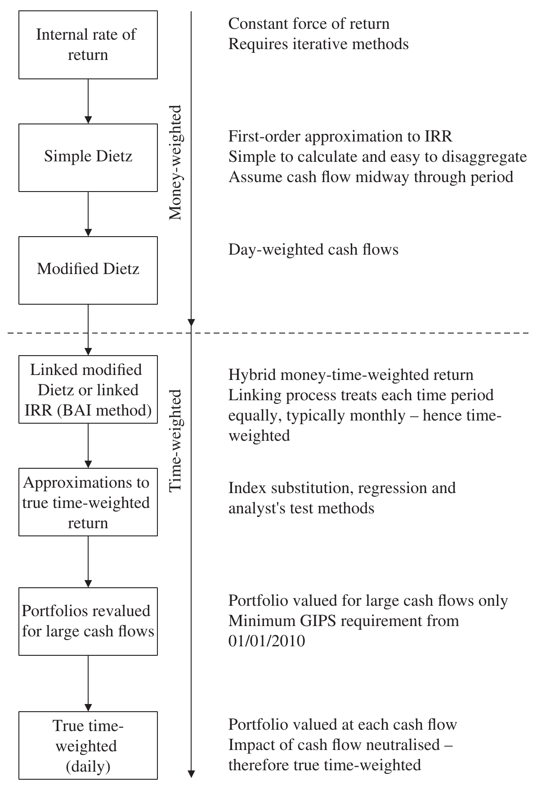

# The Mathematics of Portfolio Return (continued)

## SELF-SELECTION {#a}

With the choice of so many different acceptable calculation methodologies, asset managers should establish an internal policy to avoid both intentional and unintentional abuse. Table 3.2 illustrates the range of different returns calculated for our standard example in just the one period.

The fundamental reason for the difference in all these returns is the assumptions relating to external cash flow. Without cash flow, all these methods – money-weighted, time-weighted and approximations to time-weighted – will give the same rate of return.

The reason for the difference effectively lies in the denominator (or average capital invested) of the return calculation. Each of these methods makes different assumptions about the impact of external cash flow on the denominator: the greater the cash flow the greater the impact.

The differences in the simple Dietz and the modified Dietz returns in Table 3.2 are so significant in this example because the cash flow is large relative to the starting value. If the cash flow is not large, then the assumptions used to weight the cash flow will not have a measurable effect.

**Table 3.2** Return variations due to methodology

| Method | Return |
| --- | --- |
| Simple IRR | −7.41% |
| IRR | −7.27% |
| Simple Dietz | −7.44% |
| ICAA | −7.43% |
| ICAA (income unavailable) | −7.46% |
| Modified Dietz (end of day) | −7.30% |
| Modified Dietz (beginning of day) | −7.21% |
| True time-weighted (end of day) | −9.93% |
| True time-weighted (beginning of day) | −9.44% |
| True-time-weighted (midday cash flow) | −9.63% |
| Index substitution | −9.79% |
| Regression | −9.99% |
| Analyst's test | −10.14% |

### Large Cash Flow {#b}

Because this effect is often not significant it is not always worth revaluing the portfolio for each cash flow. Many institutional asset managers employ a standard modified Dietz method and only revalue for a large external cash flow above a set percentage limit (10% is common). Asset management firms should set a limit and apply it rigorously. This large cash flow limit may be defined to apply to a single cash flow during the period or the total cash flow during the period.

> **Note**
>
> In effect, large cash flows are cash flows large enough to distort the calculation of return.

### Self-selection of methodologies {#c}

If multiple returns are routinely calculated for each methodology and the best return chosen for each period, even poor-performing portfolios could appear to be performing quite well. Clearly it is unethical to calculate returns using multiple methods and then choose the best return.

> **⚠ Caution**
>
> Intentional self-selection of the best methodology is easy to avoid but unintentional abuse can occur. Portfolio managers are well aware that cash flow can impact return calculations and often they have a good feel for the return of their own portfolios. If they have underperformed their expectations by say 0.2%, they may require the performance analyst to investigate the return. The analyst, recognising that a cash flow has occurred (but less than the normal limit), may conclude that the return has been adversely impacted by the cash flow. It would be entirely inappropriate for the performance analyst to adjust the return (even though it is theoretically more accurate) because the portfolio manager is unlikely to require the same analysis if the return is 0.2% above expectations, resulting in only positive adjustments taking place.

Table 3.3 lists the advantages and disadvantages of each return methodology available to the performance measurer together with my personal preference from the asset manager's perspective.

**Table 3.3** Calculation methodologies

| Method | Advantages | Disadvantages | Author's ranking (highest number preferred) |
| --- | --- | --- | --- |
| Simple Dietz | (i) Simple to calculate (ii) Not sensitive to valuation errors (iii) Can be disaggregated (iv) Net gain = positive return (v) Net loss = negative return | (i) Crude estimate for timing of cash flows (ii) Not suitable for comparison against other funds or published indexes | 4 |
| Modified Dietz | (i) Simple to calculate (ii) Not sensitive to valuation errors (iii) Can be disaggregated (iv) Net gain = positive return (v) Net loss = negative return | (i) Not suitable for comparison against other funds or published indexes | 8 |
| ICCA | (i) Simple to calculate (ii) Not sensitive to valuation errors (iii) Can be disaggregated (iv) Net gain = positive return (v) Net loss = negative return | (i) Not suitable for comparison against other funds or published indexes (ii) Potential gearing effect because of treatment of income | 7 |
| Simple IRR | (i) Reflects the value added from the client's perspective (ii) Not sensitive to valuation errors (iii) Net gain = positive return (iv) Net loss = negative return | (i) Crude estimate for timing of cash flows (ii) Cannot be disaggregated (iii) Not suitable for comparison against other funds or published indexes | 3 |
| Internal rate of return | (i) Reflects the value added from the client's perspective. (ii) Not sensitive to valuation errors (iii) Common measure in finance. Frequently used in private equity/ venture capital | (i) Relatively difficult to calculate (ii) Cannot be disaggregated (iii) Not suitable for comparison against other funds or published indexes | 5 |
| BAI | (i) Hybrid time-weighted, money-weighted return (ii) Not sensitive to valuation errors | (i) Relatively difficult to calculate (ii) Cannot be disaggregated | 6 |
| Linked modified Dietz | (i) Hybrid time-weighted, money-weighted return (ii) Easier to calculate than BAI method (iii) Can be disaggregated within single periods (iv) Well established and in common usage | (i) Can be impacted by large cash flows | 9 |
| True time-weighted | (i) Measures the true performance of the portfolio manager adjusting for cash flows (ii) Suitable for comparison with other asset managers and benchmarks | (i) Sensitive to incorrect valuations | 10 |
| Analyst's test | (i) Good estimate of true time-weighted rate of return (ii) Does not require accurate daily valuations | (i) Change in benchmark appears to change portfolio return | 2 |
| Index substitution | (i) Time-weighted methodology (ii) Does not require accurate daily valuations | (i) Approximation only as good as index assumption. Less accurate than analyst's test (ii) Change in benchmark appears to change portfolio return | 1 |
| Regression | (i) Time-weighted methodology (ii) Does not require accurate daily valuations (iii) Use of systematic risk may provide a more accurate valuation approximation than index substitution method | (i) Approximation only as good as index and systematic risk assumption. Low $R^2$ implies volatile systematic risk (ii) Change in benchmark or systematic risk calculation appears to change portfolio return | 0 |

My preferences are consistent with the evolution of performance returns methodologies shown in Figure 3.3.

Different asset categories and different product types have progressed through this evolution of return methodologies at different rates – I would suggest driven by the availability of accurate valuations. Mutual funds evolved to true time-weighted return first because an accurate valuation must be derived to allow investors to enter and exit the mutual fund at a fair price. Pension funds are perhaps one step behind in evolutionary development, seeking time-weighted returns to neutralise the impact of cash flows and allow fair comparison of their managers with each other and benchmarks. In fact, pension funds are still in the process of evolving to the final stage with many institutional asset managers still using linked modified Dietz; they are not able, or are unwilling because of cost, to calculate daily valuations. In fact, the Global Investment Performance Standards (GIPS) (See Chapter 7, Provision 2.A.23.c.) mandate from 2010 a halfway house between linked modified Dietz and true time-weighting, which requires asset managers to value the portfolio for large cash flows only.

Internal rate of return is clearly the starting point, followed by the simple and modified Dietz approximations to the internal rate of return. Private equity because of the difficulty of obtaining accurate valuations is unable to evolve further. Interestingly, real estate has evolved from money-weighted to time-weighted more recently facilitated by more frequent property valuations.

**Figure 3.3** Evolution of performance returns
