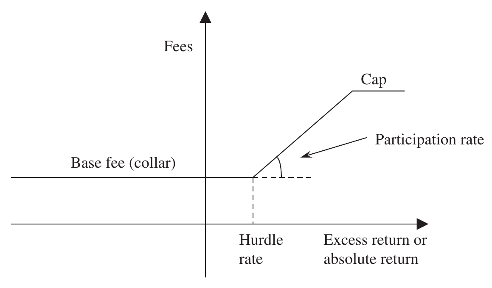
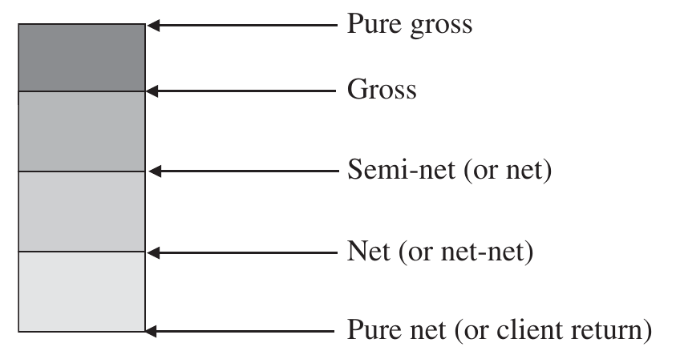

# The Mathematics of Portfolio Return (continued)

## GROSS- AND NET-OF-FEE CALCULATIONS {#a}

A key component in long-term investment performance is the fee charged by the asset manager. Fees are charged in many different ways by several different parties; in evaluating and comparing the performance of a portfolio manager it is essential that the impact of fees be appropriately assessed.

There are three basic types of fees or costs incurred in the management of an investment portfolio:

1. **Transaction fees** – the costs directly related to buying and selling assets including broker's commission, bid/offer spread, and transaction-related regulatory charges and taxes (stamp duty, etc.), but excluding transaction-related custody charges.

2. **Portfolio management fee** – the fees charged by the asset manager for the management of the account.

3. **Custody and other administrative fees** including audit fees, performance measurement fees, legal fees and any other fee.

Asset managers should be evaluated against those factors, which are within their control. Clearly asset managers have a choice whether or not to buy or sell securities; therefore, performance should always be calculated after (or net of) transaction costs. This is naturally reflected in the valuations used in the methods described previously and no more action need be taken.

Portfolio management fees are traditionally taken direct from the account but need not be; the asset manager may invoice the client directly receiving payment from another source. If payments were not taken directly from the portfolio, then any return calculated would be before or "gross" of fees.

The gross-of-fee effect can be replicated, if the fee is deducted from the account by treating the management fee as a negative external cash flow. If the fee is not treated as an external cash flow, then the return calculated is after, or "net", of fees.

The gross return is the investment return achieved by the asset manager and normally the most appropriate return to use for comparison purposes since asset owners are normally able to negotiate fees.

Custody and other administration fees are not normally in the control of the asset manager and hence should not be reflected in the calculation of return for evaluation purposes. It should be noted, however, that the "client return" after administration fees is the real return delivered to the asset owner or client.

Asset managers may bundle all of their services together and charge a "bundled fee". If the bundled fee includes transaction costs that cannot be separated, then the entire fee must be subtracted to obtain the investment return.

In most countries local regulators will require mutual funds to report and advertise their performance net of all fees.

If calculating performance net of fees then to reflect the correct economic value of the portfolio, fees (including performance fees) should be accrued negatively in the valuation.

### Estimating gross- and net-of-fee returns {#b}

The most accurate way to calculate the gross and net series of returns for a portfolio would be to calculate each set of returns separately, treating the fee as an external cash flow for the gross return but making no adjustment for the net return.

Alternatively, if only one series is calculated (either gross or net) the other can be estimated using the fee rate as follows:

(1) "Grossing up" net returns:

$$r_g = (1 + r_n) \times (1 + f) - 1 \tag{3.38}$$

(2) "Netting down" gross returns:

$$r_n = \frac{(1 + r_g)}{(1 + f)} - 1 \tag{3.39}$$

where:

- $r_g$ = return gross of portfolio management fee
- $r_n$ = return net of portfolio management fee
- $f$ = nominal period portfolio management fee rate

The grossing up of return calculation is normally applied to mutual fund returns, which are normally calculated net of all fees (including custody and other administrative fees). The total cost in fees and expenses of a mutual fund is normally expressed as the total expense ratio, or TER. The total net return can be grossed up for custody and administration fees only and/or the portfolio management fees depending on the requirement, taking care that regulatory requirements to advertise net of all expenses (or client return) are met. The netting down of return calculation is normally applied to institutional funds, although it is probably far easier and certainly more accurate to calculate net returns directly.

In Table 3.4 actual and estimated grossed-up returns are shown over a period of six months. Note that the underlying growth in the portfolio has appeared to exaggerate the arithmetic difference between gross and net returns: $35.8\% - 35.0\% = 0.8\%$. The expected fee difference for a 1.2% per annum fee over six months would be 0.6%. In fact, the geometric difference of $\frac{1.358}{1.35} = 0.6\%$ between gross and net returns will provide a better representation of the fees charged. In this example the estimated gross return is a good estimate of the actual gross return. Timing of fee cash flows, payment in advance or in arrears and the frequency of calculation (i.e., monthly or quarterly) will all have minor impacts on the gross return calculation.

**Table 3.4 Gross- and net-of-fees calculations**

*Fee 1.2% per annum calculated monthly in arrears (assume paid at the midpoint of next month)*

| | Market value | Fee | Net-of-fees return | Gross-of-fees return | Estimated gross-of-fees return |
| --- | --- | --- | --- | --- | --- |
| Start value | £100m | £0.1m | | | |
| End of month 1 | £112m | £0.112m | $\frac{112}{100} - 1 = 12.0\%$ | $\frac{112 - 100 + 0.1}{100 - \frac{0.1}{2}} = 12.106\%$ | $1.12 \times 1.001 - 1 = 12.112\%$ |
| End of month 2 | £95m | £0.095m | $\frac{95}{112} - 1 = -15.178\%$ | $\frac{95 - 112 + 0.112}{112 - \frac{0.112}{2}} = -15.086\%$ | $0.8482 \times 1.001 - 1 = -15.094\%$ |
| End of month 3 | £99m | £0.099m | $\frac{99}{95} - 1 = 4.211\%$ | $\frac{99 - 95 + 0.095}{95 - \frac{0.095}{2}} = 4.313\%$ | $1.04211 \times 1.001 - 1 = 4.315\%$ |
| End of month 4 | £107m | £0.107m | $\frac{107}{99} - 1 = 8.081\%$ | $\frac{107 - 99 + 0.099}{99 - \frac{0.099}{2}} = 8.185\%$ | $1.08081 \times 1.001 - 1 = 8.189\%$ |
| End of month 5 | £115m | £0.115m | $\frac{115}{107} - 1 = 7.477\%$ | $\frac{115 - 107 + 0.107}{107 - \frac{0.107}{2}} = 7.580\%$ | $1.07477 \times 1.001 - 1 = 7.584\%$ |
| End of month 6 | £135m | | $\frac{135}{115} - 1 = 17.391\%$ | $\frac{135 - 115 + 0.115}{115 - \frac{0.115}{2}} = 17.500\%$ | $1.17391 \times 1.001 - 1 = 17.509\%$ |
| Six-month return net of fees | $\frac{135}{100} - 1 = 35.0\%$ | | | | |

Actual gross-of-fees return: $1.12106 \times 0.84914 \times 1.04313 \times 1.08185 \times 1.0758 \times 1.175 - 1 = 35.795\%$

Estimated gross-of-fees return: $1.12112 \times 0.84905 \times 1.04315 \times 1.08189 \times 1.07584 \times 1.17508 - 1 = 35.812\%$

### Initial fees {#c}

Initial fees (or front-load fees) are normally associated with investment product wrappers around a portfolio of assets. While initial fees will certainly impact the ultimate client return in terms of making judgements about the portfolio manager's performance, they can normally be ignored for both gross- and net-of-fees calculation. Their impact will vary with the time period measured and, in many cases, initial fees are wholly or partially rebated. Appropriate disclosure should be sufficient.

### Performance fees {#d}

A performance fee is a variable fee based on the performance of the portfolio.

Supporters of performance fees would suggest that they are desirable because they align the interests of the asset manager with that of the asset owner.(Davanzo and Nesbitt, "Performance Fees for Investment Managers" (1987).) If the asset manager performs well, then the owner's assets rise in value and for the most part asset owners appear happy to pay performance fees for good performance. If the asset manager performs poorly, only a smaller base fee and no incentive fee is paid.

Those not in favour claim that rather than aligning interests, performance fees create a conflict of interest, and for the most part performance fees are biased when designed in favour of the asset manager.(Goetzmann, Ingersoll and Ross, "High-water Marks and Hedge Fund Management Contracts" (2003).) Without doubt, performance fees have had a beneficial impact on asset management revenues. In my early career the pressure on fees was always down while later average fees increased across the entire industry responding to incentive fees for alternative strategies. More recently low-fee passive strategies have again exerted downward pressure. Hedge funds demonstrated to the entire industry that asset owners, including institutions like endowments, pension funds and sovereign wealth funds, are prepared to accept high management fees if they are "dressed up" in the form of a performance or incentive fee.

### Asymmetric or symmetric {#e}

Whether or not performance fees are beneficial for asset owners depends on how the performance fees are structured. There are many flavours but essentially there are two main types: asymmetric and symmetric. Asymmetric fees shown in Figure 3.4 are by far the most common and are very seductive to asset owners.

Typically, asset managers will present this type of fee to clients at a base fee rate considerably lower (perhaps less than half) than their normal management fee with an incentive fee for performance greater than an agreed hurdle rate. (The minimum absolute return (risk-free rate or target return, perhaps) or relative return against an agreed benchmark that has to be reached before a performance fee is earned.) This is extremely attractive to asset owners; they pay a lower fee and will only pay higher fees if the asset manager performs well. There is considerable opportunity to negotiate the hurdle rate, angle of the participation rate, time period, excess or absolute return, caps and collars and perhaps a high-water mark, (The highest peak in value. In subsequent periods asset managers must exceed the high-water mark before receiving performance incentives.) but the basic structure is the same.

**Figure 3.4** Asymmetric performance fees

A rare alternative would be a symmetric structure. (In the US, under the Investment Advisers Act (1940) any performance fee charged to a mutual fund can only utilise symmetrical performance fee structures. Consequently, performance fees are rare in US mutual funds; asset managers do not like rebating fees to clients. In the US symmetrical fee structures are often called fulcrum fees.) In this type of structure, the base fee would probably not be lower and may even be higher than the normal management fee. Incentive fees are paid for outperformance, but crucially fees are rebated for underperformance to the extent that the asset manager may ultimately make a net payment to the client if performance is sufficiently bad. Though unpopular with asset managers, these types of fees genuinely align the interest of both parties. (Starks, "Performance Incentive Fees: An Agency Theoretic Approach" (1987).)

Some critics of performance fees make the claim that asymmetric fees encourage asset managers to take more risk if performance is poor because they have little further downside and considerable upside. This is not my personal experience: often when in a hole I've observed that portfolio managers in effect stop digging and take less risk when performing badly. On the flip side I have observed portfolio managers "lock in" outperformance when they have achieved the cap and take much less risk. This obviously reduces the business risk of the asset manager but presumably the asset owner would prefer the asset manager to continue taking risk if they are obtaining good rewards. Risk-adjusted returns such as $M^2$, (See Equation 5.136.) or, even better, adjusted $M^2$, (See Equation 5.142.) would help alleviate this problem. Muralidhar (Muralidhar, "Risk and Skill-adjusted Investment Compensation" (2009).) reviews the available literature on performance fees and in conclusion supports the use of risk-adjusted returns such as $M^2$.

Schliemann and Stanzel (Schliemann and Stanzel, "Performance-based Compensation Contracts in the Asset Management Industry" (2008).) emphasise, among other issues, the option-like character of performance fees. Chevalier and Ellison (Chevalier Ellison, "Risk Taking by Mutual Funds as a Response to Incentives" (1997).) demonstrate that asymmetrical performance fees create call option–like components in the incentives of the asset manager. The price of the call option is implicitly borne by the asset owner, but the asset manager receives the benefits. The higher the risk, the more valuable the call option, thus incentivising the asset manager to take more risk, particularly when close to hurdle rate boundaries.

Sadly, performance fee arrangements often end in acrimony. For long-term agreements the original authors on both sides may have moved on, and, if the agreements were badly written, at the point when both partners should be celebrating good performance, relationships can be damaged by a dispute about the size of fees to be paid. Performance fee agreements should be clear, concise and as simple as possible. I would always recommend including a few worked examples to ensure that both parties fully understand the agreement. There is a tendency to complicate performance fees with high watermarks and variable hurdle rates; frankly, the more complex the agreement the more likely interests will be misaligned. Investor interests are best protected by structuring performance fees over longer time periods, three or even five years.

Endowments, pension funds and sovereign wealth funds typically select a portfolio of asset managers to diversify their selection risk. Asset owners should think through the implications before establishing a performance fee structure for their asset managers. Theoretically the existence of a performance fee should not alter the actual performance enjoyed. A portfolio manager is either skilled or unskilled; those extra hours staying behind in the office will not necessarily add to performance. Sufficient constraints and incentives already exist such that managers are always encouraged to deliver good performance with or without performance fees. The evidence on the impact of performance fees is mixed. In a recent study of Dutch pension funds, Broeders, van Oord and Rijsbergen find no statistical evidence that the returns of pension funds that pay performance fees to asset managers for active investing are significantly higher or lower than the returns of pension funds that do not pay performance fees. (Broeders, van Oord and Rijsbergen, "Does It Pay to Pay Performance Fees? Empirical Evidence from Dutch Pension Funds" (2019).) They found that this is true for most asset classes and is more robust if corrected for risk. To attract new investors, asset managers must demonstrate a superior, consistent track record. The asset manager cannot favour performance fee clients over and above other clients without a performance fee; they have a fiduciary duty to treat all clients equally. Why pay a performance fee for performance you might expect to receive anyway? Obviously, the asset owner chooses the asset manager. Is it then not rather perverse that the asset owner is rewarded by a lower fee (i.e., no performance fee) for choosing an underperforming asset manager and penalised (by paying a performing fee) for choosing an outperforming asset manager? Consider for a moment that the asset owner is an average selector of asset managers; the overperformance of the good-performing asset managers will offset the underperformance of the poor-performing asset managers, leading to average performance overall. However, if the performance fee arrangement is asymmetric the performance fees paid will more than exceed the advantage gained from the lower base fees of the poor-performing asset managers, leading to above-average fees paid for average performance overall! Asset owners should treat performance fees as a necessarily evil, only accepting performance fees to access demonstrably superior asset managers where a simple base fee is not available.

### Crystallisation {#f}

Performance fees by their very nature are variable and paid on an infrequent basis; entitlements can build up over a period of three years or longer. Because base fees are inevitably lower it would be inappropriate not to accrue for any performance fee element earned in a net-of-fee calculation. The performance fee accrual should reflect the performance of the portfolio at that point in time and unlike other accruals can be quite volatile. A reducing performance fee accrual may over shorter time periods give the impression that the performance net of fees is greater than gross of fees performance.

The eventual payment of the performance fee accrual is described as crystallisation. Crystallisation may be smoothed over a rolling three- or longer-year period – one third of the entitlement paid in the first year with subsequent payments deferred based on performance. Some performance fees may only be crystallised when an investor leaves a fund in terms of an exit fee.

### Performance fees in practice {#g}

If used, performance fees should be:

1. **Unambiguous and fair to both parties**

   The performance fee structure should be fair and equitable to both asset owners and asset managers. The performance fee structure should be consistent with the portfolio's objective and should provide reward commensurate with the skill exercised in achieving the performance.

   The agreement should be clear and unambiguous, preferably including a worked example. Calculation methodologies should be agreed, and mechanisms for adjusting for cash flows, changing benchmarks and arbitration processes should be approved at the start of the relationship. The performance fee calculation should be verifiable. A worked example of the performance fee calculation should be included in the performance fee agreement.

2. **Symmetrical**

   Symmetrical fees are more likely to align the interests of the asset owner and asset manager on both the upside and the downside.

3. **Simple**

   The more complex the performance fee structure the more likely the interests of the asset manager and asset owner will be misaligned.

4. **Risk-adjusted**

   The performance fee structure should not influence the risk strategy of the asset manager. Ideally, performance calculations should be risk-adjusted.

Unfortunately, many performance fee structures are unfair and ambiguous, asymmetrical rather than symmetrical, frequently complex and rarely risk-adjusted.

> **Note**
>
> In terms of my own preference, if asked to rank fee arrangements, of any type, from an asset owner's perspective, I would simply prefer a fixed fee: a simple fixed amount, for example, $100,000 per annum. Clearly, asset managers need to cover costs, reward staff as appropriate and deliver a return on capital (mostly human capital). The ideal structure is an annual fee (paid quarterly) over a fixed period, say three or five years (immediately cancellable if the investment mandate is breached), with or without an inflation uplift. Reward, based on good performance, would be renewing the mandate for an extended period at perhaps an increased cost. Admittedly this type of arrangement is rare in the asset management industry. More common is my second preference: an "ad valorem" fee, a fee rate based on the assets under management, for example, 40 basis points per annum. Some would say the asset manager is automatically rewarded with a higher fee for growing the asset base. My third preference is a symmetrical performance fee, for example, a 50-basis-points base fee, with 10% profit participation above, say, 1% outperformance and a 10% performance rebate below 1% underperformance. Least favoured, but common, is an asymmetrical performance fee, for example, a 2% base fee plus 20% profit participation above a 5% hurdle rate.

> **⚠ Caution**
>
> The parameters of a performance fee structure should clearly specify:
>
> 1. The return calculation methodology
> 2. The agreed benchmark (one only)
> 3. Hurdle rate (soft or hard)
> 4. High-water mark
> 5. Resetting arrangements (The periodic resetting of a contractually defined high-water mark. If high-water marks are not reset asset managers may find they are unable to generate performance fees and are thus disincentivised; alternatively, if high-water marks are reset too early asset managers may be rewarded for partially recovered performance below the previous high-water mark.)
> 6. Profit participation rate and rebate rate
> 7. Time period (one, three or five years, for example)
> 8. Fee accrual and payment schedule
> 9. Capital basis for determination of base performance fee (a key area of ambiguity in practice)
> 10. Clawback arrangements
> 11. Arbitration procedures

### Equalisation {#h}

Equalisation is designed to be fair to all investors in a collective mutual or hedge fund who inevitably invest at different times and are therefore subject to different performance returns. An investor who joins in the middle of a good period of performance may be charged a full performance fee even if they only participated for part of that performance; alternatively, an investor may enjoy a free ride if they invest at a low point after a high-water mark and avoid paying a performance fee as the fund recovers to previous highs.

One obvious solution would be to issue a different class of share for investors investing at different times, each with its own performance fee calculation. Clearly several different classes of shares can soon become a heavy administrative burden; alternatively, equalisation can be used. Any performance fee accrued but not yet crystallised will be included in the net asset value price of the fund; any investor buying units at this price in effect buys an equalisation credit equal to the accrual for the performance fee ultimately to be paid at the next crystallisation. The investor should not pay for performance not received. At crystallisation if any performance fee is due an amount is rebated either directly or in the form of additional units up to the amount of the equalisation credit.

If the unit price is below a high-water mark, an equalisation debit (or depreciation deposit) is established equal to the equivalent performance fee entitlement between the current net asset value price and the high-water mark level. If the high-water mark is achieved a performance fee is charged, normally by redeeming units in the fund. Example calculations are shown in Exhibit 3.26.

### Exhibit 3.26 Equalisation {#i}

*Assume a performance fee of 25%*

| | Gross assets | Net assets | Performance fee accrual |
| --- | --- | --- | --- |
| Unit price 31/12/2006 | 100 | 100 | 0 |
| Unit price 31/03/2007 | 90 | 90 | 0 |
| Unit price 30/06/2007 | 120 | 115 | 5 |
| Unit price 30/09/2007 | 140 | 130 | 10 |
| Unit price 31/12/2007 | 130 | 122.5 | 7.5 |

**First investor invests 31/12/2006**

Performance return: $130 - 100 = 30$

Performance fee due: $30 \times 25\% = 7.5$ (distributed from the fund)

**Second investor invests 31/03/2007**

Performance return: $130 - 90 = 40$

Performance fee due: $40 \times 25\% = 10$

Distributed from the fund = 7.5

Depreciation deposit: $(100 - 90) \times 25\% = 2.5$ (paid by redeemed units)

Total distribution: $7.5 + 2.5 = 10$

**Third investor invests 30/06/2007**

Performance return: $130 - 120 = 10$

Performance fee due: $10 \times 25\% = 2.5$

Distributed from the fund = 7.5

Equalisation credit: $20 \times 25\% = 5$ (rebated to client)

Total distribution: $7.5 - 5 = 2.5$

**Fourth investor invests 30/09/2007**

Performance return: $130 - 140 = -10$

Performance fee due: nil

Distributed from the fund = 7.5

Equalisation credit: $40 \times 25\% = 10$ (7.5 rebated to client)

Total distribution: $7.5 - 7.5 = 0$

Equalisation credit retained: $10 - 7.5 = 2.5$

### Reporting hierarchy {#j}

Peterson lists the hierarchy of performance returns with or without fees available for presentation. (Peterson, "Performance Measurement for Alternative Investments" (2015).) This range is shown in Figure 3.5. Pure gross return represents the return before transaction costs and management fees and of course is not a realistic number to present, but it should be noted that commercial indexes are typically calculated and presented pure gross. The gross return represents a more realistic return after transaction costs but before management fees. The semi-net return (sometimes erroneously described as a net return) represents the return after transaction fees and base management fees but before performance fees. The net return (sometimes described as net-net) represents the return after transaction fees, base management fees and performance fees (net-net in the sense of net of both base fees and performance fees). The pure net return (the actual return enjoyed by the client) represents the return after transaction fees, base management fees, performance fees and other administrative fees. Regulation will often demand the presentation of the pure net return, the actual return experienced by the client; although this is clearly appropriate for presenting to retail clients (who have no or little fee negotiating power) it is not necessarily appropriate for analysing the skill of the asset manager. For internal analysis and for institutional asset owners who have some fee-negotiating power, gross return is the most appropriate measure for analysing skill.

**Figure 3.5** Fee reporting hierarchy

If management fees must be taken into account, then the net (or net-net) return is more appropriate than semi-net fees. In most cases base fees will be lower if there is also a performance fee and hence it would be misleading to present returns net of base fees only.
