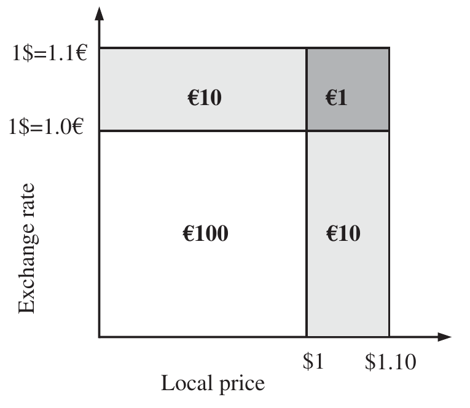
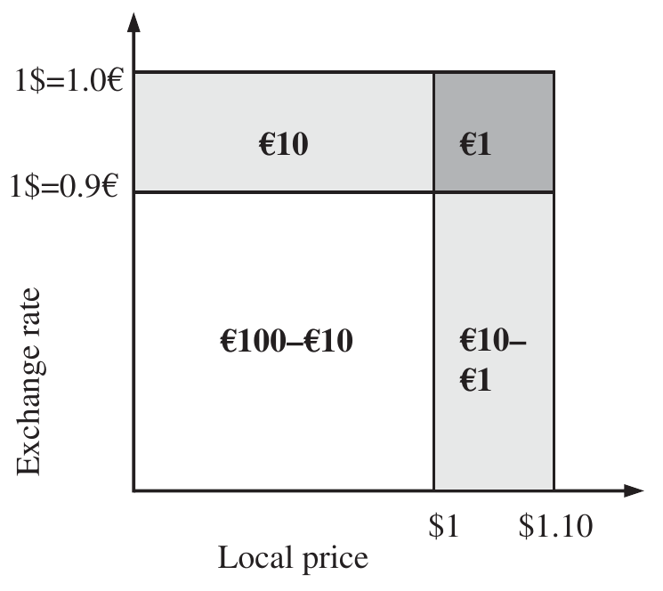
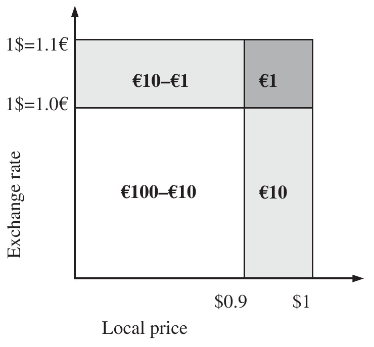
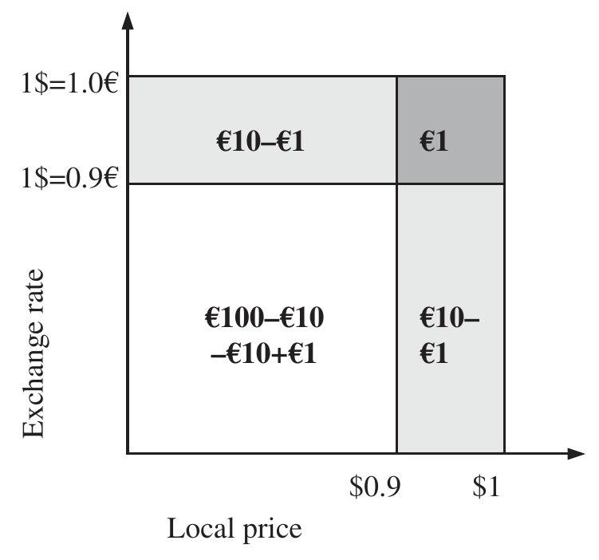

# The Mathematics of Portfolio Return (continued)

## BASE CURRENCY AND LOCAL RETURNS {#a}

A domestic asset is an asset that trades in the asset owner's domestic currency. Foreign assets (overseas or non-domestic assets) are assets denominated in currencies other than the asset owner's domestic currency. The domestic currency or base currency is the currency in which the portfolio is valued and returns reported. The portfolio return excluding currency is normally called the local currency (or local) return.

Clearly, international portfolios will include assets denominated in foreign currencies. The methods of calculation previously described are still appropriate to calculate returns, provided the securities denominated in foreign currencies are converted at appropriate exchange rates.

The impact of currency on a single asset portfolio is shown in Exhibit 3.30.

### Exhibit 3.30 Currency returns {#b}

| | Portfolio value in $ | Exchange rate €/$ | Portfolio value in € |
| --- | --- | --- | --- |
| Start value | $100\* | 1.0 | $100 × 1.0 = €100 |
| End value | $110\# | 1.1 | $110 × 1.1 = €121 |

\* 100 units of stock priced at $1.0
\# 100 units of stock priced at $1.1

Note that the dollar buys 1.1 euros at the end of the period compared to 1.0 euro at the start; the dollar has increased in value.

The return of the portfolios in dollars (or local return) is:

$$\frac{110}{100} = 1.1 \text{ or a return of 10%}$$

The currency return is:

$$\frac{1.1}{1.0} = 1.1 \text{ or a return of 10%}$$

The return of the portfolio in euros is:

$$\frac{110 \times 1.1}{100 \times 1.0} = \frac{121}{100} = 1.21 \text{ or a return of 21%}$$

Note that the portfolio return in Exhibit 3.30 is not the addition of the local return and currency return but the compound of returns:

$$(1 + r_L) \times (1 + r_C) = (1 + r) \tag{3.40}$$

where:

- $r_L$ = return in local currency
- $r_C$ = currency return

$r$ is the return of the portfolio in the base currency, the currency denomination or reference currency of the portfolio. Figure 3.6 illustrates the currency impact on portfolio valuation. The lightly shaded bottom right-hand area of €10 represents the underlying return of the portfolio in dollars or local return. The lightly shaded top left-hand area of €10 represents the currency return. The shaded top right-hand area of €1 represents the combined impact of local market returns with currency return. The initial value of the portfolio is the bottom left-hand area of €100 and the final value is the sum of all four areas, which is €121.

**Figure 3.6** Components of base currency return

The example illustrated in Exhibit 3.30 and Figure 3.6 shows a positive contribution from the combined effect of local market returns with currency return. Exhibits 3.31 and 3.32 and Figures 3.7 and 3.8 illustrate a negative contribution from the combined effect of local market return with currency return.

### Exhibit 3.31 Currency returns (positive local return, negative currency return) {#c}

| | Portfolio value in $ | Exchange rate €/$ | Portfolio value in € |
| --- | --- | --- | --- |
| Start value | $100\* | 1.0 | $100 × 1.0 = €100 |
| End value | $110\# | 0.9 | $110 × 0.9 = €99 |

\* 100 units of stock priced at $1.0
\# 100 units of stock priced at $1.1

Note that the dollar buys 0.9 euros at the end of the period compared to 1.0 euro at the start; the dollar has decreased in value.

The return of the portfolios in dollars (or local return) is:

$$\frac{110}{100} = 1.1 \text{ or a return of 10%}$$

The currency return is:

$$\frac{0.9}{1.0} = 0.9 \text{ or a return of } -10\%$$

The return of the portfolio in euros:

$$\frac{110 \times 0.9}{100 \times 1.0} = \frac{99}{100} = 0.99 \text{ or a return of } -1.0\%$$

The shaded top right-hand area of €1 in Figure 3.7 still represents the combined impact of market return with currency return but, in this instance, it overlaps the bottom right-hand area, thus resulting in a negative contribution of €1. The final value of the portfolio is represented by the bottom left-hand quadrant of €90 (€100 initial value minus the overlapping loss from currency return of €10) plus the bottom right-hand area of €9 (€10 market return minus the overlapping loss from currency of €1). The total value is €99 ($90 × 1.1 = €99).

**Figure 3.7** Components of base currency return (positive local return, negative currency return)

### Exhibit 3.32 Currency returns (negative local return, positive currency return) {#d}

| | Portfolio value in $ | Exchange rate €/$ | Portfolio value in € |
| --- | --- | --- | --- |
| Start value | $100\* | 1.0 | $100 × 1.0 = €100 |
| End value | $90\# | 1.1 | $90 × 1.1 = €99 |

\* 100 units of stock priced at $1.0
\# 100 units of stock priced at $0.9

Note that the dollar buys 1.1 euros at the end of the period compared to 1.0 euro at the start; the dollar has increased in value.

The return of the portfolios in dollars (or local return) is:

$$\frac{90}{100} = 0.9 \text{ or a return of } -10\%$$

The currency return is:

$$\frac{1.1}{1.0} = 1.1 \text{ or a return of } +10\%$$

The return of the portfolio in euros is:

$$\frac{90 \times 1.1}{100 \times 1.0} = \frac{99}{100} = 0.99 \text{ or a return of } -1.0\%$$

The shaded top right-hand area of €1 in Figure 3.8 still represents the combined impact of market return with currency return but, in this instance, it overlaps the top left-hand area, thus resulting in a negative contribution of €1. The final value of the portfolio is represented by the bottom left-hand quadrant of €90 (€100 initial value minus the overlapping loss from portfolio return of €10) plus the top left-hand area of €9 (€10 market return minus the overlapping loss from currency of €1). The total value is €99 ($110 × 0.9 = €99).

Exhibit 3.33 and Figure 3.9 illustrate a positive contribution from the combined effect of a negative local market return with a negative currency return.

**Figure 3.8** Components of base currency return (negative local return, positive currency return)

### Exhibit 3.33 Currency returns (negative local return, negative currency return) {#e}

| | Portfolio value in $ | Exchange rate €/$ | Portfolio value in € |
| --- | --- | --- | --- |
| Start value | $100\* | 1.0 | $100 × 1.0 = €100 |
| End value | $90\# | 0.9 | $90 × 0.9 = €81 |

\* 100 units of stock priced at $1.0
\# 100 units of stock priced at $0.9

Note that the dollar buys 0.9 euros at the end of the period compared to 1.0 euro at the start; the dollar has decreased in value.

The return of the portfolios in dollars is:

$$\frac{90}{100} = 0.9 \text{ or a return of } -10\%$$

The currency return is:

$$\frac{0.9}{1.0} = 0.9 \text{ or a return of } -10\%$$

The return of the portfolio in euros is:

$$\frac{90 \times 0.9}{100 \times 1.0} = \frac{81}{100} = 0.81 \text{ or a return of } -19.0\%$$

The shaded top right-hand area of €1 in Figure 3.9 still represents the combined impact of market return with currency return but, in this instance, it overlaps both the top left-hand area and bottom right-hand area, resulting in a positive contribution since the value can't be lost twice. The final value of the portfolio is represented by the bottom left-hand quadrant of €81 (€100 initial value minus the overlapping loss from portfolio return of €10), minus the overlapping loss from currency return of €10, plus €1 from the double overlapping combination of local return and currency return. The total value is €81 ($90 × 0.9 = €81).

**Figure 3.9** Components of base currency return (negative local return, negative currency return)

> **Note**
> The interaction of local market returns and currency returns is neither currency nor local market return, rather a combination of both.

> **Note**
> The interaction of local market returns and currency returns will be positive if returns are both positive or both negative and will be negative if either local market returns or currency returns is negative and the other is positive.

### Currency conversions {#f}

The base currency returns of the portfolio can be readily converted to any other currency return for presentation purposes as follows:

$$(1 + r) \times (1 + c) - 1 = r_C \tag{3.41}$$

where:

- $c$ = currency return relative to the base currency
- $r_C$ = portfolio return expressed in currency $c$

Local currency returns are calculated ignoring the impact of changes in the currency exchange rate. Although in reality the local currency return of a portfolio consisting of assets in multiple currencies does not exist, it is useful to make an intermediate calculation. The local return of a multi-currency portfolio is defined as the weighted average local return for assets in each currency as follows:

$$r_L = \sum_{j=1}^{j=n} w_i \times r_{Li} \tag{3.42}$$

where:

- $w_i$ = weight of sector $i$
- $r_{Li}$ = local return of sector $i$

The ratio of the base currency return with the local return of the portfolio will calculate the implicit return due to currency in the portfolio.

Local, base currency (or just base) and currency returns for the portfolio data in Table 3.8 are calculated in Exhibits 3.34, 3.35 and 3.36 over a period of six months. Local returns are calculated in Exhibit 3.34.

**Table 3.8 Local, base and currency returns**

| Period | Local market value in £m | $/£ spot rate | Base market value in $m |
| --- | --- | --- | --- |
| Start | 100 | 1.5 | 150 |
| End of month 1 | 100 | 1.6 | 160 |
| End of month 2 | 110 | 1.55 | 170.5 |
| End of month 3 | 115 | 1.4 | 161 |
| End of month 4 | 105 | 1.3 | 136.5 |
| End of month 5 | 95 | 1.4 | 133 |
| End of month 6 | 90 | 1.4 | 126 |

### Exhibit 3.34 Local returns {#g}

Local returns for each month:

$$\text{Month 1 local return: } \frac{100}{100} - 1 = 0\%$$

$$\text{Month 2 local return: } \frac{110}{100} - 1 = 10\%$$

$$\text{Month 3 local return: } \frac{115}{110} - 1 = 4.55\%$$

$$\text{Month 4 local return: } \frac{105}{115} - 1 = -8.7\%$$

$$\text{Month 5 local return: } \frac{95}{105} - 1 = -9.52\%$$

$$\text{Month 6 local return: } \frac{90}{95} - 1 = -5.26\%$$

The total local return over the six-month period is:

$$(1 + 0.0\%) \times (1 + 10.0\%) \times (1 + 4.55\%) \times (1 - 8.7\%) \times (1 - 9.52\%) \times (1 - 5.26\%) - 1 = -10.0\%$$

Alternatively, the local return over the six-month period is:

$$\frac{90}{100} - 1 = -10.0\%$$

### Exhibit 3.35 Currency returns {#h}

Spot currency return for each month:

$$\text{Month 1 currency spot return £ versus \$ } \frac{1.6}{1.5} - 1 = 6.67\%$$

$$\text{Month 2 currency spot return £ versus \$ } \frac{1.55}{1.6} - 1 = -3.13\%$$

$$\text{Month 3 currency spot return £ versus \$ } \frac{1.4}{1.55} - 1 = -9.68\%$$

$$\text{Month 4 currency spot return £ versus \$ } \frac{1.3}{1.4} - 1 = -7.14\%$$

$$\text{Month 5 currency spot return £ versus \$ } \frac{1.4}{1.3} - 1 = 7.69\%$$

$$\text{Month 6 currency spot return £ versus \$ } \frac{1.4}{1.4} - 1 = 0.00\%$$

The total spot currency return over the six-month period is:

$$(1 + 6.67\%) \times (1 - 3.13\%) \times (1 - 9.68\%) \times (1 - 7.14\%) \times (1 + 7.69\%) \times (1 + 0.00\%) - 1 = -6.67\%$$

Alternatively, the currency return over the six-month period is:

$$\frac{1.4}{1.5} - 1 = -6.67\%$$

Spot currency returns, or simply currency returns, are calculated in Exhibit 3.35. Focusing on month 1 the dollar has fallen against the pound; the pound bought more dollars at the end of month 1 than at the start.

> **Note**
> There are always two ways to express currency movements – in the example of Exhibit 3.35, pound against the dollar or dollar against the pound. These are not the opposite of each other; for example, in month 1 of Exhibit 3.35 the dollar depreciated 6.25% but the pound appreciated 6.67% against the dollar, $\frac{1.6}{1.5} - 1 = 6.67\%$.
>
> Currency pairs[^38] are reciprocal or inverse relationships:
>
> $$-6.25\% = 1 - \frac{1}{1 + 6.67\%} = \frac{1.5}{1.6} - 1 = \frac{0.62500}{0.66667} - 1$$

Base currency returns are calculated in Exhibit 3.36. The base currency for the portfolio in Table 3.8 is pounds.

Local, spot currency and base returns for each month and the total period are summarised in Table 3.9.

[^38]: A currency pair is the quotation of two different currencies, with the value of one currency being quoted against the other.

### Exhibit 3.36 Base currency returns {#i}

Base currency return for each month:

$$\text{Month 1 base currency return: } \frac{100 \times 1.6}{100 \times 1.5} - 1 = \frac{160}{150} - 1 = 6.67\% \text{ or } (1 + 0\%) \times (1 + 6.67\%) - 1 = 6.67\%$$

$$\text{Month 2 base currency return: } \frac{110 \times 1.55}{100 \times 1.6} - 1 = \frac{170.5}{160} - 1 = 6.56\% \text{ or } (1 + 10\%) \times (1 - 3.13\%) - 1 = 6.56\%$$

$$\text{Month 3 base currency return: } \frac{115 \times 1.4}{110 \times 1.55} - 1 = \frac{161}{170.5} - 1 = -5.57\% \text{ or } (1 + 4.55\%) \times (1 - 9.68\%) - 1 = -5.57\%$$

$$\text{Month 4 base currency return: } \frac{105 \times 1.3}{115 \times 1.4} - 1 = \frac{136.5}{161} - 1 = -15.22\% \text{ or } (1 - 8.7\%) \times (1 - 7.14\%) - 1 = -15.22\%$$

$$\text{Month 5 base currency return: } \frac{95 \times 1.4}{105 \times 1.3} - 1 = \frac{133}{136.5} - 1 = -2.56\% \text{ or } (1 - 9.52\%) \times (1 + 7.69\%) - 1 = -2.56\%$$

$$\text{Month 6 base currency return: } \frac{90 \times 1.4}{95 \times 1.4} - 1 = \frac{126}{133} - 1 = -5.26\% \text{ or } (1 - 5.26\%) \times (1 + 0.00\%) - 1 = -5.26\%$$

Base currency return for six months:

The total base currency return over the six-month period is:

$$(1 + 6.67\%) \times (1 + 6.56\%) \times (1 - 5.57\%) \times (1 - 15.22\%) \times (1 - 2.56\%) \times (1 - 5.26\%) - 1 = -16.00\%$$

Alternatively, the total base currency return over the six-month period is:

$$(1 - 10.0\%) \times (1 - 6.67\%) - 1 = -16.00\%$$

Or, the total base currency return over the six-month period is:

$$\frac{90 \times 1.4}{100 \times 1.5} - 1 = \frac{126}{150} - 1 = -16.00\%$$

**Table 3.9 Local, currency and base currency portfolio returns**

| Period | Market value in £m | £/$ spot rate | Local return | Currency return £ vs. $ | Base return |
| --- | --- | --- | --- | --- | --- |
| Start | 100 | 1.5 | | | |
| End of month 1 | 100 | 1.6 | 0.00% | 6.67% | 6.67% |
| End of month 2 | 110 | 1.55 | 10.0% | −3.13% | 6.56% |
| End of month 3 | 115 | 1.4 | 4.55% | −9.68% | −5.57% |
| End of month 4 | 105 | 1.3 | −8.70% | −7.14% | −15.22% |
| End of month 5 | 95 | 1.4 | −9.52% | 7.69% | −2.56% |
| End of month 6 | 90 | 1.4 | −5.26% | 0.00% | −5.26% |
| | | | **−10.0%** | **−6.67%** | **−16.00%** |
