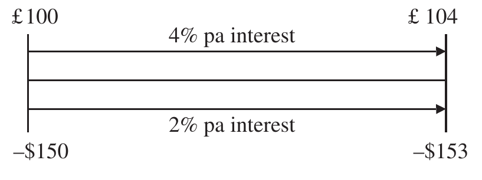
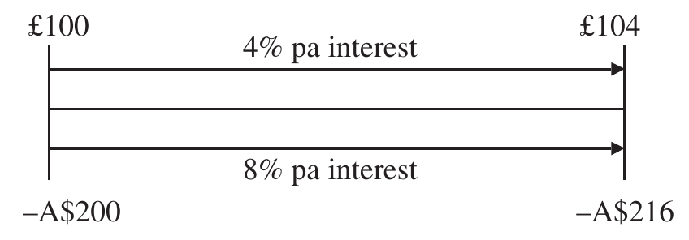
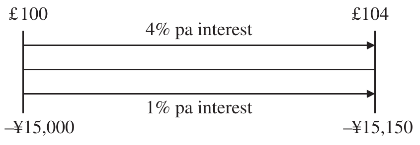

# The Mathematics of Portfolio Return (continued)

## HEDGED RETURNS {#a}

Asset owners may decide that although they are content with the risk of holding the underlying asset, they are not content with the additional uncertainty of foreign currency exposure. Consequently, they may decide to hedge their currency risk. The purpose of currency hedging is to reduce or eliminate currency exposure. Asset owners can hedge their currency risk using forward currency contracts, currency swaps, currency futures contracts and currency options.

Forward currency contracts are relatively simple derivative instruments. They are contracts between two parties for the exchange of an agreed amount of currency at a fixed exchange rate on a fixed date in the future. The two currencies are not actually exchanged until the value date is reached but the rate is agreed on the trade date. The fair rate for a forward currency contract can be established using the spot exchange rate and the interest rates of the two currencies involved as shown in Exhibit 3.37.

### Exhibit 3.37 — Forward currency contracts {#b}

Assume a current spot rate of $/£1.5
Assume an annual rate of interest in £ of 4%
Assume an annual rate of interest in $ of 2%

The one-year forward rate of £ against the $ is:
At today's spot rate £100 would buy $150. Investing £100 at an annualised interest rate of 4% for one year would yield $100 \times (1.04) = 104$. Investing $150 at an annualised rate of 2% for one year would yield $150 \times (1.02) = 153$. The value of £ against the $ in one year's time is therefore:

$$£104 = \$153$$

$$£1 = \frac{153}{104} = \$1.47115$$

The one-year forward rate (the currency exchange rate today for conversion in one year's time) is therefore £/$ 1.47115.

If the forward rate does not reflect interest rates, then an arbitrageur could borrow in one currency, invest in another, and cover the future repayment of the loan without currency risk using a currency forward contract. The potential for this covered interest arbitrage results in a relationship described as "covered interest rate parity", which states that the currency forward rate will be a function of the currency spot rate and the respective interest rates of the two currencies as follows:

$$F_0 = S_0 \times \frac{1 + x_L}{1 + x_B} \qquad (3.43)$$

where:

- $F_0$ = forward exchange rate at time $t = 0$
- $S_0$ = spot exchange rate at time $t = 0$
- $x_L$ = interest rate in local currency at time $t = 0$
- $x_B$ = interest rate in base currency at time $t = 0$

Exhibit 3.38 applies Equation 3.43 to the forward contract data in Exhibit 3.37.

### Exhibit 3.38 — Forward currency exchange rate {#c}

$$F_0 = S_0 \times \frac{1 + x_L}{1 + x_B} = 1.5 \times \frac{1.02}{1.04} = 1.47115$$

The one-year forward rate is £/$ 1.47115.

The spot currency return for period $t$ is:

$$= \frac{S_{t+1}}{S_t} - 1 \qquad (3.44)$$

where: $S_{t+1}$ = spot exchange rate at time $t + 1$

The return on a forward currency contract is not the same as the spot currency return (unless the interest rates of both currencies are the same). The return on the forward currency contract is known as the forward currency return (or simply the forward return or currency surprise).

The currency forward return for period $t$ is:

$$= \frac{S_{t+1}}{F_t} - 1 \qquad (3.45)$$

where: $F_t$ = forward exchange rate at time $t$ for conversion at time $t + 1$

The forward premium or interest rate differential for period $t$ is:

$$= \frac{F_t}{S_t} - 1 \qquad (3.46)$$

Therefore, the spot currency return is the compound of the interest rate differential with the currency forward return:

$$= \frac{S_{t+1}}{S_t} - 1 = \frac{S_{t+1}}{F_t} \times \frac{F_t}{S_t} - 1 \qquad (3.47)$$

Assuming a spot exchange rate of $/£ of 1.6 in one year's time, spot currency returns, forward returns and forward premiums are calculated in Exhibit 3.39 for the forward contract in Exhibit 3.40. From the perspective of the pound as base currency the forward return in this example is greater than the spot currency return because interest rates in the pound are greater than the dollar. Notionally to gain exposure to the pound and hedging dollars, cash must be borrowed in dollars at a lower rate of interest and reinvested in the pound at a greater rate of interest. This is called the benefit of hedging. Traders might recognise this as the carry trade, (The carry trade involves borrowing at a low rate of interest and reinvesting at a high rate of interest.) traditionally borrowing in a low-interest-rate currency such as the Japanese yen or Swiss franc and reinvesting in a high-interest currency such as the Australian or New Zealand dollar.

### Exhibit 3.39 — Spot currency return, forward return and forward premium {#d}

| | |
| --- | --- |
| Spot currency return | $= \dfrac{S_{t+1}}{S_t} - 1 = \dfrac{1.6}{1.5} - 1 = 6.67\%$ |
| Forward currency return | $= \dfrac{S_{t+1}}{F_t} - 1 = \dfrac{1.6}{1.47115} = 8.76\%$ |
| Forward premium | $= \dfrac{F_t}{S_t} - 1 = \dfrac{1.47115}{1.5} - 1 = \dfrac{1.02}{1.04} - 1 = -1.92\%$ |
| Spot currency | $= \dfrac{S_{t+1}}{F_t} \times \dfrac{F_t}{S_t} - 1 = (1 + 8.76\%) \times (1 - 0.192\%) - 1 = 6.67\%$ |

### Exhibit 3.40 — Pound–Australian dollar forward contract {#e}

Assume a current spot rate of £/A$2.0
Assume an annual rate of interest in £ of 4%
Assume an annual rate of interest in A$ of 8%

The one-year forward rate of £ against the A$ is:
At today's spot rate £100 would buy A$200.
Investing £100 at an annualised interest rate of 4% for one year would yield $100 \times (1.04) = 104$.
Investing A$200 at an annualised rate of 8% for one year would yield $200 \times (1.08) = 216$.
The value of £ against the A$ in one year's time is therefore:

$$£104 = A\$216$$

$$£1 = \frac{216}{104} = \$2.077$$

The one-year forward rate (the currency exchange rate today for conversion in one year's time) is therefore £/A$ 2.077.
Or using Equation 3.43:

$$F_0 = S_0 \times \frac{1 + x_L}{1 + x_B} = 2.0 \times \frac{1.08}{1.04} = 2.077$$

Exhibit 3.40 illustrates a forward currency contract in a high-interest-rate currency: Australian dollars.

Assuming a spot exchange rate of £/A$ of 1.8 in one year's time, spot currency returns and forward returns are calculated in Exhibit 3.41 for the forward contract in Exhibit 3.40. From the perspective of the pound as base currency the forward return in this example is worse that the spot currency return because interest rates in the pound are less than the Australian dollar. Notionally to gain exposure to the pound and hedging Australian dollars, cash must be borrowed in Australian dollars at a higher rate of interest and reinvested in the pound at a lower rate of interest. This is called the cost of hedging. From the perspective of the Australian dollar, borrowing at lower interest rates and investing in higher interest rates is a benefit of hedging.

### Exhibit 3.41 — Currency return, forward return – high-interest-rate currency {#f}

**Pound against Australian dollar**

| | |
| --- | --- |
| Spot currency return | $= \dfrac{S_{t+1}}{S_t} - 1 = \dfrac{1.8}{2.0} - 1 = -10.0\%$ |
| Forward currency return | $= \dfrac{S_{t+1}}{F_t} - 1 = \dfrac{1.8}{2.077} = -13.33\%$ |

**Australian dollar against the pound (the reciprocal or inverse relationship)**

| | |
| --- | --- |
| Spot currency return | $= \dfrac{S_t}{S_{t+1}} - 1 = \dfrac{0.55556}{0.5} - 1 = \dfrac{2.0}{1.8} - 1 = 11.11\%$ |
| Forward currency return | $= \dfrac{F_t}{S_{t+1}} - 1 = \dfrac{0.55556}{0.48146} - 1 = \dfrac{2.077}{1.8} = 15.39\%$ |

Exhibit 3.42 illustrates a forward currency contract in a low-interest-rate currency – the Japanese yen.

### Exhibit 3.42 — Pound–Yen forward contract {#g}

Assume a current spot rate of £/¥150
Assume an annual rate of interest in £ of 4%
Assume an annual rate of interest in ¥ of 1%

The one-year forward rate of £ against the ¥ is:
At today's spot rate £100 would buy ¥15,000.
Investing £100 at an annualised interest rate of 4% for one year would yield $100 \times (1.04) = 104$.
Investing ¥15,000 at an annualised rate of 1% for one year would yield $15,000 \times (1.01) = 15,150$.
The value of £ against the ¥ in one year's time is therefore:

$$£104 = ¥15,150$$

$$£1 = \frac{15,150}{104} = ¥145.67$$

The one-year forward rate (the currency exchange rate today for conversion in one year's time) is therefore £/¥ 145.67.
Or using Equation 3.43:

$$F_0 = S_0 \times \frac{1 + x_L}{1 + x_B} = 150 \times \frac{1.01}{1.04} = 145.67$$

Assuming a spot exchange rate of £/¥ of 135 in one year's time, spot currency returns and forward returns are calculated in Exhibit 3.43 for the forward contract in Exhibit 3.42. The forward return in this example is better than the spot currency return because interest rates in the pound are greater than the yen. Notionally to gain exposure to the pound and hedging yen, cash must be borrowed in yen at a lower rate of interest and reinvested in the pound at a higher rate of interest.

### Exhibit 3.43 — Currency return, forward return – low-interest-rate currency {#h}

**Pound against Japanese yen**

| | |
| -- | --- |
| Spot currency return | $= \dfrac{S_{t+1}}{S_t} - 1 = \dfrac{135}{150} - 1 = -10.0\%$ |
| Forward currency return | $= \dfrac{S_{t+1}}{F_t} - 1 = \dfrac{135}{145.67} = -7.32\%$ |

**Japanese yen against the pound (the reciprocal or inverse relationship)**

| | |
| --- | --- |
| Spot currency return | $= \dfrac{S_t}{S_{t+1}} - 1 = \dfrac{150}{135} - 1 = 11.11\%$ |
| Forward currency return | $= \dfrac{F_t}{S_{S+1}} - 1 = \dfrac{145.67}{135} = 7.90\%$ |

### Currency overlay returns {#i}

The local returns in Table 3.9 are unobtainable to a dollar-based investor; the only returns that are obtainable are either the local returns converted to dollars or returns hedged back into dollars. Unless interest rates in both currencies are the same there will be a cost or benefit associated with hedging.

To hedge the pound exposure in Table 3.8 we can use forward currency contracts, in effect shorting the pound and gaining exposure to dollars. We can either trade these forward contracts within the existing portfolio or hire a currency overlay asset manager to trade these forward contracts in a separate currency overlay portfolio. Exhibit 3.44 demonstrates hedged returns using a separate currency overlay portfolio.

Using the same spot currency exchange rates in Table 3.9 and assuming constant interest rates of 4.0% per annum in pounds and 2.0% per annum in dollars throughout the six-month period, one-month forward rates are shown in Table 3.10.

Hedged portfolio returns are summarised in Table 3.11.

### Exhibit 3.44 — Currency overlay {#j}

Hedging pound exposure in month 1 requires the sale of £100 million at a forward rate of 1.49757.
At the end of month 1, the loss in dollars on this contract is:

$$100 \times 1.49757 - 100 \times 1.6 = -10.24$$

This results in a base currency return of $\dfrac{-10.24}{150} = -6.83\%$

Adding the currency overlay return in month 1 to the base currency of the portfolio in Table 3.9 provides the fully hedged return:

$$6.67\% - 6.83\% = -0.16\%$$

Because there is a 0% underlying local market return, $-0.16\%$ represents the cost of hedging pounds into dollars.

Hedging pound exposure in month 2 also requires the sale of £100 million but at a forward rate of 1.59741.
At the end of month 2, the profit in dollars on this contract is:

$$100 \times 1.59741 - 100 \times 1.55 = 4.74$$

This results in a base currency return of $\dfrac{4.74}{160} = 2.96\%$.

Therefore, the hedged return in month 2 is $6.56\% + 2.96\% = 9.53\%$.

Hedging pound exposure in month 3 requires the sale of £110 million at a forward rate of 1.54749.
At the end of month 3, the profit in dollars on this contract is:

$$110 \times 1.54749 - 110 \times 1.4 = 16.22$$

This results in a base currency return of $\dfrac{16.22}{170.5} = 9.52\%$.

Therefore, the hedged return in month 3 is $-5.57\% + 9.52\% = 3.94\%$.

Hedging pound exposure in month 4 requires the sale of £115 million at a forward rate of 1.39774.
At the end of month 4, the profit in dollars on this contract is:

$$115 \times 1.39774 - 115 \times 1.3 = 11.24$$

This results in a base currency return of $\dfrac{11.24}{161} = 6.98\%$.

Therefore, the hedged return in month 4 is $-15.22\% + 6.98\% = -8.24\%$.

Hedging pound exposure in month 5 requires the sale of £105 million at a forward rate of 1.29790.
At the end of month 5, the loss in dollars on this contract is:

$$105 \times 1.29790 - 105 \times 1.4 = -10.72$$

This results in a base currency return of $\dfrac{-10.72}{136.5} = -7.85\%$.

Therefore, the hedged return in month 5 is $-2.56\% - 7.85\% = -10.42\%$.

Hedging pound exposure in month 6 requires the sale of £95 million at a forward rate of 1.39774.
At the end of month 6, the loss in dollars on this contract is:

$$95 \times 1.39774 - 95 \times 1.4 = -0.22$$

This results in a base currency return of $\dfrac{-0.22}{133.0} = -0.16\%$.

Therefore, the hedged return in month 6 is $-5.26\% - 0.16\% = -5.42\%$.
Because there is no change in spot rates, $-0.16\%$ is simply the cost of hedging. Because interest rates have remained constant for both currencies throughout, the cost of hedging is identical for each month.

The total hedged return over the six-month period is:

$$(1 - 0.16\%) \times (1 + 9.53\%) \times (1 + 3.54\%) \times (1 - 8.24\%) \times (1 - 10.42\%) \times (1 - 5.42\%) - 1 = -11.63\%$$

**Table 3.10 — One-month forward rates**

| Period | $/£ spot rate | $/£ one-month forward rate |
| --- | --- | --- |
| Start | 1.5 | 1.49757 |
| End of month 1 | 1.6 | 1.59741 |
| End of month 2 | 1.55 | 1.54749 |
| End of month 3 | 1.4 | 1.39774 |
| End of month 4 | 1.3 | 1.29790 |
| End of month 5 | 1.4 | 1.39744 |
| End of month 6 | 1.4 | 1.39744 |

**Table 3.11 — Hedged portfolio returns**

| Period | Base return | Currency overlay return | Hedged return |
| --- | --- | --- | --- |
| Month 1 | 6.67% | −6.83% | −0.16% |
| Month 2 | 6.65% | 2.96% | 9.53% |
| Month 3 | −5.57% | 9.52% | 3.94% |
| Month 4 | −15.22% | 6.98% | −8.24% |
| Month 5 | −2.56% | −7.85% | −10.24% |
| Month 6 | −5.26% | −0.16% | −5.24% |
| **Six-month** | **−16.00%** | **n/a** | **−11.63%** |

However, currency exposures will change with underlying market movements. Hedges taken out at the start of the measurement period will not capture changing exposures caused by market movements. From the perspective of a currency overlay manager, unless informed differently, they will be unaware of residual currency exposures caused by underlying local market movements. If these residual positions are perfectly hedged, then the only difference between the local return and the hedged return will be due to interest rate differentials between the respective currencies.

The theoretically perfect hedge returns for the portfolio in Table 3.8 are calculated in Exhibit 3.45 and compared to the hedged returns calculated for the currency overlay portfolio in Table 3.12.

### Exhibit 3.45 — Perfectly hedged returns {#k}

| Period | Calculation | Result |
| --- | --- | --- |
| Month 1 | $(1 + 0.0\%) \times (1 - 0.16\%) - 1$ | $-0.16\%$ |
| Month 2 | $(1 + 10.0\%) \times (1 - 0.16\%) - 1$ | $9.82\%$ |
| Month 3 | $(1 + 4.55\%) \times (1 - 0.16\%) - 1$ | $4.38\%$ |
| Month 4 | $(1 - 8.70\%) \times (1 - 0.16\%) - 1$ | $-8.84\%$ |
| Month 5 | $(1 - 9.52\%) \times (1 - 0.16\%) - 1$ | $-9.67\%$ |
| Month 6 | $(1 - 5.26\%) \times (1 - 0.16\%) - 1$ | $-5.42\%$ |

**Table 3.12 — Hedged versus perfectly hedged returns**

| Period | Hedged return | Perfectly hedged return |
| --- | --- | --- |
| Month 1 | −0.16% | −0.16% |
| Month 2 | 9.53% | 9.82% |
| Month 3 | 3.94% | 4.38% |
| Month 4 | −8.24% | −8.84% |
| Month 5 | −10.24% | −9.67% |
| Month 6 | −5.24% | −5.42% |
| **Six-month** | **−11.63%** | **−10.87%** |

The hedged return in month 2 of 9.53% is less than the perfectly hedged return of 9.82% because there is a residual unhedged exposure to the falling pound from the underlying market return. The hedged return in month 4 of −8.24% is greater than the perfectly hedged return of −8.84% because there is less exposure to the falling pound due to a negative underlying local market return.

> **⚠ Caution**
>
> It is virtually impossible to perfectly hedge portfolios; underlying market values are constantly changing. Currency overlay managers are best advised to manage against the currency exposures they are aware of, rather than assumptions of currency exposures based on the impact of market movements. This will cause problems for multi-currency attribution as described in Chapter 6.

> **⚠ Caution**
>
> Illiquid assets with currency exposure also cause problems for currency overlay managers. Illiquid assets are typically revalued at the end of a measurement period; overlay managers are simply unaware of the residual currency exposure prior to updated valuations.
