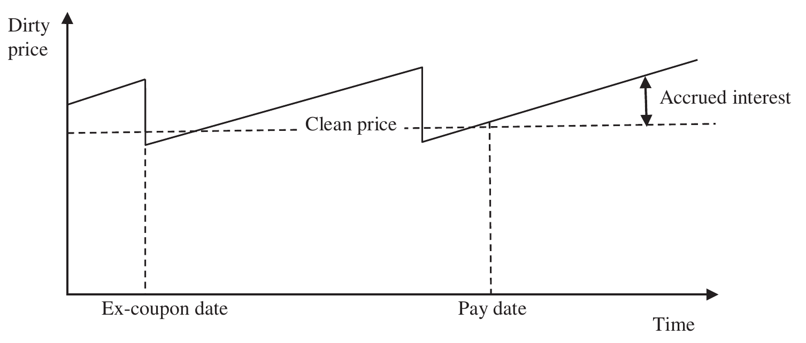

# The Mathematics of Portfolio Return (continued)

## PORTFOLIO COMPONENT RETURNS {#a}

Calculating the performance of the total portfolio is only part of the analytical process. If we are to understand all the sources of return in a portfolio, we must calculate the returns of subsets, or components, of the portfolio (asset classes, categories, regions, countries, sectors, etc.), including individual securities and instruments that contribute to the total return of a portfolio.

The calculation methodologies for component returns are the same as for the total portfolio; however, internal cash flows between components or sectors should be treated as external cash flows within that component. Dividend and coupon payments should be treated as cash flow out of the relevant sector into an appropriate cash sector, if, that is, these sectors are defined separately.

Provided return calculation methodologies are consistent, the sum of component returns should equal the total portfolio return. This is a key requirement for both attribution and contribution analysis. Because internal rates of return assume a constant rate of return for all assets within the portfolio it is not appropriate to use internal rates of return to calculate component returns.

> **Note**
>
> I cannot understate the importance of the total portfolio return being the sum of its parts. This not only facilitates the good analysis of the sources of return, consistent with the investment decision process, but also allows diagnostic processes that improve operational performance.

### Money-weighted component returns {#b}

Both simple and modified Dietz total returns can be broken down or disaggregated into component returns.

Let $r_i$ be the return of the portfolio in the $i$th component, sector or asset category. Then, using modified Dietz:

$$r_i = \frac{{}^iV_E - {}^iV_S - {}^iC}{{}^iV_S + \sum {}^iC_t \times {}^iW_t} \tag{3.48}$$

where:

- ${}^iV_E$ = end value of sector $i$
- ${}^iV_S$ = start value of sector $i$
- ${}^iC$ = total cash flow in sector $i$
- ${}^iC_t$ = cash flow in sector $i$ on day $t$
- ${}^iW_t$ = weighting ratio in sector $i$ on day $t$

Then the total portfolio return

$$r = \sum_{i=1}^{i=n} w_i \times r_i \tag{3.49}$$

where: $w_i$ = weight of the portfolio in the $i$th asset class

$$w_i = \frac{{}^iV_S + \sum {}^iC_t \times {}^iW_t}{V_S + \sum C_t \times W_t} \tag{3.50}$$

Note that $\sum_{i=1}^{i=n} w_i = 1$ since $\sum_{i=1}^{i=n} {}^iV_S = V_S$ and $\sum_{i=1}^{i=n} \sum {}^iC_t \times {}^iW_t = \sum C_t \times W_t$

### Time-weighted component returns {#c}

Time-weighted returns can be disaggregated as well. The weight allocated to transactions within the time-weighted period must be the same as the return methodology associated with the overall portfolio (i.e., beginning of day, middle of day or end of day). Because cash flows will exist between categories within a portfolio it is no longer sufficient to revalue only at the date of an external cash flow. To calculate the time-weighted return for a component or sector, valuations are required for internal cash flows, which in effect require daily valuations.

> **Note**
>
> Equation 3.49 applies equally to time-weighted as well as money-weighted returns. This equation is fundamental to much of the detailed attribution and contribution analysis that follows.

In rare circumstances, due to transaction activity, the effective weight in a sector may total zero but still contribute a gain or loss to the overall portfolio. The most common instance of this is a buy transaction (an inflow) in a sector with no current holding but using the end of day cash flow assumption. In these circumstances it is acceptable to use the size of cash flow as the weight for that sector, ensuring there is an offsetting cash flow in the cash sector.

It is this problem of apparent zero weights for individual sectors and most particularly for individual securities that has led some firms to use a midday weighting assumption, which of course guarantees that the cash flow will be represented in the denominator of the return calculation.

Although both midday weighting and inflow-start of day and outflow-end of day approaches both remove the zero-weighting problem, they are systems-inspired solutions. I prefer end of day as a logical timing for all cash flows; if this method results in a zero weight in an individual category it is appropriate to default to start of day for that sector only with a balancing adjustment in the cash sector. Therefore, the overall return is unaffected by this adjustment and the sum of the parts still equals the total because of the equalising adjustment in the cash sector.

The timing of external cash flow assumptions within the day impacts true time-weighted return calculations as well as money-weighted return calculations. The assumptions asset managers make include:

1. End of day
2. Beginning of day
3. Intra-day weighted
4. Differentiated
5. Actual time
6. Rule-based

### End of day {#d}

The end of day cash flow assumption is perhaps the most common assumption applied by asset managers. Using an end of day cash flow assumption requires that the return for that day is calculated using an end of day valuation excluding the value of the cash flow (see Equation 3.23). The economic rationale for the end of day assumption is clear: asset managers need time to decide how to respond to any cash flow. Assuming that cash flow is only available for investment at the end of the day is reasonable, given the time required to respond.

Of course, the reality is that cash flows have occurred during the day: assets may have been bought or sold and profits made or lost. These profits (or losses) will be applied to a smaller capital employed for inflows and a larger capital employed for outflows. For small cash flows relative to the initial capital employed this will normally have little impact; for larger cash flows on occasion the impact might be more significant.

If there is no initial capital in the sector then for an inflow, an end of day cash flow assumption will generate a zero denominator, resulting in the failure to calculate any contribution to return for that period.

### Beginning of day {#e}

The beginning of day assumption is an obvious alternative to the end of day assumption. Using this assumption, the cash flow is added to the previous period end valuation resulting in profits and losses being applied to a larger capital employed for inflows and a smaller capital employed for outflows (see Equation 3.24). The economic rationale of this assumption presupposes that the asset manager has been alerted to the possibility of a cash flow and is therefore ready to respond. Clearly this method results in a non-zero denominator in an empty sector for cash inflows. But of course, zero, near zero or even negative denominators may result from a cash outflow of the entire holding within the day.

### Intra-day weighted {#f}

The intra-day method is a type of Dietz method calculation within the day. The most common intra-day method, making a midday assumption, is to simply weight the cash flow by 50%, see Equation 3.25. This has the advantage of eliminating most zero denominator issues of beginning and end of day methods. The main disadvantage is that the capital employed, within the day, is arbitrarily 50% of the cash flow, not 100%, a real compromise. More extreme versions of this method may choose to weight by the hour; for example, given an 8:30 a.m. to 4:30 p.m. working day, a 10:30 a.m. cash flow may be given a 75% weight of capital employed.

### Differentiated {#g}

The differentiated method applies a different approach to each cash flow depending on whether they are inflows or outflows.

Either:

1. Beginning of day for a cash inflow and end of day for a cash outflow
or
2. End of day for a cash inflow and beginning of day for a cash outflow

The first of these differentiated methods has the advantage of eliminating zero denominators for both inflows and outflows at the expense of a structurally higher capital employed. Higher capital employed naturally results from assuming that all inflows occur at the beginning of the day and all outflows occur at the end of the day. If we are to assume, certainly over the long term, that investment returns are positive, then higher capital employed will tend to dilute these positive returns – no asset manager would wish to employ a method that structurally dilutes positive returns.

> **Note**
>
> Although both the intra-day-weighted and differentiated approaches both remove the zero-weighting problem, they are systems-inspired solutions. I prefer end of day as a logical timing for all cash flows; if this method results in a zero weight in an individual category it is appropriate to default to start of day for that sector only with a balancing adjustment in the cash sector. Therefore, the overall return is unaffected by this adjustment and the sum of the parts still equals the total because of the equalising adjustment in the cash sector.

The impact of the first differentiated method on the overall return for our standard example is shown in Exhibit 3.46. Unsurprisingly given that the net external cash flow is predominately inflow, the resultant return of −9.42% is close to the start of day assumption return of −9.44%.

### Exhibit 3.46 Time-weighted (inflow start of day, outflow end of day) {#h}

| | | |
| --- | --- | --- |
| **Inflow start of day, outflow end of day** | | |
| Market start value | 31 December | $74.2m |
| Market end value | 31 January | $104.4m |
| External inflow | 14 January | $39.5m |
| External outflow | 14 January | $2.4m |
| Net external cash flow | | $37.1m |
| Market value start of | 14 January | $67.0m (before inflow) |
| Market value end of | 14 January | $103.1m (after outflow) |

$$\frac{67.0}{74.2} \times \frac{103.1 + 2.4}{67.0 + 39.5} \times \frac{104.4}{103.1} - 1 = 0.9030 \times 0.9906 \times 1.0126 - 1 = -9.42\%$$

The second differentiated method suffers the disadvantage of potential zero denominators for both inflows and outflows but employs a lower capital base, thus potentially leveraging returns.

The impact of the second differentiated method on the overall return for our standard example is shown in Exhibit 3.47. This differentiated approach leverages the loss within the day of the cash flow on a smaller capital base, resulting in a more negative return over the entire period.

### Exhibit 3.47 Time-weighted (inflow end of day, outflow start of day) {#i}

| | | |
| --- | --- | --- |
| **Inflow start of day, outflow end of day** | | |
| Market start value | 31 December | $74.2m |
| Market end value | 31 January | $104.4m |
| External inflow | 14 January | $39.5m |
| External outflow | 14 January | $2.4m |
| Net external cash flow | | $37.1m |
| Market value start of | 14 January | $67.0m (before inflow) |
| Market value end of | 14 January | $103.1m (after outflow) |

$$\frac{67.0}{74.2} \times \frac{103.1 - 39.5}{67.0 - 2.4} \times \frac{104.4}{103.1} - 1 = 0.9030 \times 0.9845 \times 1.0126 - 1 = -9.98\%$$

Exhibits 3.46 and 3.47 add two further return variations due to methodology to Table 3.2, all based on the same sample data. The differences in all these methodologies are caused by assumptions addressing the timing of cash flows resulting in differing effective capital employed.

> **Note**
>
> The very wide range of return methodologies offers significant opportunities for self-selection. Ex-post it is often quite easy to construct a rationale for a particular methodology in a particular circumstance. This should be avoided; consistency and transparency are key – methodologies are only changed ex-post if there is a return advantage!

### Actual time {#j}

The actual time method is the most accurate but least practical method. It requires an accurate valuation at the specific time of each cash flow. If there are multiple cash flows in the day at different times, then the portfolio must be valued at each time and returns between each cash flow chain-linked – a pure, true time-weighted return if you like. The difficulties of achieving accurate valuations at any time and the cost effectively eliminate this method as a practical alternative.

### Rule-based {#k}

The rule-based method is not a method in its own right but an ex-ante rule that allows switching between certain methodologies in certain circumstances.

### Extremely large cash flows {#l}

Extremely large cash flows are cash flows extreme enough to dominate the return calculation for that period. Extremely large cash flows are policy determined but are typically greater than 100% of initial capital. Note that if there is no initial capital than any cash flow is extreme. For example, an asset manager with an end of day standard assumption might require a beginning of day assumption if the cash flow qualifies as an extreme cash flow. This clearly works on the first day of a portfolio's history but is most likely to be applied on sub-sectors or individual securities within the portfolio.

### Which timing assumption to use for time-weighted returns? {#m}

Exhibit 3.48 demonstrates, with a simple example, the difference in return for each of the timing assumptions typically used in true time-weighted returns. In this example we have a small portfolio of $100 with a cash inflow of $10 on day 1. The value at the time of this cash inflow is $100.50. The value of the portfolio at the end of day 1 including the cash inflow is $111, a profit of $1 during day 1. On day 2 there is a cash outflow of $10. The value of the portfolio at the time of this outflow is $111.50. The value of the portfolio at the end of day 2 excluding the cash outflow is $102, a profit of $1 during day 2.

### Exhibit 3.48 Timing of cash flow – true time-weighted {#n}

| | Day 1 | Day 2 |
| --- | --- | --- |
| Beginning market value | $100 | $111 |
| Cash flow | +$10 | −$10 |
| Actual value | $100.50 | $111.50 |
| End market value | $111 | $102 |
| **End of day** | $\frac{101}{100} \times \frac{112}{111} - 1 = 1.91\%$ | |
| **Beginning of day** | $\frac{111}{110} \times \frac{102}{101} - 1 = 1.908\%$ | |
| **Intra-day** | $\left(1 + \frac{111 - 100 - 10}{100 + 10/2}\right) \times \left(1 + \frac{102 - 111 + 10}{111 - 10/2}\right) = 1.905\%$ | |
| **Differentiated** | Inflow (beginning of day), outflow (end of day): $\frac{111}{110} \times \frac{112}{111} - 1 = 1.818\%$ | |
| | Inflow (end of day), outflow (beginning of day): $\frac{101}{100} \times \frac{102}{101} - 1 = 2.0\%$ | |
| **Actual** | $\frac{100.5}{100} \times \frac{111.5}{110.5} \times \frac{102}{101.5} - 1 = 1.909\%$ | |

The end of day method assumes the cash inflow is not available to the asset manager until the end of day so to calculate the return on day 1 the cash inflow is excluded from the end of day valuation, $101. The start value is $100: a profit of $1 ($101 – $100) on a capital base of $100 generates a day 1 return of 1.0%. To calculate the return on day 2 we must assume the cash outflow has not yet occurred; therefore, we have a profit of $1 ($112 – $111) applied to a capital base of $111 = 0.901%.

Compounding day 1 with day 2 we get a return of 1.91%.

The beginning of day method assumes the cash inflow is available to the asset manager from the beginning of the day so the capital base on day 1 is $110. The $1 profit on day 1 ($111 – $100) generates a return of 0.909% rather than the 1.0% from the end of day method – a significant return difference caused by the capital available assumption. In this example much of this return difference is recovered on day 2 because the capital base assumption is now $101, resulting from assuming the cash outflow occurred at the beginning of day. The day 2 return is 0.990%. Compounding day 1 with day 2 we get a return of 1.908%, admittedly only 0.2 of a basis point different, but different nevertheless.

The midday, intra-day assumption results in a capital base on day 1 of $105 and hence a return of 0.952%, and a capital base on day 2 of $106 and hence a return of 0.943%. Compounding day 1 with day 2 we get 1.905%, 0.3 of a basis point less than the beginning of day method and 0.5 of a basis point less than the end of day method.

The differentiated method produces the most interesting return difference. Assuming beginning of day for a cash inflow and end of day for a cash outflow results in a higher capital base for both days. Day 1 is a cash inflow hence a return of 0.909%, day 2 is a cash outflow hence a return of 0.901%. Compounding day 1 with day 2 we get a two-day return of 1.818% – an astonishing nine-basis-point-plus difference from the end of day methodology.

The second differentiated method assumes beginning of day for a cash outflow and end of day for a cash inflow, resulting in a lower capital base for both days. Day 1 is a cash inflow hence a return of 1.0%, day 2 is a cash outflow hence a return of 0.990%. Compounding day 1 with day 2 we get a two day return of 2.0%. Again an astonishing difference from the end of day methodology, this time in the other direction.

The most accurate, and least practical, method is to value the portfolio accurately at the time of each cash flow. In this example we have two cash flows and hence three sub-period returns. The return immediately before the cash flow on day 1 is 0.5%, the return between cash flows is 0.905% and the return after the second cash flow is 0.493%. Compounding the three sub-period returns results in a two-day return of 1.909%.

This of course is a contrived example with symmetrical profits and symmetrical, offsetting cash flows. As a result, the actual return falls midway between the end of day and beginning of day methodologies; this is atypical. Different return and cash flow profiles will generate different impacts. The main takeaway from this example, however, is that the differentiated method diverges the most from the actual return.

My timing methodology preferences are listed in Table 3.13.

**Table 3.13** Time-weighted timing assumption methodologies

| Method | Advantages | Disadvantages | Author's ranking (highest number preferred) |
| --- | --- | --- | --- |
| End of day | (i) Most common (ii) Simple to understand (iii) Good economic rationale | (i) Potential zero denominator for inflows | 6 |
| Beginning of day | (i) Simple to calculate (ii) Avoids potential zero denominator for inflows | (i) Potential zero, near zero or negative denominator for outflows (ii) Assumes advance notice of cash flows | 4 |
| Intra-day weighting | (i) Simple to calculate (ii) Avoids zero, near zero and negative denominators in most circumstances | (i) Weak economic rationale | 3 |
| Differentiated inflow (beginning of day) Outflow (end of day) | (i) Avoids zero, near zero and negative denominators for inflows and outflows | (i) Structural higher capital base, potentially diluting returns (ii) Less economic rationale – more systems driven | 2 |
| Differentiated inflow (end of day) Outflow (beginning of day) | (i) Structural lower capital base potentially leveraging returns. Might be described as unethical | (i) Potential zero, near zero or negative denominator for outflows (ii) Potential zero denominator for inflows | 1 |
| Actual time | (i) Technically the most accurate | (i) Not practicable | 5 |
| Rule-based | (i) Can combine preferred method in specific circumstances based on ex-ante rules | (i) Complex | 7 |

### Carve-outs {#o}

Sub-sector returns of larger portfolios are often calculated and presented separately by asset managers to demonstrate competence in managing assets of that type, particularly if the manager does not manage that type of asset in stand-alone portfolios. These sub-sector returns are often called "carve-outs".

### Sub-portfolios {#p}

Carve-outs with their own dedicated cash and managed just like a stand-alone portfolio are called sub-portfolios. Carve-outs and sub-portfolios are discussed in more detail in Chapter 7.

### Cash sectors {#q}

Cash and cash equivalents in a portfolio should be measured using the same methodology as any other asset within the portfolio. Because the cash sector naturally suffers large and frequent cash flows, the calculation assumptions with regard to cash flow may result in a return which on face value is most unlike a cash return. Crucially, the combination of average weight and return will replicate the contribution of the cash component to total return.

### Individual security returns {#r}

Accounting policies, valuation procedures and return methodologies flow directly to individual securities. To ensure that the total portfolio return is the sum of its parts it is essential that policies, procedures and methodologies are consistent throughout all levels of analysis. Total return, of course, includes income. For equities, income is in the form of discretionary payments known as dividends; for bonds, income (interest or coupon payments) is a contractual obligation, the timing and amount of which are normally known in advance.

When an equity dividend is announced, a date is set – the ex-dividend date – from which point any purchaser of that equity is not entitled to that dividend. The dividend is actually paid on the pay date, which may be several weeks later. The price of the equity before the ex-dividend date will implicitly include the value of the dividend entitlement and exclude its value after the ex-dividend date. Thus, there is a period after the ex-dividend date but before the pay date in which the price of the equity does not reflect the economic value of the dividend yet to be paid. Policies will vary between asset management firms, but if the correct return is to be included in the appropriate period, then outstanding dividend payments should be accrued after the ex-dividend date.

> **Note**
>
> To facilitate the correct comparison of return and to avoid unnecessary volatility I strongly recommend that equity dividends are accrued.

Accruals are then reversed when the cash dividend is paid. Reclaimable withholding taxes are sometimes deducted from dividend payments. If these withholding taxes are recoverable, they should also be accrued – although it may take many years before tax is eventually recovered. Asset owners, at some point, may choose to write off accrued taxes they believe are not recoverable, although of course the reversal of an accrual without a corresponding cash payment will generate a negative return impact.

In terms of return methodology, a dividend payment is an external cash flow for an individual security and should be calculated as such. Whether a dividend is treated as an external cash flow for an investment category depends on whether the resulting cash is retained for investment by the category portfolio manager or transferred to a separate pot. Return calculations for a security with a dividend payment are shown in Exhibit 3.49.

### Exhibit 3.49 Individual equity returns {#s}

Company A announced a dividend of $2.50 per share on 6 July 2022 with an ex-dividend date of 13 July and a pay date of 27 July.

Closing prices for the month of July for company A are as follows:

| Date | Price |
| --- | --- |
| 30 June | $100 |
| 6 July | $101 |
| 13 July | $99 |
| 27 July | $98 |
| 29 July | $99.50 |

29 July is the last business day of the month.

The money-weighted return for the month of July using modified Dietz, Equation 3.22, is:

$$r = \frac{V_E - V_S - C}{V_S + \sum C_t \times W_t} = \frac{99.5 - 100 + 2.5}{100 - 2.5 \times \frac{31 - 27}{31}} = \frac{2}{99.68} = 2.01\%$$

Using an end of day timing assumption there are only four calendar days left in the month after the 27 July pay date.

The time-weighted return for the month of July, using Equation 3.23, is:

**30 June to 6 July**

$$\frac{101 - 100}{100} = 1.0\%$$

**6 July to 13 July**

$$\frac{99 + 2.5 - 101}{101} = 0.495\%$$

Note that the dividend entitlement of $2.50 has been included in the end value of the return calculation for the security.

**13 July to 27 July**

$$\frac{98 - (99 + 2.5) + 2.5}{99 + 2.5} = -0.99\%$$

Note that the accrual of $2.50 has been reversed but $2.50 of income has also been received. Note also that the accrual is included in the start of period value.

**27 July to 29 July**

$$\frac{99.5 - 98}{98} = 1.53\%$$

Note that the start value excludes the dividend payment which in effect was a negative cash flow at the end of 27 July.

Time-weighted return for July is therefore:

$$\frac{101}{100} \times \frac{101.5}{101} \times \frac{100.5}{101.5} \times \frac{99.5}{98} - 1 = 2.04\%$$

> **Note**
>
> Separation of income and capital matter in terms of tax and liquidity, but from a performance analysis perspective total return is key. Historically, there may have been some demand for separate income and capital returns, but these calculations are rarely required today. Multi-period capital and income returns will require an underlying assumption on the future reinvestment of capital and income.

**Figure 3.10** Clean price, accrued interest, dirty price and pay dates

Bonds are different: income payments are contractual. Interest payments are accrued constantly as a fraction of the days between interest or coupon payments, as shown in Figure 3.10. The price paid by an asset owner to buy a bond, or received to sell a bond, will include accrued interest. That said, accrued interest is not typically included in the quoted price. Prices excluding accrued interest are known as clean prices, and those including accrued interest, dirty prices. Practice varies between markets, but bonds also have ex-dates (ex-coupon dates), although the time between the ex-coupon date and the payment date is typically short. Interest will continue to be accrued after the ex-coupon date but before the pay date, leading to a subtraction of accrued interest in the valuation after ex-coupon dates in some markets.

### Multi-period component returns {#t}

Portfolio managers will make asset allocation decisions in different portfolio components over time. The timing of these decisions will impact the overall return of the portfolio. It is entirely possible that the overall portfolio return is less or more than all of the component returns (see Exhibit 3.50).

### Exhibit 3.50 Multi-period component returns {#u}

| Period | Equity weight | Fixed income weight | Equity return | Fixed income return | Total return |
| --- | --- | --- | --- | --- | --- |
| Q1 | 20% | 80% | 10.4% | 2.3% | **3.9%** |
| Q2 | 60% | 40% | 3.5% | 1.3% | **2.6%** |
| Q3 | 90% | 10% | −15.7% | 1.4% | **−14.0%** |
| Q4 | 30% | 70% | 12.7% | 8.7% | **9.9%** |
| **Year** | **50%** | **50%** | **8.6%** | **14.2%** | **0.8%** |

In Exhibit 3.50 both the equity and fixed income returns exceed the total return for the full year by a considerable margin. The total return is so low because of the high weight in equities in the third quarter. The timing of asset allocation decisions can make a significant difference.

### Abnormal returns {#v}

Bacon, Thompson and van der Westhuizen (2016) define an abnormal return as a return that appears to misrepresent the true economic performance of the asset being measured.

### Short positions {#w}

All the return formulae previously described, time-weighted and money-weighted, are equally useable if market values are negative; in other words, if the return denominator is negative ($V_S < 0$ or $V_S + C < 0$ or $V_S + \sum C_t \times W_t < 0$). For individual security level, as Menchero, Laker, and Bacon, Thompson and van der Westhuizen have pointed out, the return has the desirable property of being independent of whether the security is held long or short. So, for example, if the price changes from $100 to $110 over the period, the return of the stock is simply +10% regardless of whether it is held long or short. This is a fundamental and crucial observation: the return of the asset is independent of the holding; the return experience of that asset is the same for all. Arbitrarily changing the sign of the return for presentational convenience, as well as being incorrect, will also lead to many potential calculation issues. However, the contribution, portfolio gains and losses will depend on the holding quantity and of course whether the holding is long or short.

Negative market values are caused by short positions (selling securities you do not own), but also derivative instruments and through time leverage. Derivative instruments might be relatively straightforward instruments, such as futures or contracts for difference, which create symmetric positive and negative economic exposures that offset. Gains and losses in these simple derivative instruments manifest as real cash in the margin account. More complex derivative instruments such as swaps and forwards in which the notional exposures are not symmetric might result in unrealised gains or losses during the lifetime of the instrument. As single-line instruments, swaps and forwards have the undesirable property of changing signs positive to negative and negative to positive as one leg of the contract changes value relative to the other. This may cause a discontinuity in the return series, which in isolation suggests that returns cannot be linked. Leverage (in which the total value of positive assets is greater than the total portfolio value) can also cause negative total portfolio values through time. If the portfolio of assets also includes liabilities (in effect negative assets) then the value of positive assets can fall to a value smaller than the liabilities and create, just like a single-line swap, a portfolio that changes from positive to negative value.

But what if the total portfolio value is negative and this portfolio value itself becomes more negative? Take a portfolio with a start value of −£1,000 and an end value −£1,100; the return is calculated in Exhibit 3.51.

### Exhibit 3.51 Negative portfolio values? {#x}

Using Equation 3.2:

$$\frac{-1,100 - (-1,000)}{-1,000} = \frac{-100}{-1,000} = +10.0\%$$

The positive return in Exhibit 3.51 seems quite counterintuitive. Starting with a negative value and ending with a more negative value means that we've *lost* money; most portfolio managers would expect a negative return in such circumstances. However, consider a portfolio with one security only, and this was held short. If the security's price increases, the individual security return would still be positive (even though it is held short). This is another important observation: the return is meaningful only when viewed in the context of the market value. A positive return causes a negative contribution when the starting market value is negative and the total portfolio starting market value is positive. Most asset owners and indeed analysts are conditioned to expect positive contributions from positive returns, but that is only because most of the time we are dealing with positive market values.

The context is vital. If the portfolio in question was really part of an aggregate portfolio, then the fact that there was a positive return but a negative weight (due to its negative value) correctly generates a negative *contribution* to the aggregate portfolio – which is clearly what we would expect. In effect the negative portfolio is a short holding of the portfolio in the context of the aggregated portfolio.

It seems unlikely that any negative value portfolios would persist independently in the long term, as the portfolio would not remain solvent. However, there may be cases where a portfolio could be in overdraft position for a short period of time. In this situation, what return should be calculated? Moreover, if the portfolio fluctuates between negative and positive values over time, how should the period return calculation work? There are situations where a portfolio's total market value may be negative for a period of time. Should it be possible to calculate a return for the period where the portfolio market value is negative? Yes – as long as the return is presented along with the market value so that the total contribution is interpretable. A portfolio which starts the period as negative and ends the period as even more negative (but is negative throughout the period) actually generates a positive return, which, as discussed earlier, is initially counterintuitive. However, as we know, the portfolio market value is negative; we know therefore that the combination of negative assets and positive return would result in a negative contribution (in effect shorting an asset going up in value). If this total contribution were also reported, irrespective of whether the portfolio was stand-alone or part of an aggregate, then these results would be more meaningful.

However, should it be possible to calculate a compounded return across a period which included both negative and positive market values?

It could be argued that switching from a negative to positive portfolio (or an asset portfolio to a liability portfolio) over time creates a discontinuity and returns should not be reported under such circumstances. It can certainly be argued that reporting returns without knowledge of the portfolio's asset values over the period would be misleading. The time-weighted return is independent of whether the portfolio value is positive or negative – but crucially, contribution, attribution and gain and losses obviously depend on the sign.

> **Caution**
>
> If asset values change sign (positive to negative, or negative to positive), this creates a discontinuity. Just like a gap or hiatus in return, returns cannot be linked across a discontinuity.

Why not just switch the sign of the return? Wouldn't this give the same result? Apart from the obvious issues in attribution and contribution calculations and arbitrarily altering a return calculation, a more fundamental issue is that a positive return is not equivalent to a negative return of the same size. To demonstrate this just take +10% compounded with −10%; the resulting return is not 0%, it is −1%:

$$(1 + 10\%) \times (1 - 10\%) - 1 = 0.99 - 1 = -1.0\%$$

> **Caution**
>
> It is simply not appropriate to naively switch positive and negative returns for presentational convenience. If portfolio managers make gains shorting stocks, they want to see positive returns – this is not appropriate, the return is negative. It is the combination of negative values and negative returns that generate positive contributions to overall returns.
