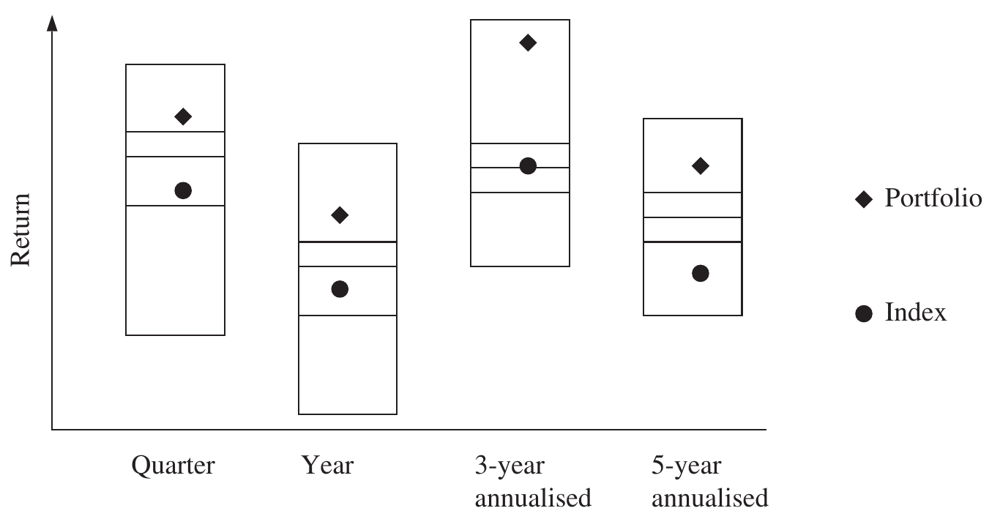

# 4 Benchmarks (continued)

## PEER GROUPS AND UNIVERSES {#a}

Peer groups are collections of competitor portfolios of similar strategies grouped together to provide both an average and range of competitor returns.

Some would argue that peer groups offer a more appropriate comparison than indexes for an asset manager because they represent a genuine alternative to the asset manager and because they consist of real portfolios, they suffer transaction costs; therefore comparisons are on a like-for-like basis. Asset managers are always up against an inbuilt disadvantage in that indexes never suffer transaction costs.

There are a number of disadvantages associated with peer groups; firstly, asset owners are reliant on the independent peer group complier to control the quality of the peer group. Comparisons are only relevant between similar strategies if the peer group complier adopts loose entry criteria; the peer group may be larger but may consist of widely divergent strategies.

Peer groups generate different challenges for asset managers: not only are asset managers required to make good investment decisions, but they must have a good understanding of what their competitors are doing. For example, if an asset manager likes IBM, against the index it is easy to ensure that the position is overweight, but in the peer group there is an element of guesswork involved: the asset manager must guess the average weight in the competitor portfolios and then determine the weight of IBM required. A peer group benchmark requires an additional competency or increased skillset from the asset manager.

Peer groups also suffer "survivorship bias": poor-performing portfolios are either closed, removed from the universe or merged with another fund within the asset manager's stable of funds because the asset manager is unwilling to keep a poor-performing portfolio in the survey. The result is increasing the good long-term performance of the peer group as a poor-performing portfolio ceases to belong to the long-term track record.

> **Note**
>
> When funds are merged, seldom is the poor-performing track record retained. In virtually all cases, justified or not, the better-performing track record will be retained; otherwise the merger will not be willingly undertaken.

### Percentile rank {#b}

One way of describing the relative performance of a portfolio or fund in a peer group is to provide the rank (or position) of the portfolio compared to the total number of portfolios in the universe.

Raw ranks, however, are very hard to compare against peer groups of different size; to allow comparison we can convert the raw rank to an equivalent rank based on a total peer group size of 100 using the following formula.

There are at least five different methods that might be used to calculate percentile rank:

$$\text{Percentile rank method 1} = \frac{n}{N} \tag{4.15}$$

$$\text{Percentile rank method 2} = \frac{n - 1}{N} \tag{4.16}$$

$$\text{Percentile rank method 3} = \frac{n - 1}{N - 1} \tag{4.17}$$

$$\text{Percentile rank method 4} = \frac{n - 0.5}{N} \tag{4.18}$$

$$\text{Percentile rank method 5} = \frac{n}{N + 1} \tag{4.19}$$

where:

- $n$ = rank of the observation (ranked best to worst)
- $N$ = total number of observations

Which percentile rank method to use really depends on the use to which it is put. For small samples the difference between methods can be significant (see Table 4.6), but for large samples the impact will be small. From the performance measurer's perspective, to rank portfolios in a peer group comparison I much prefer method 3; in effect, whatever the size of the peer group the percentile rank equates to the equivalent rank as if there were 100 portfolios in the peer group. The top-ranked fund would have a percentile rank of 0% and the bottom rank fund 100%. This method also ensures that the middle rank portfolio, the median, has a percentile rank of 50%. For example, the percentile rank of the portfolio ranked 8 out of a peer group size of 15 (the median portfolio) is calculated as follows:

$$\frac{8 - 1}{15 - 1} = \frac{7}{14} = 50\%$$

To test whether the percentile ranking methodology is sound, simply calculate the percentile rank of the middle rank fund in an odd sample size; if it is not exactly 50% it is a poor methodology.

**Table 4.6 — Percentile rank methodologies**

| Rank | Method 1 $\dfrac{n}{N}$ | Method 2 $\dfrac{n-1}{N}$ | Method 3 $\dfrac{n-1}{N-1}$ | Method 4 $\dfrac{n-0.5}{N}$ | Method 5 $\dfrac{n}{N+1}$ |
| --- | --- | --- | --- | --- | --- |
| 1 | 8.33% | 0.00% | 0.00% | 4.17% | 7.69% |
| 2 | 16.67% | 8.33% | 9.09% | 12.50% | 15.38% |
| 3 | 25.00% | 16.67% | 18.18% | 20.83% | 23.08% |
| 4 | 33.33% | 25.00% | 27.27% | 29.17% | 30.77% |
| 5 | 41.67% | 33.33% | 36.36% | 37.50% | 38.46% |
| 6 | 50.00% | 41.67% | 45.45% | 45.83% | 46.15% |
| 7 | 58.33% | 50.00% | 54.55% | 54.17% | 53.85% |
| 8 | 66.67% | 58.33% | 63.64% | 62.50% | 61.54% |
| 9 | 75.00% | 66.67% | 72.73% | 70.83% | 69.23% |
| 10 | 83.33% | 75.00% | 81.82% | 79.17% | 76.92% |
| 11 | 91.67% | 83.33% | 90.91% | 87.50% | 84.62% |
| 12 | 100.00% | 91.67% | 100.00% | 95.83% | 92.31% |

**Figure 4.1** Floating bar chart

Percentile ranks are often banded as follows:

| Range | Band |
| --- | --- |
| 0–25% | First quartile |
| 25–50% | Second quartile |
| 50–75% | Third quartile |
| 75–100% | Fourth quartile |

Quintiles (20% bands) and deciles (10% bands) are also common.

An extremely useful way of showing peer group information is in the form of a floating bar chart as shown in Figure 4.1.

The bars represent the range of returns of the peer group, which are banded by quartiles. Note that the bandwidths for the second and third quartiles are much narrower than the first and fourth quartiles, indicating a normal distribution of returns. For convenience many peer group managers ignore the top and bottom 5% of returns to ensure that the distribution can fit onto the page.

In this example it is easy to see that the portfolio has performed well within the 1st quartile for all periods as well as outperforming the index.

## RANDOM PORTFOLIOS {#c}

Peer groups and indexes both have their critics – peer groups because of survivorship bias, inefficient construction, investability and achievability issues and indexes because of the choice of stock weightings and the tendency for portfolio managers to be closet indexers, reducing the asset manager's business risk by taking only small deviations from index weights. Closet indexers will neither underperform nor outperform significantly since they are taking little relative risk; asset owners presumably pay asset managers to take risk on their behalf, and hence closet indexers are not acting in the best interests of their clients.

Random portfolios avoid most of these issues. Using Monte Carlo simulations, we can create all the possible outcomes given the restraints of the investment management mandate. If the actual performance of the portfolio manager is toward the top of all the possibilities the performance is good; if toward the bottom performance is bad. Since the construction of the median portfolio is unknown beforehand it is impossible to closely follow the index and of course there are no competitor construction or survivorship bias issues. Whether a random portfolio is investable or achievable is debatable: it is certainly impossible to construct the portfolio to match the median return of all possible outcomes at the outset of the period; the manager is required to take positions from the very start.

## EXCHANGE-TRADED FUNDS (ETFs) {#d}

Exchange-traded funds (ETFs) are, in reality, a special case of index benchmark. ETFs are pooled investment vehicles intended to track a commercial index. They inherit the advantages and disadvantages of the underlying index but in addition they represent a genuine investable alternative to the asset owner, including transaction costs and management fees.

## TARGET RETURNS {#e}

Target returns, such as a predetermined hurdle rate or arbitrary amount, inflation plus a specified amount, risk-free rate, minimum accepted return, and short-term interest rates are a relatively common type of benchmark. Target returns by their nature contain little information to aid performance analysis, typically do not reflect the investment mandate, and are not investable and are therefore very poor benchmarks.
