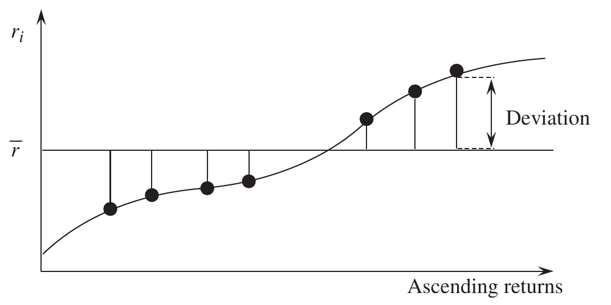
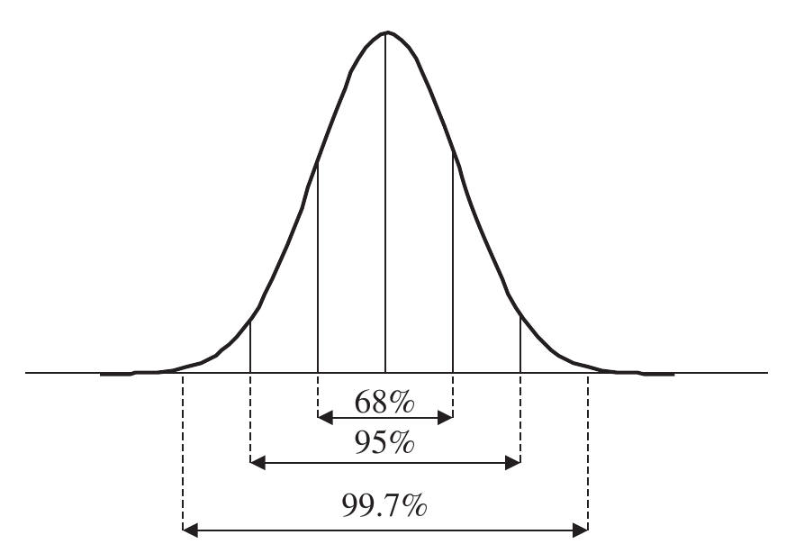
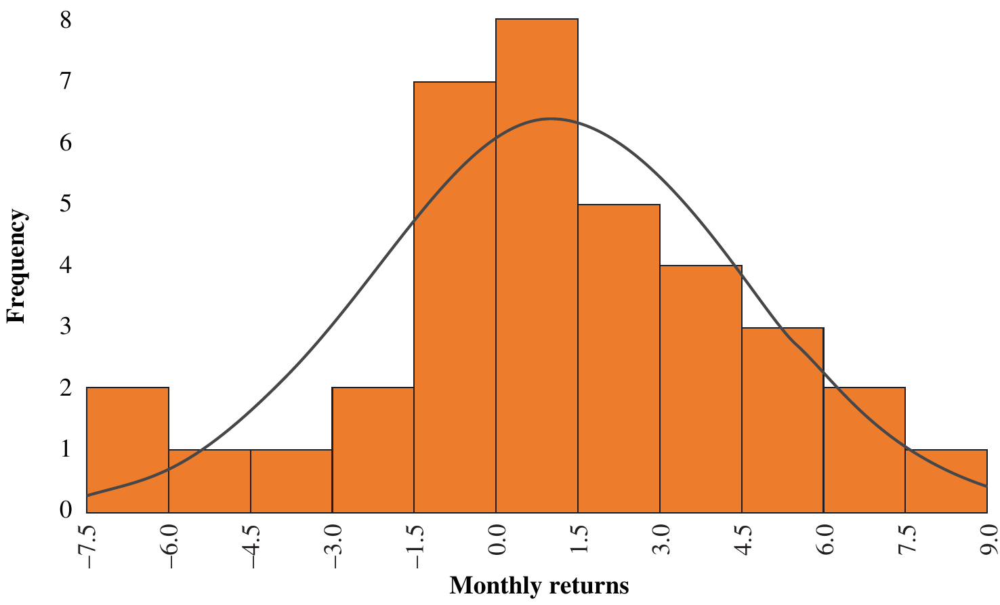
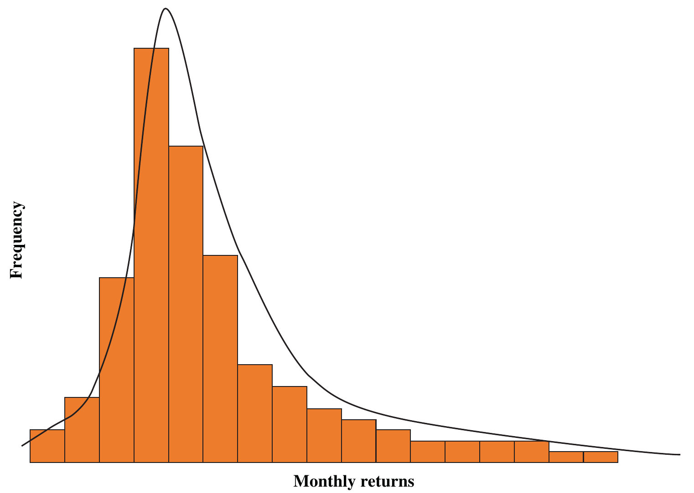
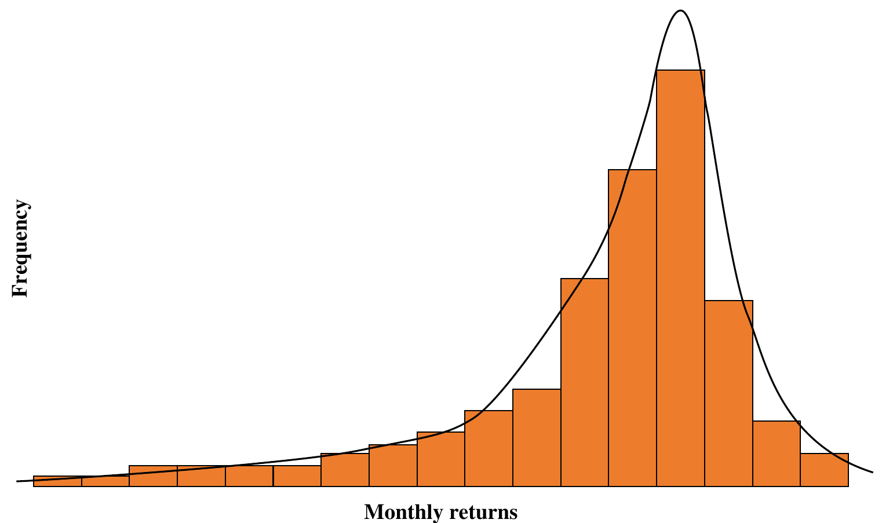
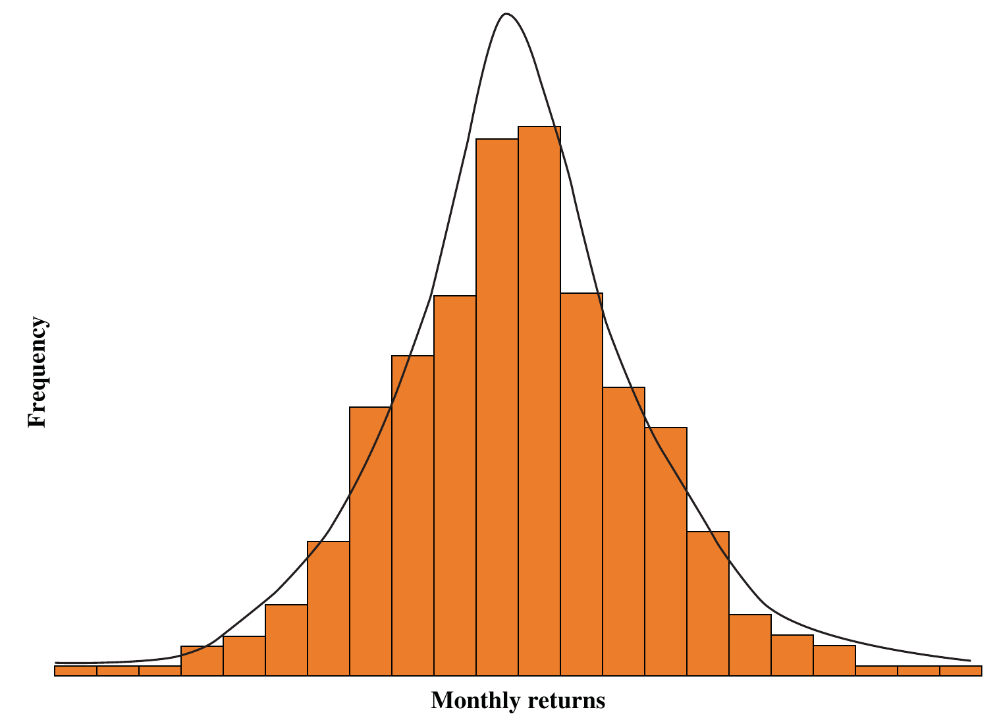
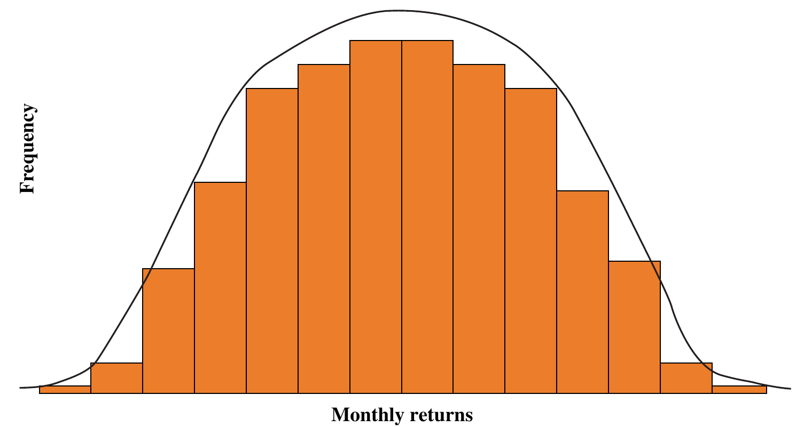

# 5 Risk (continued)

## Descriptive Statistics {#a}

For the most part risk managers and risk controllers use dispersion measures of return as a
proxy for their perception of risk.

There are several measures of return dispersion; they all measure some aspect of the range of
portfolio returns experienced in a particular time period. They all report on what has actually
happened during the time period of interest. Even from an ex-post perspective, one can ask
whether the return variability truly represents how much risk the asset manager took during
the time period or whether one needs to explore the range of possible returns that might have
(*realistically*) happened during the time period.

Ex-post performance measurement is two-dimensional: we are concerned with both the
return of the asset manager over a period of time and the risk of that return measured by the
variability of return or another dispersion measure. Both the return and the shape of the return
distribution are of interest to asset owners. We need descriptive statistics to help understand
the underlying distribution of returns. The classic descriptive statistics are the mean, variance,
skewness and kurtosis known as the first, second, third and fourth moments of the return dis-
tribution. These descriptive statistics are the basic components of many of the ex-post risk
measures defined in this chapter.

### Mean (or arithmetic mean) {#b}

The mean is the sum of returns divided by the total number of returns:

$$\text{Mean } \bar{r} = \frac{\sum_{i=1}^{i=n} r_i}{n} \tag{5.1}$$

where: $n$ = total number of returns, and $r_i$ = return in period $i$

For example, one might calculate the average monthly return over a two-year period using 24 returns ($n = 24$), where each $r_i$ is the monthly return.

Note that this mean (or average) return is calculated arithmetically and should not be confused with the annualised return, which is calculated geometrically. The average is a measure of central tendency; the median and the mode are also average measures. The mode is the most frequently occurring return and the median is the middle ranked when returns are ranked in order of size.

The annual arithmetic mean return ($\bar{r}_A$) or annual average return is simply the mean of annual returns over the time period being evaluated.

### Mean absolute deviation (or mean deviation) {#c}

The mean of the distribution of returns provides useful information but as investors we are also interested in the deviation or dispersion of returns from the mean, as shown in Figure 5.1.

If one were to simply sum up all the positive and negative deviations from the mean, they would cancel each other out. By using the absolute difference (i.e., ignoring the sign), we are able to calculate the mean or average absolute deviation as follows:

$$\text{Mean absolute deviation } MAD = \frac{\sum_{i=1}^{i=n} |r_i - \bar{r}|}{n} \tag{5.2}$$

The mean absolute deviation is the average *absolute* deviation of returns from the mean and penalises positive and negative deviations equally.

**Figure 5.1** Deviation from the mean

### Variance {#d}

The variance of returns is the average *squared* deviation of returns from the mean.

$$\text{Variance } \sigma^2 = \frac{\sum_{i=1}^{i=n} (r_i - \bar{r})^2}{n} \tag{5.3}$$

Squaring the deviations from the mean avoids the problem of negative deviations cancelling with positive deviations and also penalises larger deviations from the mean. It provides a kind of weighted average deviation in which large deviations carry more weight (because the square of the difference is larger). It is a more accepted method for measuring deviation, hence the name "standard deviation", which is the square root of the variance.

Variance is a measure of variability (or dispersion) of returns from the average or mean return.

Table 5.1 contains 36 monthly portfolio returns. We will return to this standard portfolio data many times during the course of this chapter. The mean, annualised return, mean absolute deviation and variance for this portfolio are calculated in Exhibit 5.1.

**Table 5.1 Portfolio variability**

| Portfolio monthly return (%) $r_i$ | Unit price | Absolute deviation $\vert r_i - \bar{r}\vert$ | Deviation squared $(r_i - \bar{r})^2$ |
| --- | --- | --- | --- |
| | 100.00 | | |
| 0.3 | 100.30 | 0.8 | 0.64 |
| 2.6 | 102.91 | 1.5 | 2.25 |
| 1.1 | 104.04 | 0.0 | 0.00 |
| −0.9 | 103.10 | 2.0 | 4.00 |
| 1.4 | 104.55 | 0.3 | 0.09 |
| 2.4 | 107.06 | 1.3 | 1.69 |
| 1.5 | 108.66 | 0.4 | 0.16 |
| 6.6 | 115.83 | 5.5 | 30.25 |
| −1.4 | 114.21 | 2.5 | 6.25 |
| 3.9 | 118.67 | 2.8 | 7.84 |
| −0.5 | 118.07 | 1.6 | 2.56 |
| 8.1 | 127.64 | 7.0 | 49.00 |
| 4.0 | 132.74 | 2.9 | 8.41 |
| −3.7 | 127.83 | 4.8 | 23.04 |
| −6.1 | 120.03 | 7.2 | 51.84 |
| 1.4 | 121.71 | 0.3 | 0.09 |
| −4.9 | 115.75 | 6.0 | 36.00 |
| −2.1 | 113.32 | 3.2 | 10.24 |
| 6.2 | 120.34 | 5.1 | 26.01 |
| 5.8 | 127.32 | 4.7 | 22.09 |
| −6.4 | 119.18 | 7.5 | 56.25 |
| 1.7 | 121.20 | 0.6 | 0.36 |
| −0.4 | 120.72 | 1.5 | 2.25 |
| −0.2 | 120.48 | 1.3 | 1.69 |
| −2.1 | 117.95 | 3.2 | 10.24 |
| 1.1 | 119.24 | 0.0 | 0.00 |
| 4.7 | 124.85 | 3.6 | 12.96 |
| 2.4 | 127.84 | 1.3 | 1.69 |
| 3.3 | 132.06 | 2.2 | 4.84 |
| −0.7 | 131.14 | 1.8 | 3.24 |
| 4.7 | 137.30 | 3.6 | 12.96 |
| 0.6 | 138.13 | 0.5 | 0.25 |
| 1.0 | 139.51 | 0.1 | 0.01 |
| −0.2 | 139.23 | 1.3 | 1.69 |
| 3.4 | 143.96 | 2.3 | 5.29 |
| 1.0 | 145.40 | 0.1 | 0.01 |
| **Total** | | **Total** | **Total** |
| $\sum_{i=1}^{i=n} r_i = 39.6$ | | $\sum_{i=1}^{i=n} \vert r_i - \bar{r}\vert = 90.8$ | $\sum_{i=1}^{i=n} (r_i - \bar{r})^2 = 396.18$ |

### Exhibit 5.1 Portfolio mean and variance {#e}

$$\text{Mean } \bar{r} = \frac{\sum_{i=1}^{i=n} r_i}{n} = \frac{39.6\%}{36} = 1.1\%$$

$$\text{Annualised return } \tilde{r} = \left(\frac{145.4}{100.0}\right)^{12/36} - 1 = 13.29\%$$

$$\text{Mean absolute deviation} = \frac{\sum_{i=1}^{i=n} |r_i - \bar{r}|}{n} = \frac{90.8\%}{36} = 2.52\%$$

$$\text{Variance } \sigma^2 = \frac{\sum_{i=1}^{i=n} (r_i - \bar{r})^2}{n} = \frac{396.18}{36} = 11.0\%$$

Table 5.2 contains 36 months of benchmark returns associated with the portfolio in Table 5.1. The mean, annualised return, mean absolute deviation and variance for this benchmark are calculated in Exhibit 5.2.

### Bessel's correction (population or sample, n or n – 1) {#f}

It might seem obvious that we should use $n$ in the denominator of the calculation of variance; however, if we are using sample data to estimate the variance of the population, the sample mean will typically differ from the real mean of the population $\mu$ and as a consequence underestimate variance.

**Table 5.2 Benchmark variability**

| Benchmark monthly return (%) $b_i$ | Benchmark value | Absolute deviation $\vert b_i - \bar{b}\vert$ | Deviation squared $(b_i - \bar{b})^2$ |
| --- | --- | --- | --- |
| | 100 | | |
| 0.2 | 100.20 | 1.0 | 1.00 |
| 2.5 | 102.71 | 1.3 | 1.69 |
| 1.8 | 104.55 | 0.6 | 0.36 |
| −1.1 | 103.40 | 2.3 | 5.29 |
| 1.4 | 104.85 | 0.2 | 0.04 |
| 2.3 | 107.26 | 1.1 | 1.21 |
| 1.4 | 108.76 | 0.2 | 0.04 |
| 6.5 | 115.83 | 5.3 | 28.09 |
| −1.5 | 114.10 | 2.7 | 7.29 |
| 4.2 | 118.89 | 3.0 | 9.00 |
| −0.3 | 118.53 | 1.5 | 2.25 |
| 8.3 | 128.37 | 7.1 | 50.41 |
| 3.9 | 133.38 | 2.7 | 7.29 |
| −3.8 | 128.31 | 5.0 | 25.00 |
| −6.2 | 120.35 | 7.4 | 54.76 |
| 1.5 | 122.16 | 0.3 | 0.09 |
| −4.8 | 116.29 | 6.0 | 36.00 |
| −2.0 | 113.97 | 3.2 | 10.24 |
| 6.0 | 120.81 | 4.8 | 23.04 |
| 5.6 | 127.57 | 4.4 | 19.36 |
| −6.7 | 119.03 | 7.9 | 62.41 |
| 1.9 | 121.29 | 0.7 | 0.49 |
| −0.3 | 120.92 | 1.5 | 2.25 |
| −0.1 | 120.80 | 1.3 | 1.69 |
| −2.6 | 117.66 | 3.8 | 14.44 |
| 0.7 | 118.48 | 0.5 | 0.25 |
| 4.3 | 123.58 | 3.1 | 9.61 |
| 2.9 | 127.16 | 1.7 | 2.89 |
| 3.8 | 132.00 | 2.6 | 6.76 |
| −0.2 | 131.73 | 1.4 | 1.96 |
| 5.1 | 138.45 | 3.9 | 15.21 |
| 1.4 | 140.39 | 0.2 | 0.04 |
| 1.3 | 142.21 | 0.1 | 0.01 |
| 0.3 | 142.64 | 0.9 | 0.81 |
| 3.4 | 147.49 | 2.2 | 4.84 |
| 2.1 | 150.59 | 0.9 | 0.81 |
| **Total** | | **Total** | **Total** |
| $\sum_{i=1}^{i=n} b_i = 43.2$ | | $\sum_{i=1}^{i=n} \vert b_i - \bar{b}\vert = 92.8$ | $\sum_{i=1}^{i=n} (b_i - \bar{b})^2 = 406.92$ |

### Exhibit 5.2 Benchmark mean and variance {#g}

$$\text{Mean } \bar{b} = \frac{\sum_{i=1}^{i=n} b_i}{n} = \frac{43.2\%}{36} = 1.2\%$$

$$\text{Annualised return } \tilde{b} = \left(\frac{150.59}{100.0}\right)^{12/36} - 1 = 14.62\%$$

$$\text{Mean absolute deviation} = \frac{\sum_{i=1}^{i=n} |b_i - \bar{b}|}{n} = \frac{92.8\%}{36} = 2.58\%$$

$$\text{Variance } \sigma^2 = \frac{\sum_{i=1}^{i=n} (b_i - \bar{b})^2}{n} = \frac{406.92\%}{36} = 11.3\%$$

Bessel's correction helps correct this underestimation by multiplying by the term $\frac{n}{n-1}$.

For a more detailed discussion on Bessel's correction see So (So, “Why Is the Sample Variance a Biased Estimator?”, 2008).

> **Note**
>
> It is a moot point whether the mean of the full period of 36 months is a sample of the asset manager's returns or is the true mean of the population being analysed – I incline to the full population. In any event for large $n$ there is little practical difference, and the industry standard is $n$, not $(n - 1)$. This is sensible from the performance measurer's ex-post perspective; it is easy to appreciate from the risk controller's more conservative ex-ante perspective that $(n - 1)$ might be chosen.

### Sample variance {#h}

Multiplying Equation 5.3 by Bessel's correction $\frac{n}{n-1}$ provides the formula for sample variance:

$$\text{Sample variance } \hat{\sigma}^2 = \frac{\sum_{i=1}^{i=n} (r_i - \bar{r})^2}{n-1} \tag{5.4}$$

### Standard deviation (variability or volatility) {#i}

For the analysis of portfolio variability, it is more convenient to use our original non-squared units of return; therefore, we take the square root of the variance to obtain the standard deviation:

$$\text{Standard deviation } \sigma = \sqrt{\frac{\sum_{i=1}^{i=n} (r_i - \bar{r})^2}{n}} \tag{5.5}$$

The term "standard deviation" was first coined by the statistician Karl Pearson in 1894 (Pearson, “On the Dissection of Asymmetrical Frequency-Curves”, 1894). It is convenient to interpret standard deviation as a standardised measure of variance or even just a standard measure. A higher standard deviation would indicate greater uncertainty, variability or risk. Mean absolute deviation and standard deviation are related measures of variability. The standard deviation of portfolio returns is frequently (but less accurately) described as volatility; variability is a more appropriate term. Sample standard deviation is simply:

$$\text{Sample standard deviation } \hat{\sigma} = \sqrt{\frac{\sum_{i=1}^{i=n} (r_i - \bar{r})^2}{n-1}} \tag{5.6}$$

> **Interpretation**
>
> Many risk practitioners warn about interpreting a portfolio's standard deviation (also known as volatility) as a proper measure of "risk". Their reasoning is as follows: a portfolio's volatility is a measure of the portfolio's *usual* deviation from its average return and is therefore not a measure of how bad a performance can be generated by the portfolio. Most investors are concerned about large losses, not the usual deviation from the average return.
>
> **Note**
>
> The annualised return and the arithmetic average annual return are linked by the formula:
>
> $$\tilde{r} \cong \bar{r}_A - \frac{\sigma^2}{2} \tag{3.34}$$
>
> The annualised return is always less than the annual arithmetic average; the greater the variability of the returns the greater the difference.

### Annualised risk (or time aggregation) {#j}

Equations 5.5 and 5.6 calculate standard deviation based on the periodicity of the data used, daily, monthly, quarterly, and so forth. For comparison of portfolio returns, standard deviation or variability is normally annualised for presentation purposes.

To annualise standard deviation we need to multiply by the square root of the number of observations in the year:

$$\text{Annualised standard deviation } \tilde{\sigma} = \sqrt{t} \times \sigma \tag{5.7}$$

where: $t$ = number of observations in year, quarterly = 4, monthly = 12, weekly = 52, etc.

For example, to annualise a monthly standard deviation, regardless of the number of monthly observations, multiply by $\sqrt{12}$; for quarterly standard deviation, multiply by $\sqrt{4}$ or 2.

> **Note**
>
> Because of weekends and public holidays, to annualise a daily standard deviation, a range of 250 to 260 ($52 \times 5$ weekdays) observations in the year is typically used. The number itself is less important; the number chosen should be used consistently for comparison.

This calculation requires the assumption that each periodic return is independent and hence not correlated with other returns. Making this assumption the variance over one year is simply:

$$\sigma^2_{\text{12 months}} = \sigma^2_{\text{Month 1}} + \sigma^2_{\text{Month 2}} + \ldots + \sigma^2_{\text{Month 12}} \tag{5.8}$$

If we now assume that the variance of each month is the same, then the variance over the year is simply 12 times the variance over one month.

$$\sigma^2_{\text{12 months}} = 12 \times \sigma^2 \tag{5.9}$$

Taking the square root leads to Equation 5.10, which ultimately leads back to Equation 5.7:

$$\sigma_{\text{12 months}} = \sqrt{12} \times \sigma \tag{5.10}$$

> **Note**
>
> The typical annualised standard deviation of worldwide equities is about 16%, corresponding to a typical daily standard deviation of about 1% ($\sqrt{252} \times 1.0\% \approx 16\%$) since there are about 252 trading days per calendar year. This means that a 1% daily move in equities is normal: equities generate daily returns of ±1% about two-thirds (68%) of the time.

### The central limit theorem {#k}

To annualise risk we must, in part, rely on the central limit theorem, which states that, if a number of observations of an independent random variable are taken:

1. The mean of the resulting sample mean is equal to the mean of the underlying population.
2. The standard deviation of the resulting sample mean is the standard deviation of the underlying population divided by the square root of the number of observations.
3. Even if the underlying distribution is strongly non-normal the sampling distribution of means will increasingly approximate to a normal distribution as the sample size increases.

### Frequency and number of data points {#l}

If variability is stable then clearly the more observations, the higher number of data points, the better, to maximise the accuracy of the estimation process. If variability is not stable, then we must find a balance between long measurement periods that are more accurate but slow to reflect structural changes and short recent measurement periods that reflect recent market conditions but are less accurate.

> **⚠ Caution**
>
> The industry standard requires a minimum of 36 monthly periods and 20 quarterly periods. If absolutely pushed, I would provide risk statistics calculated using 24 months of monthly data but never less; the resulting information is less meaningful and potentially misleading.

Daily information is too noisy for long-term investment portfolios and should be ignored for standard risk measures (but not extreme risk measures for which there are few observations in the tail of the return distribution), although it is very tempting for short time periods for which there are an insufficient number of observations. On the other hand, the standard for ex-ante value-at-risk calculations is to use a 100-day (5-month) or 252-day (1-year) window of daily returns. Far better to refuse to calculate risk measures, for which there are insufficient data points, than to provide misleading information.

> **⚠ Caution**
>
> Although it is easy to calculate annualised standard deviations, it is never appropriate to compare portfolios with risk statistics calculated using different frequencies. For daily valued mutual funds, you may wish to calculate the daily, weekly, monthly and quarterly annualised standard deviations, say over five years, and note the range of annualised standard deviations that result from the same data.

Using the data from Table 5.1 and Table 5.2 the standard deviation, sample standard deviation and annualised standard deviation are calculated in Exhibit 5.3 for both the portfolio and benchmark, respectively.

### Exhibit 5.3 Standard deviation {#m}

$$\text{Portfolio standard deviation } \sigma = \sqrt{\frac{\sum_{i=1}^{i=n} (r_i - \bar{r})^2}{n}} = \sqrt{\frac{396.18\%}{36}} = 3.32\%$$

$$\text{Sample standard deviation } \hat{\sigma} = \sqrt{\frac{\sum_{i=1}^{i=n} (r_i - \bar{r})^2}{n-1}} = \sqrt{\frac{396.18\%}{35}} = 3.36\%$$

$$\text{Annualised standard deviation } \tilde{\sigma} = \sqrt{t} \times \sigma = \sqrt{12} \times 3.32\% = 11.49\%$$

$$\text{Benchmark standard deviation } \sigma_b = \sqrt{\frac{\sum_{i=1}^{i=n} (b_i - \bar{b})^2}{n}} = \sqrt{\frac{406.92\%}{36}} = 3.36\%$$

$$\text{Sample standard deviation } \hat{\sigma}_b = \sqrt{\frac{\sum_{i=1}^{i=n} (b_i - \bar{b})^2}{n-1}} = \sqrt{\frac{406.92\%}{35}} = 3.41\%$$

$$\text{Annualised standard deviation } \tilde{\sigma}_b = \sqrt{t} \times \sigma_b = \sqrt{12} \times 3.36\% = 11.65\%$$

### Normal (or Gaussian) distribution {#n}

A distribution is said to be normal if there is a high probability that an observation will be close to the average and a low probability that an observation is far away from the average, tailing away symmetrically. A normal distribution curve peaks at the average value. Returns are equally likely to lie above or below the mean. Normal distributions, sometimes called the "bell curve", are more formally known as Gaussian distributions, named after the German mathematician Carl Friedrich Gauss.

A normal distribution (see Figure 5.2) has special properties that are useful to asset management. If returns are normally distributed, then we can use the average return and variability or standard deviation of returns to describe the distribution of returns, such that:

- Approximately 68% of returns will be within a range of one standard deviation above and below the average return.
- Approximately 95% of returns will be within a range of two standard deviations above and below the average return.
- Approximately 99.7% of returns will be within a range of three standard deviations above and below the average return (The “Empirical or 68-95-99.7” Rule; actually, more accurately 68.2689%, 95.4499% and 99.7300%).

**Figure 5.2** Normal distribution

This property is obviously especially useful for calculating the probability of an event occurring outside a specified range of returns. Normal distributions are popular because of these statistical properties and because many random events can be approximated by a normal distribution.

> **⚠ Caution**
>
> While it is tempting to use a mathematical function, like the normal curve, because it has convenient properties, care must be taken to ensure that it properly models the data. Equity returns are often shown to follow the normal curve within about two standard deviations but outside this range show a higher frequency of extreme returns than the normal curve implies. Equities exhibit so-called "fat tails" precisely for this reason: their return distributions have more weight (i.e., are fatter) for large returns. This means that large losses (and gains) occur more frequently that the normal curve implies.

### Histograms {#o}

Histograms were first introduced by Pearson (K. Pearson, “Contributions to the Mathematical Theory of Evolution”, 1895) to provide a graphical representation of the distribution of data and are ideal for illustrating the distribution of returns of a portfolio manager's track record. A histogram of the example data from the portfolio in Table 5.1 is shown in Figure 5.3. The horizontal axis is split into consecutive intervals of return or bins and the vertical axis represents the frequency in which periodic returns fall within the bin. A normal distribution curve is imposed on the histogram to show that in this case the distribution of returns is quite normal. The term *histogram* is derived from the Greek *histos*, anything set upright such as the vertical bars on a graph, and *gramma*, drawing.

**Figure 5.3** Histogram of portfolio returns

### Skewness (Fisher's or moment skewness) {#p}

Not all distributions are normally distributed; if there are more extreme returns extending to the right tail of a distribution it is said to be positively skewed and if there are more returns extending to the left it is said to be negatively skewed.

We can measure the degree of skewness (or more accurately Fisher's skewness) in the following formula:

$$\text{Skewness } \zeta = \sum_{i=1}^{i=n} \left(\frac{r_i - \bar{r}}{\sigma}\right)^3 \times \frac{1}{n} \tag{5.11}$$

A normal distribution will have a skewness of 0. Note that in Equation 5.11, extreme values carry greater weight since they are cubed while maintaining their initial sign, positive or negative. Note also that the difference from the mean return is standardised by dividing by the standard deviation of returns. Skewness is a measure of asymmetry of the return distribution.

Positive and negative skew are illustrated in Figures 5.4 and 5.5, respectively.

We can use skewness in making a judgement about the possibility of large negative or positive outliers when comparing portfolio returns. Skewness provides more information about the shape of return distribution, where deviations from the mean are greater in one direction than the other; this measure will deviate from zero in the direction of the larger deviations.

**Figure 5.4** Positive skew

**Figure 5.5** Negative skew

### Sample skewness {#q}

Sample skewness is calculated using Bessel's correction as follows:

$$\text{Sample skewness } \hat{\zeta} = \sum_{i=1}^{i=n} \left(\frac{r_i - \bar{r}}{\hat{\sigma}}\right)^3 \times \frac{n}{(n-1) \times (n-2)} \tag{5.12}$$

> **Note**
>
> The standard Excel® function called skewness is in fact sample skewness.

### Kurtosis (Pearson's kurtosis) {#r}

Kurtosis (Pearson, “Das Fehlergesetz und seine Verallgemeinerungen durch Fechner und Pearson. A Rejoinder”, 1905) (or more correctly Pearson's kurtosis) provides additional information about the shape of a return distribution; formally it measures the weight of returns in the tails of the distribution relative to standard deviation, but is more often associated as a measure of flatness or peakedness of the return distribution. In fact, DeCarlo (DeCarlo, “On the Meaning and Use of Kurtosis”, 1997) correctly points out that both tailedness and peakedness are components of kurtosis.

$$\text{Kurtosis } \kappa = \sum_{i=1}^{i=n} \left(\frac{r_i - \bar{r}}{\sigma}\right)^4 \times \frac{1}{n} \tag{5.13}$$

Note that in Equation 5.13 extreme results of either sign make exceptionally large positive contributions to kurtosis. Just like the formula for skewness the difference from the mean is again standardised by dividing by the standard deviation of returns.

The kurtosis of a normal distribution is 3 (called *mesokurtic*), greater than 3 may indicate a peaked distribution with fat tails (called *leptokurtic*) and less than 3 may indicate a less peaked distribution with thin tails (called *platykurtic*). The word *kurtosis* is derived from the Greek word for bulge, *kurtos*. *Platy* comes from the Greek word *platus* for broad or flat. *Leptos* is Greek for thin or slender describing the shape of the peak not the tails. For symmetric distributions with skewness close to zero, kurtosis greater than 3 could indicate an excess of returns either in the tails, or the centre, or both.

> **Note**
>
> Generally speaking, investors prefer platykurtic distributions with a kurtosis less than 3, less peaked but with fewer extreme returns.

A leptokurtic distribution is shown in Figure 5.6 and a platykurtic distribution in Figure 5.7.

**Figure 5.6** Kurtosis >3, thin peak with fat tails

**Figure 5.7** Kurtosis <3, broad peak with thin tails

### Excess kurtosis (or Fisher's kurtosis) {#s}

Subtracting 3 from Equation 5.13, we obtain a measure of excess kurtosis (or Fisher's kurtosis). The terms *kurtosis* and *excess kurtosis* are often confused.

$$\text{Excess kurtosis } \kappa_E = \sum_{i=1}^{i=n} \left(\frac{r_i - \bar{r}}{\sigma}\right)^4 \times \frac{1}{n} - 3 \tag{5.14}$$

> **⚠ Caution**
>
> Care needs to be taken whenever calculating kurtosis to ensure that it is clear whether the calculation is excess kurtosis (subtracting 3) or not.

### Sample kurtosis {#t}

Sample kurtosis is calculated using Bessel's correction as follows:

$$\text{Sample kurtosis } \hat{\kappa} = \sum_{i=1}^{i=n} \left(\frac{r_i - \bar{r}}{\hat{\sigma}}\right)^4 \times \frac{n \times (n+1)}{(n-1) \times (n-2) \times (n-3)} \tag{5.15}$$

Sample excess kurtosis is calculated also using Bessel's correction as follows:

$$\hat{\kappa}_E = \sum_{i=1}^{i=n} \left(\frac{r_i - \bar{r}}{\hat{\sigma}}\right)^4 \times \frac{n \times (n+1)}{(n-1) \times (n-2) \times (n-3)} - \frac{3 \times (n-1)^2}{(n-2) \times (n-3)} \tag{5.16}$$

> **⚠ Caution**
>
> The standard Excel® function labelled kurtosis is in fact sample excess kurtosis (or sample Fisher's kurtosis if I am more generous). The same arguments used to justify using the standard deviation of the population as opposed to a sample also apply to skewness and kurtosis.

A better understanding of the shape of the distribution of returns will aid in assessing the relative qualities of asset manager return distributions. Whether we prefer higher or lower kurtosis (or for that matter positive or negative skewness) will depend on the type of return series we want to see.

Equity markets tend to have fat tails; when markets fall portfolio managers tend to sell and when markets rise, portfolio managers tend to buy, and there is a higher probability of extreme events than the normal distribution would suggest. Therefore, any risk measure calculated using normal assumptions may well underestimate risk, especially outside the two-standard-deviation bands.

> **Note**
>
> Investors will naturally prefer positive skew and lower kurtosis with thinner tails.

### Bera-Jarque statistic (or Jarque-Bera) {#u}

Since normal distributions should have skewness near 0 and kurtosis near 3, we can test for normality using the Bera-Jarque test (Jarque and Bera, “A Test for Normality of Observations and Regression Residuals”, 1987).

$$\text{Bera-Jarque statistic } BJ = \frac{n}{6} \times \left(\zeta^2 + \frac{\kappa_E^2}{4}\right) \tag{5.17}$$

With a confidence level of 95% we will reject the hypothesis that a distribution is normal if the Bera-Jarque statistic exceeds 5.99, and with a confidence level of 99% if it exceeds 9.21.

> **Note**
>
> Perfectly normal distributions will have a BJ = 0.

Portfolio skewness, kurtosis and the Bera-Jarque statistic of the portfolio data first shown in Table 5.1 are calculated in Exhibit 5.4 from summarised data contained in Table 5.3.

### Exhibit 5.4 Skewness, kurtosis and the Bera-Jarque hypothesis test {#v}

$$\text{Skewness } \zeta = \sum_{i=1}^{i=n} \left(\frac{r_i - \bar{r}}{\sigma}\right)^3 \times \frac{1}{n} = \frac{-312.79}{3.32^3} \times \frac{1}{36} = -0.24$$

$$\text{Kurtosis } \kappa = \sum_{i=1}^{i=n} \left(\frac{r_i - \bar{r}}{\sigma}\right)^4 \times \frac{1}{n} = \frac{12982.39}{3.32^4} \times \frac{1}{36} = 2.98$$

$$\text{Excess kurtosis } \kappa_E = \kappa - 3 = 2.98 - 3 = -0.02$$

$$\text{Bera-Jarque statistic} = \frac{n}{6} \times \left(\zeta^2 + \frac{\kappa_E^2}{4}\right) = \frac{36}{6} \times \left(-0.24^2 + \frac{-0.02^2}{4}\right) = 0.34$$

It would appear that this return distribution is close to normal.

$$\text{Sample skewness } \hat{\zeta} = \sum_{i=1}^{i=n} \left(\frac{r_i - \bar{r}}{\hat{\sigma}}\right)^3 \times \frac{n}{(n-1) \times (n-2)} = \frac{-312.79}{3.36^3} \times \frac{36}{(36-1) \times (36-2)} = -0.25$$

$$\text{Sample kurtosis } \hat{\kappa} = \sum_{i=1}^{i=n} \left(\frac{r_i - \bar{r}}{\hat{\sigma}}\right)^4 \times \frac{n \times (n+1)}{(n-1) \times (n-2) \times (n-3)} = \frac{12982.39}{3.36^4} \times \frac{36 \times (36+1)}{(36-1) \times (36-2) \times (36-3)} = 3.44$$

$$\text{Sample excess kurtosis } \hat{\kappa}_E = \hat{\kappa} - \frac{3 \times (n-1)^2}{(n-2) \times (n-3)} = 3.44 - \frac{3 \times (36-1)^2}{(36-2) \times (36-3)} = 0.16$$

**Table 5.3 Portfolio skewness and kurtosis**

| Monthly return (%) $r_i$ | Deviation cubed $(r_i - \bar{r})^3$ | Fourth-power deviation $(r_i - \bar{r})^4$ |
| --- | --- | --- |
| 0.3 | −0.51 | 0.41 |
| 2.6 | 3.38 | 5.06 |
| 1.1 | 0.00 | 0.00 |
| −0.9 | −8.00 | 16.00 |
| 1.4 | 0.03 | 0.01 |
| 2.4 | 2.20 | 2.86 |
| 1.5 | 0.06 | 0.03 |
| 6.6 | 166.38 | 915.06 |
| −1.4 | −15.63 | 39.06 |
| 3.9 | 21.95 | 61.47 |
| −0.5 | −4.10 | 6.55 |
| 8.1 | 343.00 | 2401.00 |
| 4.0 | 24.39 | 70.73 |
| −3.7 | −110.59 | 530.84 |
| −6.1 | −373.25 | 2687.39 |
| 1.4 | 0.03 | 0.01 |
| −4.9 | −216.00 | 1,296.00 |
| −2.1 | −32.77 | 104.86 |
| 6.2 | 132.65 | 676.52 |
| 5.8 | 103.82 | 487.97 |
| −6.4 | −421.88 | 3,164.06 |
| 1.7 | 0.22 | 0.13 |
| −0.4 | −3.38 | 5.06 |
| −0.2 | −2.20 | 2.86 |
| −2.1 | −32.77 | 104.86 |
| 1.1 | 0.00 | 0.00 |
| 4.7 | 46.66 | 167.96 |
| 2.4 | 2.20 | 2.86 |
| 3.3 | 10.65 | 23.43 |
| −0.7 | −5.83 | 10.50 |
| 4.7 | 46.66 | 167.96 |
| 0.6 | −0.13 | 0.06 |
| 1.0 | 0.00 | 0.00 |
| −0.2 | −2.20 | 2.86 |
| 3.4 | 12.17 | 27.98 |
| 1.0 | 0.00 | 0.00 |
| **Total** | **Total** | **Total** |
| $\sum_{i=1}^{i=n} (r_i - \bar{r})^3 = -312.79$ | | $\sum_{i=1}^{i=n} (r_i - \bar{r})^4 = 12,982.39$ |

Skewness and kurtosis for the benchmark data in Table 5.2 are calculated in Exhibit 5.5 from the summarised data in Table 5.4.

### Exhibit 5.5 Benchmark skewness and kurtosis {#w}

$$\text{Skewness } \zeta_b = \sum_{i=1}^{i=n} \left(\frac{b_i - \bar{b}}{\sigma_b}\right)^3 \times \frac{1}{n} = \frac{-495.94}{3.36^3} \times \frac{1}{36} = -0.36$$

$$\text{Kurtosis } \kappa_b = \sum_{i=1}^{i=n} \left(\frac{b_i - \bar{b}}{\sigma_b}\right)^4 \times \frac{1}{n} = \frac{14004.25}{3.36^4} \times \frac{1}{36} = 3.04$$

$$\text{Excess kurtosis } \kappa_{Eb} = \kappa_b - 3 = 3.04 - 3 = 0.04$$

$$\text{Sample skewness } \hat{\zeta} = \sum_{i=1}^{i=n} \left(\frac{b_i - \bar{b}}{\hat{\sigma}_b}\right)^3 \times \frac{n}{(n-1) \times (n-2)} = \frac{-495.94}{3.41^3} \times \frac{36}{(36-1) \times (36-2)} = -0.38$$

$$\text{Sample kurtosis } \hat{\kappa} = \sum_{i=1}^{i=n} \left(\frac{b_i - \bar{b}}{\hat{\sigma}_b}\right)^4 \times \frac{n \times (n+1)}{(n-1) \times (n-2) \times (n-3)} = \frac{14004.25}{3.41^4} \times \frac{36 \times (36+1)}{(36-1) \times (36-2) \times (36-3)} = 3.51$$

$$\text{Sample excess kurtosis } \hat{\kappa}_E = \hat{\kappa} - \frac{3 \times (n-1)^2}{(n-2) \times (n-3)} = 3.51 - \frac{3 \times (36-1)^2}{(36-2) \times (36-3)} = 0.24$$

**Table 5.4 Benchmark skewness and kurtosis**

| Monthly return (%) $b_i$ | Deviation cubed $(b_i - \bar{b})^3$ | Fourth-power deviation $(b_i - \bar{b})^4$ |
| --- | --- | --- |
| 0.2 | –1.00 | 1.00 |
| 2.5 | 2.20 | 2.86 |
| 1.8 | 0.22 | 0.13 |
| −1.1 | −12.17 | 27.98 |
| 1.4 | 0.01 | 0.00 |
| 2.3 | 1.33 | 1.46 |
| 1.4 | 0.01 | 0.00 |
| 6.5 | 148.88 | 789.05 |
| −1.5 | −19.68 | 53.14 |
| 4.2 | 27.00 | 81.00 |
| −0.3 | –3.38 | 5.06 |
| 8.3 | 357.91 | 2,541.17 |
| 3.9 | 19.68 | 53.14 |
| −3.8 | −125.00 | 625.00 |
| −6.2 | −405.22 | 2,998.66 |
| 1.5 | 0.03 | 0.01 |
| −4.8 | −216.00 | 1296.00 |
| −2.0 | –32.77 | 104.86 |
| 6.0 | 110.59 | 530.84 |
| 5.6 | 85.18 | 374.81 |
| −6.7 | −493.04 | 3,895.01 |
| 1.9 | 0.34 | 0.24 |
| −0.3 | –3.38 | 5.06 |
| −0.1 | –2.20 | 2.86 |
| −2.6 | –54.87 | 208.51 |
| 0.7 | –0.13 | 0.06 |
| 4.3 | 29.79 | 92.35 |
| 2.9 | 4.91 | 8.35 |
| 3.8 | 17.58 | 45.70 |
| −0.2 | −2.74 | 3.84 |
| 5.1 | 59.32 | 231.34 |
| 1.4 | 0.01 | 0.00 |
| 1.3 | 0.00 | 0.00 |
| 0.3 | –0.73 | 0.66 |
| 3.4 | 10.65 | 23.43 |
| 2.1 | 0.73 | 0.66 |
| **Total** | **Total** | **Total** |
| $\sum_{i=1}^{i=n} (b_i - \bar{b})^3 = -495.94$ | | $\sum_{i=1}^{i=n} (b_i - \bar{b})^4 = 14,004.25$ |

### Covariance {#x}

Covariance is a descriptive statistic that measures the tendency of two return streams to move together relative to their averages – for example, this could be the covariance between two portfolios, two indexes or, most commonly, between a portfolio and its benchmark.

$$\text{Covariance} = \frac{\sum_{i=1}^{i=n} (r_i - \bar{r}) \times (b_i - \bar{b})}{n} \tag{5.18}$$

where: $b_i$ = benchmark return in period $i$, $\bar{b}$ = mean benchmark return

Equation 5.18 multiplies the period portfolio return difference from the mean portfolio return with the same period benchmark return difference from the mean benchmark return. If both are positive or negative this will make a positive contribution to covariance; if they are of different sign, it will make a negative contribution to covariance.

Therefore, a total positive covariance indicates that the returns are associated; they move together. A total negative covariance indicates that the returns move in opposite directions. A low or near zero covariance would indicate little relationship between portfolio and benchmark returns.

### Sample covariance {#y}

Sample covariance is calculated using Bessel's correction as follows:

$$\text{Sample covariance} = \frac{\sum_{i=1}^{i=n} (r_i - \bar{r}) \times (b_i - \bar{b})}{n-1} \tag{5.19}$$

### Correlation ($\rho$) {#z}

In isolation, covariance is a difficult statistic to interpret because it measures the "co-dispersion" relative to both the portfolio and its benchmark, which can be of unknown size. For example, is a covariance of 3 large or small? The answer depends on the standard deviations of both the portfolio and the benchmark.

We can standardise the covariance to a value between 1 and –1 by dividing by the product of the portfolio standard deviation and the benchmark standard deviation as follows:

$$\text{Correlation } \rho_{r,b} = \frac{\text{Covariance}}{\sigma \times \sigma_b} \tag{5.20}$$

where: $\rho_{r,b}$ is the coefficient of correlation between the portfolio return and benchmark return.

The closer the correlation is to 1, the stronger the linear relationship.

This standardisation has the immensely helpful feature that it allows us to compare the correlations between disparate portfolios and benchmarks on an apples-to-apples basis.

> **⚠ Caution**
>
> Interpreting correlation can sometimes be tricky. If a portfolio and its benchmark have a high correlation (for example, above 0.9) then it can be tempting to believe that the portfolio will move up (or down) as much as the benchmark. In such a case, if the benchmark moves up 1% it is NOT correct to expect the portfolio to move up by 1%.
>
> The correlation measures the tendency of the portfolio to move up or down relative to its own average and volatility but not as an absolute measure. In this example, if the portfolio has a very small standard deviation, the expectation should be for it to move up just a little when the benchmark moves up by 1%.

### Sample correlation {#0}

Bessel's correction applies equally to covariance and the product of the portfolio and benchmark standard deviations and therefore the correction in the numerator cancels with the correction in the denominator, eliminating the need to calculate sample correlation.

Covariance and correlation are calculated in Exhibit 5.6 from the standard portfolio data shown in Table 5.5.

### Exhibit 5.6 Covariance and correlation {#1}

$$\text{Covariance} = \frac{\sum_{i=1}^{i=n} (r_i - \bar{r}) \times (b_i - \bar{b})}{n} = \frac{399.37}{36} = 11.09$$

$$\text{Correlation } \rho_{r,b} = \frac{\text{Covariance}}{\sigma \times \sigma_b} = \frac{11.09}{3.32 \times 3.36} = 0.995$$

**Table 5.5 Covariance and correlation**

| Portfolio monthly return (%) $r_i$ | Deviation from average $(r_i - \bar{r})$ | Benchmark monthly return $b_i$ | Deviation from average $(b_i - \bar{b})$ | Portfolio deviation × Benchmark deviation $(r_i - \bar{r}) \times (b_i - \bar{b})$ |
| --- | --- | --- | --- | --- |
| 0.3 | −0.8 | 0.2 | −1.0 | 0.80 |
| 2.6 | 1.5 | 2.5 | 1.3 | 1.95 |
| 1.1 | 0.0 | 1.8 | 0.6 | 0.00 |
| −0.9 | −2.0 | −1.1 | −2.3 | 4.60 |
| 1.4 | 0.3 | 1.4 | 0.2 | 0.06 |
| 2.4 | 1.3 | 2.3 | 1.1 | 1.43 |
| 1.5 | 0.4 | 1.4 | 0.2 | 0.08 |
| 6.6 | 5.5 | 6.5 | 5.3 | 29.15 |
| −1.4 | −2.5 | −1.5 | −2.7 | 6.75 |
| 3.9 | 2.8 | 4.2 | 3.0 | 8.40 |
| −0.5 | −1.6 | −0.3 | −1.5 | 2.40 |
| 8.1 | 7.0 | 8.3 | 7.1 | 49.7 |
| 4.0 | 2.9 | 3.9 | 2.7 | 7.83 |
| −3.7 | −4.8 | −3.8 | −5.0 | 24.00 |
| −6.1 | −7.2 | −6.2 | −7.4 | 53.28 |
| 1.4 | 0.3 | 1.5 | 0.3 | 0.09 |
| −4.9 | −6.0 | −4.8 | −6.0 | 36.00 |
| −2.1 | −3.2 | −2.0 | −3.2 | 10.24 |
| 6.2 | 5.1 | 6.0 | 4.8 | 24.48 |
| 5.8 | 4.7 | 5.6 | 4.4 | 20.68 |
| −6.4 | −7.5 | −6.7 | −7.9 | 59.25 |
| 1.7 | 0.6 | 1.9 | 0.7 | 0.42 |
| −0.4 | −1.5 | −0.3 | −1.5 | 2.25 |
| −0.2 | −1.3 | −0.1 | −1.3 | 1.69 |
| −2.1 | −3.2 | −2.6 | −3.8 | 12.16 |
| 1.1 | 0.0 | 0.7 | −0.5 | 0.00 |
| 4.7 | 3.6 | 4.3 | 3.1 | 11.16 |
| 2.4 | 1.3 | 2.9 | 1.7 | 2.21 |
| 3.3 | 2.2 | 3.8 | 2.6 | 5.72 |
| −0.7 | −1.8 | −0.2 | −1.4 | 2.52 |
| 4.7 | 3.6 | 5.1 | 3.9 | 14.04 |
| 0.6 | −0.5 | 1.4 | 0.2 | –0.10 |
| 1.0 | −0.1 | 1.3 | 0.1 | –0.01 |
| −0.2 | −1.3 | 0.3 | −0.9 | 1.17 |
| 3.4 | 2.3 | 3.4 | 2.2 | 5.06 |
| 1.0 | −0.1 | 2.1 | 0.9 | –0.09 |
| **Total** | | | | **Total** |
| | | | | $\sum_{i=1}^{i=n} (r_i - \bar{r}) \times (b_i - \bar{b}) = 399.37$ |
