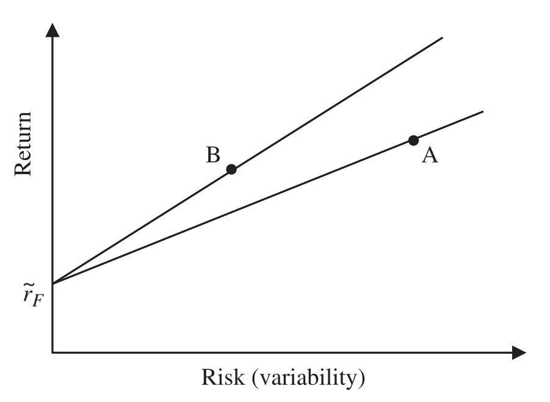
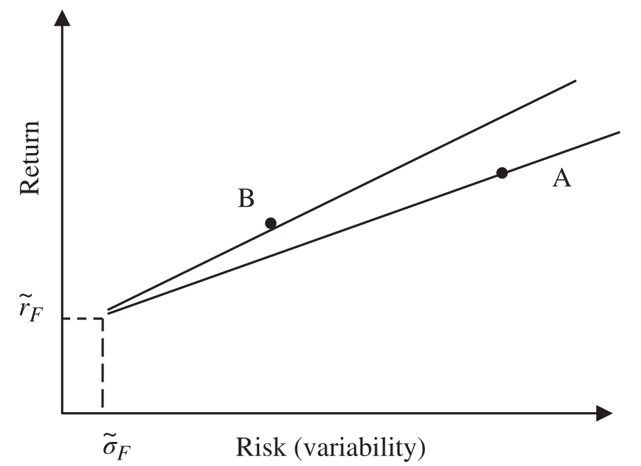
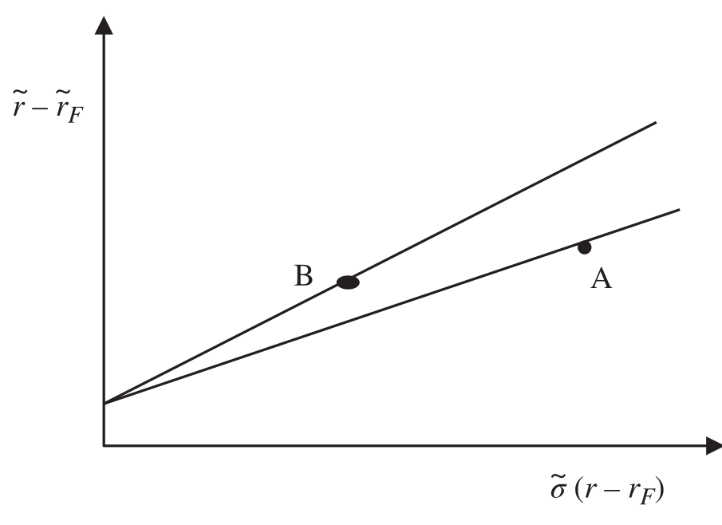

# 5 Risk (continued)

## Performance Appraisal {#a}

Asset owners are risk averse; given the same return, they would prefer the portfolio with less risk or less variability of return. Therefore, how do we evaluate portfolios with different returns and various levels of risk? We need composite risk measures that determine if the risk undertaken by the asset manager has been justified by the reward received. The dispersion, variability and tendency measures we have just defined allow us to appraise the performance of the asset manager by combining a measure of risk with a measure of reward ex-post.

Attempting to interpret a portfolio's performance without considering its risk is a misguided venture. Is an annualised performance of 8% a good return? One way to compare that number is relative to what other portfolios returned. Another, potentially more nuanced, way is to compare it to its own risk: a portfolio that delivers an 8% return while taking only 4% risk is clearly superior to a portfolio that delivers the same 8% return while taking 16% risk.

One way of thinking about the relationship between return and risk is that risk is one of the *costs* of investing. It is a *potential* cost that may (or may not) be realised and therefore should be interpreted probabilistically. Not taking it into account is a dangerous game.

### Sharpe ratio (reward to variability, Sharpe index) {#b}

With two variables it is natural to resort to a graphical representation with return represented by the vertical axis and risk represented by the horizontal axis as shown in Figure 5.8 using data from Table 5.6.

**Figure 5.8** Sharpe ratio

**Table 5.6** Sharpe ratio

| | Portfolio A | Portfolio B | Benchmark |
| --- | --- | --- | --- |
| Annualised return | 7.9% | 6.9% | 7.5% |
| Annualised risk | 5.5% | 3.2% | 4.5% |
| Sharpe ratio | | | |
| (Risk-free rate = 2%) $SR = \dfrac{\tilde{r} - \tilde{r}_F}{\tilde{\sigma}}$ | $\dfrac{7.9\% - 2.0\%}{5.5\%} = 1.07$ | $\dfrac{6.9\% - 2.0\%}{3.2\%} = 1.53$ | $\dfrac{7.5\% - 2.0\%}{4.5\%} = 1.22$ |

A straight line is drawn from a fixed point on the vertical axis to points A and B representing the annualised returns and annualised variability (risk) of portfolios A and B respectively.

This fixed point represents the natural starting point for all investors, the risk-free rate. The risk-free rate represents the return we should expect on a riskless asset, for example the interest return on cash or Treasury bills. An investor can achieve this return without any variability or risk.

> **⚠ Caution**
>
> It is important to ensure that the same risk-free rate is used for all portfolios for comparison purposes.

Clearly the investor will prefer to be in the top left-hand quadrant of this graph, representing high return and low risk. The gradient of the line determines how far toward the top left-hand quadrant each portfolio is positioned. The steeper the gradient, the further to the top left-hand side.

This gradient is called the Sharpe ratio, named after William Sharpe (Sharpe, "Mutual Fund Performance" (1966).) and calculated as follows:

$$SR = \frac{\tilde{r} - \tilde{r}_F}{\tilde{\sigma}} \tag{5.21}$$

where:

- $\tilde{r}$ = annualised portfolio return
- $\tilde{r}_F$ = annualised risk-free rate
- $\tilde{\sigma}$ = annualised portfolio risk (variability, standard deviation of return)

The greater the Sharpe ratio, the steeper the gradient and hence a better combination of risk and return. The Sharpe ratio can be described as the return (or reward) per unit of variability (or risk).

Both graphically in Figure 5.8 and in the Sharpe ratios calculated in Table 5.6 we can see that portfolio B has a better risk-adjusted performance than either portfolio A or the benchmark even though portfolio B has a lower absolute return than both portfolio A and the benchmark.

> **Interpretation**
>
> Negative returns will generate negative Sharpe ratios, which despite the views of some commentators still retain meaning. Perversely for negative returns it is better to be more variable, not least because the chance of returning into positive territory is higher than when variability is low!

Although the concept of the Sharpe ratio is based on CAPM and the assumption that excess returns from risky assets cannot be negative (otherwise investors can simply invest in a risk-free asset), comparing two portfolios that both have a negative Sharpe ratio may still be meaningful in a way that a portfolio with a "less negative" Sharpe ratio has generated a smaller loss per unit of risk incurred. Akeda (Akeda, "Interpretation of Negative Sharpe Ratio" (2003).) concludes that the Sharpe ratio can be used as an indicator of performance evaluation, irrespective of its sign. For those who think higher variability is always less desirable, negative Sharpe ratios are difficult statistics to interpret. Some commentators (See Dowd, "Adjusting for Risk: An Improved Sharpe Ratio" (1999) and Kidd, "The Sharpe Ratio and the Information Ratio" (2011).) have suggested squaring the Sharpe ratio (or squaring the numerator of the Sharpe ratio) to eliminate negative ratios. Apart from not recognising the need to adjust for negative Sharpe ratios in the first place I can see no merit in squaring the Sharpe ratio and therefore it is not listed in this book.

Annualised portfolio and risk-free returns are used in the numerator rather than the arithmetic means, primarily because as performance measurers we are more concerned with annualised returns and in any event the mean of continuously compounded returns are equivalent to the annualised simple returns.

> **Interpretation**
>
> Sharpe ratios, like returns, are best used for comparison against the Sharpe ratios of benchmarks or other portfolios rather than analysed in isolation.

### Roy ratio {#c}

The Sharpe ratio is regarded, quite correctly, as the grandfather of all risk-adjusted performance measures, despite the fact that the Treynor ratio predates the Sharpe by one year, and that Arthur Roy (Roy, "Safety First and the Holding of Assets" (1952).) suggested a similar measure as early as 1952:

$$Roy\ ratio\ RR = \frac{\tilde{r} - \tilde{r}_T}{\tilde{\sigma}} \tag{5.22}$$

where: $\tilde{r}_T$ = annualised minimum target return or "disaster level"

### Risk-free rate {#d}

The risk-free rate of return is defined as the rate of return an investor can expect from a theoretically risk-free investment. Of course, no investments are genuinely risk free and even cash returns will display some variability. Investors' perceptions of the risk-free rate of return will differ, ranging from short-term rates of interest to long-term interest rates or even real risk-free rates adjusted for inflation. In the context of the reward-to-risk ratios covered in this chapter the actual choice of risk-free rate is not as crucial as might be imagined. Consider a magnet attached to the risk-free rate that allows movement up and down the vertical axis – although the calculated ratio may differ with different risk-free rates, the ranking of portfolios is not significantly impacted.

> **⚠ Caution**
>
> When comparing the Sharpe ratios of portfolios, it is important to ensure that risk-free rates are consistent.

Risk-free rates will vary depending on investor preferences, typically across currencies, and as we have observed in recent years may even be negative.

> **⚠ Caution**
>
> Negative interest rates still represent the natural starting point for investors – do not be tempted to replace negative rates with zero.

### Alternative Sharpe ratio {#e}

In the alternative Sharpe ratio the variability of the risk-free rate is explicitly considered.

$$Alternative\ Sharpe\ ratio\ r = \frac{\tilde{r} - \tilde{r}_T}{\tilde{\sigma} - \tilde{\sigma}_F} \tag{5.23}$$

where: $\tilde{\sigma}_F$ = the annualised variability of the risk-free rate

Even after allowing the risk-free rate anchor point to move away from the vertical axis to the right as shown in Figure 5.9, the natural starting point of investors will still inhabit a region close to the vertical access with low risk and relatively low return (if the risk-free rate of return is too high, investors will not be incentivised to take any risk). The gradients of the Sharpe ratio (or alternative Sharpe ratio) lines will vary without a significant impact on rankings.

**Figure 5.9** Alternative Sharpe ratio

Although acknowledging that there is some variability in the risk-free rate this version of the Sharpe ratio is rarely, if ever, used.

### Revised Sharpe ratio {#f}

Sharpe revised his ratio in 1994, (Sharpe, "The Sharpe Ratio" (1994).) acknowledging that the risk-free rate is not constant and varies over time as follows:

$$Revised\ Sharpe\ ratio = \frac{\tilde{r} - \tilde{r}_F}{\tilde{\sigma}(r_i - r_{Fi})} \tag{5.24}$$

The denominator of the revised Sharpe ratio is the variability of return above the risk-free rate, which of course will not be significantly different from the variability of the portfolio return if the variability of the risk-free rate is low.

Although technically more appropriate than the original version of the Sharpe ratio, this revised Sharpe ratio is not often used because the original is so ingrained and universal. The revised Sharpe ratio is shown in Figure 5.10; note that the revised Sharpe ratio lines are now anchored through the origin because the x-axis has effectively been redefined to ensure zero offset.

**Figure 5.10** Revised Sharpe ratio

### Adjusted Sharpe ratio {#g}

Pezier (Pezier and White, *The Relative Merits of Investable Hedge Fund Indices and of Funds of Hedge Funds in Optimal Passive Portfolios* (2006).) suggests using the adjusted Sharpe ratio (ASR), which explicitly adjusts for skewness and kurtosis by incorporating a penalty factor for negative skewness and excess kurtosis as follows:

$$Adjusted\ Sharpe\ ratio\ ASR = SR \times \left[1 + \left(\frac{\zeta}{6}\right) \times SR - \left(\frac{\kappa - 3}{24}\right) \times SR^2\right] \tag{5.25}$$

> **Interpretation**
>
> The adjusted Sharpe ratio rewards positive skew and kurtosis less than 3 and penalises negative skew and kurtosis greater than 3.

Although rarely used, the adjusted Sharpe ratio addresses the issue that portfolio returns are not normally distributed, and it is fairly easy to calculate. It should be used more often – it is demonstrably better than the Sharpe ratio.

> **Note**
>
> Any time variability, variance or standard deviation is used in a formula, there is an implicit assumption that returns are normally distributed, which we empirically know is not a particularly good assumption. For this reason, any analytic that adjusts for skewness and kurtosis will be an improvement on that analytic.

### Skew-adjusted Sharpe ratio {#h}

A slightly easier calculation would adjust for skewness only in the skew-adjusted Sharpe ratio, ignoring kurtosis which, frankly, in most cases makes very little difference anyway:

$$Skew-adjusted\ Sharpe\ ratio\ SASR = SR \times \left[1 + \left(\frac{\zeta}{6}\right) \times SR\right] \tag{5.26}$$

The Sharpe ratio, alternative Sharpe ratio, adjusted Sharpe ratio and skew-adjusted Sharpe ratio for the standard portfolio data shown in Tables 5.1 and 5.3, together with the monthly risk-free rates in Table 5.7, are calculated in Exhibit 5.7. Revised Sharpe ratios are calculated in Exhibit 5.8 using data from Table 5.8.

### Exhibit 5.7 Sharpe, alternative, skew-adjusted and adjusted Sharpe ratios {#i}

$$Sharpe\ ratio = \frac{\tilde{r} - \tilde{r}_F}{\tilde{\sigma}} = \frac{13.29\% - 2.43\%}{11.49\%} = 0.94$$

Note that the annualised risk-free rate is 2.43%.

$$Alternative\ Sharpe\ ratio = \frac{\tilde{r} - \tilde{r}_F}{\tilde{\sigma} - \tilde{\sigma}_F} = \frac{13.29\% - 2.43\%}{11.49\% - 0.23\%} = 0.97$$

Skew-adjusted Sharpe ratio:

$$SASR = SR \times \left[1 + \left(\frac{\zeta}{6}\right) \times SR\right] = 0.94 \times \left[1 + \frac{-0.24}{6} \times 0.94\right] = 0.91$$

Adjusted Sharpe ratio:

$$ASR = SR \times \left[1 + \left(\frac{\zeta}{6}\right) \times SR - \left(\frac{\kappa - 3}{24}\right) \times SR^2\right] = 0.94 \times \left[1 + \frac{-0.24}{6} \times 0.94 - \left(\frac{2.98 - 3}{24}\right) \times 0.94^2\right] = 0.91$$

**Table 5.7 Risk-free rate variability**

| Portfolio monthly return (%) $r_i$ | Monthly risk-free rate (%) $r_{Fi}$ | Absolute deviation $\|r_{Fi} - \bar{r}_F\|$ | Deviation squared $(r_{Fi} - \bar{r}_F)^2$ |
| --- | --- | --- | --- |
| 0.3 | 0.1 | 0.10 | 0.01 |
| 2.6 | 0.1 | 0.10 | 0.01 |
| 1.1 | 0.2 | 0.00 | 0.00 |
| −0.9 | 0.2 | 0.00 | 0.00 |
| 1.4 | 0.2 | 0.00 | 0.00 |
| 2.4 | 0.2 | 0.00 | 0.00 |
| 1.5 | 0.2 | 0.00 | 0.00 |
| 6.6 | 0.3 | 0.10 | 0.01 |
| −1.4 | 0.3 | 0.10 | 0.01 |
| 3.9 | 0.4 | 0.20 | 0.04 |
| −0.5 | 0.4 | 0.20 | 0.04 |
| 8.1 | 0.3 | 0.10 | 0.01 |
| 4.0 | 0.3 | 0.10 | 0.01 |
| −3.7 | 0.3 | 0.10 | 0.01 |
| −6.1 | 0.3 | 0.10 | 0.01 |
| 1.4 | 0.4 | 0.20 | 0.04 |
| −4.9 | 0.2 | 0.00 | 0.00 |
| −2.1 | 0.2 | 0.00 | 0.00 |
| 6.2 | 0.2 | 0.00 | 0.00 |
| 5.8 | 0.1 | 0.10 | 0.01 |
| −6.4 | 0.1 | 0.10 | 0.01 |
| 1.7 | 0.1 | 0.10 | 0.01 |
| −0.4 | 0.1 | 0.10 | 0.01 |
| −0.2 | 0.1 | 0.10 | 0.01 |
| −2.1 | 0.1 | 0.10 | 0.01 |
| 1.1 | 0.1 | 0.10 | 0.01 |
| 4.7 | 0.1 | 0.10 | 0.01 |
| 2.4 | 0.1 | 0.10 | 0.01 |
| 3.3 | 0.1 | 0.10 | 0.01 |
| −0.7 | 0.2 | 0.00 | 0.00 |
| 4.7 | 0.2 | 0.00 | 0.00 |
| 0.6 | 0.2 | 0.00 | 0.00 |
| 1.0 | 0.2 | 0.00 | 0.00 |
| −0.2 | 0.2 | 0.00 | 0.00 |
| 3.4 | 0.2 | 0.00 | 0.00 |
| 1.0 | 0.2 | 0.00 | 0.00 |
| **Total** | **Total** | **Total** | **Total** |
| $\sum_{i=1}^{i=n} r_i = 39.6$ | $\sum_{i=1}^{i=n} r_{Fi} = 7.2$ | $\sum_{i=1}^{i=n} \|r_{Fi} - \bar{r}_F\| = 2.4$ | $\sum_{i=1}^{i=n} (r_{Fi} - \bar{r}_F)^2 = 0.3$ |

$$\bar{r}_F = \frac{7.2\%}{36} = 0.2 \qquad \tilde{r}_F = 2.43$$

### Exhibit 5.8 Revised Sharpe ratio {#j}

Standard deviation of excess return above risk-free rate

$$\sigma(r_i - r_{Fi}) = \sqrt{\frac{\sum_{i=1}^{i=n} ((r_i - r_{Fi}) - (\bar{r} - \bar{r}_F))^2}{n}} = \sqrt{\frac{395.62\%}{36}} = 3.315\%$$

$$\tilde{\sigma}(r_i - r_{Fi}) = 3.315\% \times \sqrt{12} = 11.48\%$$

$$Revised\ Sharpe\ ratio = \frac{\tilde{r} - \tilde{r}_F}{\tilde{\sigma}(r_i - r_{Fi})} = \frac{13.29\% - 2.43\%}{11.48\%} = 0.95$$

In this example the difference between the Sharpe ratio and the revised Sharpe ratio is so small because of the stability of the risk-free rate.

**Table 5.8 Variability of portfolio excess return above risk-free rate**

| Portfolio monthly return (%) $r_i$ | Monthly risk-free rate (%) $r_{Fi}$ | Excess return (%) (risk-free rate) $(r_i - r_{Fi})$ | Deviation $(r_i - r_{Fi}) - (\bar{r} - \bar{r}_F)$ | Deviation squared $[(r_i - r_{Fi}) - (\bar{r} - \bar{r}_F)]^2$ |
| --- | --- | --- | --- | --- |
| 0.3 | 0.1 | 0.2 | −0.7 | 0.49 |
| 2.6 | 0.1 | 2.5 | 1.6 | 2.56 |
| 1.1 | 0.2 | 0.9 | 0.0 | 0.00 |
| −0.9 | 0.2 | −1.1 | −2.0 | 4.00 |
| 1.4 | 0.2 | 1.2 | 0.3 | 0.09 |
| 2.4 | 0.2 | 2.2 | 1.3 | 1.69 |
| 1.5 | 0.2 | 1.3 | 0.4 | 0.16 |
| 6.6 | 0.3 | 6.3 | 5.4 | 29.16 |
| −1.4 | 0.3 | −1.7 | −2.6 | 6.76 |
| 3.9 | 0.4 | 3.5 | 2.6 | 6.76 |
| −0.5 | 0.4 | −0.9 | −1.8 | 3.24 |
| 8.1 | 0.3 | 7.8 | 6.9 | 47.61 |
| 4.0 | 0.3 | 3.7 | 2.8 | 7.84 |
| −3.7 | 0.3 | −4.0 | −4.9 | 24.01 |
| −6.1 | 0.3 | −6.4 | −7.3 | 53.29 |
| 1.4 | 0.4 | 1.0 | 0.1 | 0.01 |
| −4.9 | 0.2 | −5.1 | −6.0 | 36.00 |
| −2.1 | 0.2 | −2.3 | −3.2 | 10.24 |
| 6.2 | 0.2 | 6.0 | 5.1 | 26.01 |
| 5.8 | 0.1 | 5.7 | 4.8 | 23.04 |
| −6.4 | 0.1 | −6.5 | −7.4 | 54.76 |
| 1.7 | 0.1 | 1.6 | 0.7 | 0.49 |
| −0.4 | 0.1 | −0.5 | −1.4 | 1.96 |
| −0.2 | 0.1 | −0.3 | −1.2 | 1.44 |
| −2.1 | 0.1 | −2.2 | −3.1 | 9.61 |
| 1.1 | 0.1 | 1.0 | 0.1 | 0.01 |
| 4.7 | 0.1 | 4.6 | 3.7 | 13.69 |
| 2.4 | 0.1 | 2.3 | 1.4 | 1.96 |
| 3.3 | 0.1 | 3.2 | 2.3 | 5.29 |
| −0.7 | 0.2 | −0.9 | −1.8 | 3.24 |
| 4.7 | 0.2 | 4.5 | 3.6 | 12.96 |
| 0.6 | 0.2 | 0.4 | −0.5 | 0.25 |
| 1.0 | 0.2 | 0.8 | −0.1 | 0.01 |
| −0.2 | 0.2 | −0.4 | −1.3 | 1.69 |
| 3.4 | 0.2 | 3.2 | 2.3 | 5.29 |
| 1.0 | 0.2 | 0.8 | −0.1 | 0.01 |
| **Total** | **Total** | | | **Total = 395.62** |
| $\sum_{i=1}^{i=n} r_i = 39.6$ | $\sum_{i=1}^{i=n} r_{Fi} = 7.2$ | | | |

$$\bar{r} - \bar{r}_F = \frac{39.6\% - 7.2\%}{36} = 0.9$$

In this example the adjusted Sharpe ratio is less good, primarily because of the negative skewness of the return distribution. There is a tiny benefit from kurtosis just less than 3. The adjustment is small because the return distribution is close to normal with a slight negative skew.

### Relative Risk {#k}

The appraisal measures we have discussed so far are examples of absolute rather than relative risk measures, that is to say the returns and risks of the portfolio and benchmark are calculated separately and then used for comparison.

Relative risk measures, on the other hand, focus on the excess return of the portfolio against the benchmark. The variability of excess return calculated using standard deviation is called tracking error, tracking risk, relative risk or active risk. (At this point I should perhaps introduce "Bacon's law": The more alternative names for a risk statistic or appraisal measure, the more useful it is.)

Tracking error is by far the most common of these terms used in the traditional asset management industry; however, it's probably not the best. The term is also used by the exchange-traded fund (ETF) (An ETF is an investment fund traded on stock exchanges. Most ETFs are designed to "track" a specific index.) industry in particular and passive asset managers in general, but it means something slightly different. In the context of ETFs, the tracking error is the difference in the ETF's return from the index the fund is intending to track. Any difference is of course an error, so in this context the language "tracking error" makes sense. In the context of the volatility of excess return the language is less convincing.

> **Note**
>
> I prefer the term *relative risk*, rather than *tracking error*.

> **⚠ Caution**
>
> Of course, in isolation, low tracking error is not necessarily a good thing; it is a measure of consistency and might imply consistent underperformance.

### Tracking error (or tracking risk, relative risk, active risk) {#l}

Tracking error is often forecast and since the calculation methods and meaning are quite different it is essential to clearly label whether you are using an ex-post or ex-ante tracking error.

$$Tracking\ error\ \sigma_A = \sqrt{\frac{\sum_{i=1}^{i=n} (a_i - \bar{a})^2}{n}} \tag{5.27}$$
