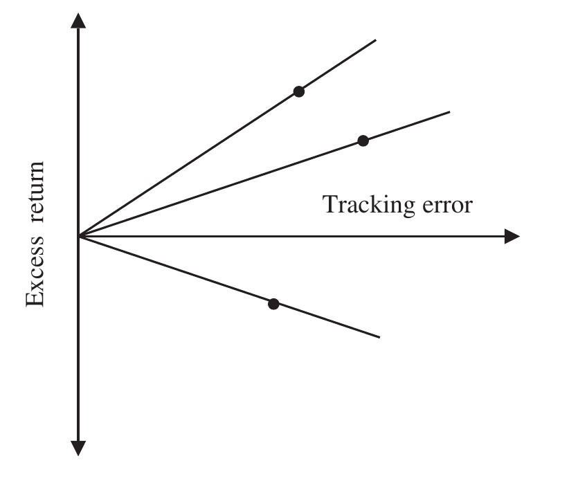

# 5 Risk (continued)

## RELATIVE RISK {#a}

The appraisal measures we have discussed so far are examples of absolute rather than relative risk measures, that is to say the returns and risks of the portfolio and benchmark are calculated separately and then used for comparison.

Relative risk measures, on the other hand, focus on the excess return of the portfolio against the benchmark. The variability of excess return calculated using standard deviation is called tracking error, tracking risk, relative risk or active risk. (At this point I should perhaps introduce "Bacon's law": The more alternative names for a risk statistic or appraisal measure, the more useful it is.)

Tracking error is by far the most common of these terms used in the traditional asset management industry; however, it's probably not the best. The term is also used by the exchange-traded fund (ETF) (An ETF is an investment fund traded on stock exchanges. Most ETFs are designed to "track" a specific index.) industry in particular and passive asset managers in general, but it means something slightly different. In the context of ETFs, the tracking error is the difference in the ETF's return from the index the fund is intending to track. Any difference is of course an error, so in this context the language "tracking error" makes sense. In the context of the volatility of excess return the language is less convincing.

> **Note**
>
> I prefer the term *relative risk*, rather than *tracking error*.
>
> **⚠ Caution**
>
> Of course, in isolation, low tracking error is not necessarily a good thing; it is a measure of consistency and might imply consistent underperformance.

### Tracking error (or tracking risk, relative risk, active risk) {#b}

Tracking error is often forecast and since the calculation methods and meaning are quite different it is essential to clearly label whether you are using an ex-post or ex-ante tracking error.

$$\text{Tracking error } \sigma_A = \sqrt{\frac{\sum_{i=1}^{i=n}(a_i - \overline{a})^2}{n}} \tag{5.27}$$

where:

- $\sigma_A$ = ex-post tracking error of arithmetic excess return
- $a_i$ = arithmetic excess return in month $i$, $(r_i - b_i)$
- $\overline{a}$ = mean arithmetic excess return

Or, if you prefer geometric excess returns:

$$\text{Tracking error } \sigma_G = \sqrt{\frac{\sum_{i=1}^{i=n}(g_i - \overline{g})^2}{n}} \tag{5.28}$$

where:

- $\sigma_G$ = ex-post tracking of geometric excess return
- $g_i$ = geometric excess return in month $i$, $\left(\frac{1 + r_i}{1 + b_i}\right) - 1$
- $\overline{g}$ = mean of geometric excess returns

The arithmetic subtraction of continuously compounded or log returns is equivalent to the geometric excess of simple returns. Therefore, the geometric excess return is equivalent to the continuously compounded arithmetic difference and is thus more appropriate for use in a statistical context.

### Information ratio {#c}

In exactly the same way we compared absolute return and absolute risk in the Sharpe ratio, you can compare excess return and tracking error (the standard deviation of excess return) graphically (see Figure 5.11).

The information ratio is similar to the Sharpe ratio except that instead of absolute return on the vertical axis we have excess return, and instead of absolute risk on the horizontal axis we have tracking error or relative risk, the standard deviation of excess return.

We have no need for a risk-free rate since we are dealing with excess returns; the natural starting point is the benchmark. The information ratio lines, therefore, must always originate from the origin. The gradient of the line is simply the ratio of excess return and tracking error as follows:

$$\text{Information ratio IR}_A = \frac{\widetilde{a}}{\widetilde{\sigma}_A} = \frac{\text{Annualised excess return}}{\text{Annualised tracking error}} \tag{5.29}$$

where:

- $\text{IR}_A$ = information ratio using arithmetic excess return
- $\widetilde{a}$ = annualised arithmetic excess return
- $\widetilde{\sigma}_A$ = annualised ex-post tracking error of arithmetic excess return

The information ratio is directly related to the revised Sharpe ratio, simply replacing the risk-free rate with the benchmark.

**Figure 5.11** Information ratio

### Geometric information ratio {#d}

Using geometric excess returns we get the geometric information ratio:

$$\text{Information ratio IR}_G = \frac{\widetilde{g}}{\widetilde{\sigma}_G} \tag{5.30}$$

where:

- $\widetilde{g}$ = annualised geometric excess return
- $\widetilde{\sigma}_G$ = annualised ex-post tracking error of geometric excess return

Normally information ratios are calculated using annualised excess returns and annualised tracking errors. To aid comparison it is absolutely essential to disclose the method of calculation, i.e., frequency of data, overall time period, arithmetic or geometric excess returns, arithmetic or geometric means, population or sample ($n$ or $n - 1$), ex-post or ex-ante, simple or continuously compounded returns.

> **⚠ Caution**
>
> When comparing information ratios, it is important to ensure that they are calculated using the same methodology and the same type of data.
>
> **Note**
>
> For the record, my preference is monthly data, over three years, using the geometric excess return, assuming a full population, calculated ex-post using simple returns — monthly returns because month-end valuations are typically of better quality and daily data can be a bit noisy, three years is long enough with monthly data to be statistically significant and short enough to reflect recent history, full population not a sample because we know the exact mean of the population we are analysing and using simple returns because they are commonly used and in truth we have bigger problems with the data than whether or not to use simple or continuously compounded returns.

If ex-ante tracking errors are used in the denominator, please remember that it is only a forecast based on a current snapshot of the portfolio. The portfolio manager will be able to "window dress" ("Window dressing" refers to actions taken by a portfolio manager prior to publication of portfolio information in order to (temporarily or artificially) improve the appearance of that information.) the portfolio by reducing any "bets" at the point of measurement, thus reducing the forecast tracking error and therefore apparently improving the information ratio.

> **Note**
>
> Information ratio is a key statistic, used extensively by institutional asset managers; it's often described as the measure of a portfolio manager's skill. Called the information ratio because it holds so much information, like many financial statistics it is borrowed from other industries. Engineers might recognise it as the "signal-to-noise" ratio.

Views vary on what constitutes a good information ratio. In his research commentary, Thomas Goodwin (Goodwin, "The Information Ratio: More Than You Ever Wanted to Know About One Performance Measure" (1998).) quotes Grinold and Kahn (Grinold and Kahn, *Active Portfolio Management* (1999).) stating that an information ratio of 0.5 is good, 0.75 is very good and 1.0 is exceptional; there is ample evidence to suggest that anything substantially above 1.0 is unsustainable or fraudulent. These numbers certainly accord with my personal experience if sustained over a substantial period (three to five years). Clearly a positive information ratio indicates outperformance and a negative information ratio indicates underperformance. Unlike the Sharpe ratio there is more consensus that if you are going to underperform, consistent underperformance (as indicated by a low tracking error) is worse than inconsistent underperformance (high tracking error).

It is quite easy to obtain a good information ratio for a single period; like all statistics the development of the information ratio should be viewed over time. Goodwin suggests that sustaining a high information ratio above 0.5 is more difficult than Grinold and Kahn suggest.

> **Note**
>
> You are likely to be statistically confident (i.e., reject the null hypothesis that the asset manager is not skilful) if the information ratio is sustained at 1.0 for 4 years, 0.75 for 7 years, and 0.5 for 16 years.

Of course, this statistic is most useful in measuring the performance of portfolios that are specifically required to outperform a benchmark.

Tracking error and information ratios are calculated in Exhibit 5.9 using standard example arithmetic data from Table 5.9 and geometric data from Table 5.10.

### Exhibit 5.9 Arithmetic and geometric information ratios {#e}

**Arithmetic tracking error:**

$$\sigma_A = \sqrt{\frac{\sum_{i=1}^{i=n}(a_i - \overline{a})^2}{n}} = \sqrt{\frac{4.36}{36}} = 0.348\%$$

Annualised arithmetic tracking error $\widetilde{\sigma}_A = \sqrt{12} \times 0.348\% = 1.21\%$

Annualised portfolio return $\widetilde{r} = 13.29\%$

Annualised benchmark return $\widetilde{b} = 14.62\%$

Annualised arithmetic excess return $\widetilde{a} = 13.29\% - 14.62\% = -1.33\%$

$$\text{Information ratio IR}_A = \frac{\widetilde{a}}{\widetilde{\sigma}_A} = \frac{-1.33\%}{1.21\%} = -1.1$$

**Geometric tracking error:**

$$\sigma_G = \sqrt{\frac{\sum_{i=1}^{i=n}(g_i - \overline{g})^2}{n}} = \sqrt{\frac{4.24}{36}} = 0.343\%$$

Annualised geometric tracking error $\widetilde{\sigma}_G = \sqrt{12} \times 0.343\% = 1.19\%$

Annualised geometric excess return $\widetilde{g} = \left(\frac{1 + \widetilde{r}}{1 + \widetilde{b}}\right) - 1 = \left(\frac{1.1329}{1.1462}\right) - 1 = -1.16\%$

$$\text{Geometric information ratio IR}_G = \frac{\widetilde{g}}{\widetilde{\sigma}_G} = \frac{-1.16\%}{1.19\%} = -0.98$$

**Table 5.9 Information ratio arithmetic excess return**

| Portfolio monthly return (%) $r_i$ | Benchmark monthly return (%) $b_i$ | Arithmetic excess return $a_i = r_i - b_i$ | Deviation from average $(a_i - \overline{a})$ | Deviation squared $(a_i - \overline{a})^2$ |
| --- | --- | --- | --- | --- |
| 0.3 | 0.2 | 0.1 | 0.2 | 0.04 |
| 2.6 | 2.5 | 0.1 | 0.2 | 0.04 |
| 1.1 | 1.8 | −0.7 | −0.6 | 0.36 |
| −0.9 | −1.1 | 0.2 | 0.3 | 0.09 |
| 1.4 | 1.4 | 0.0 | 0.1 | 0.01 |
| 2.4 | 2.3 | 0.1 | 0.2 | 0.04 |
| 1.5 | 1.4 | 0.1 | 0.2 | 0.04 |
| 6.6 | 6.5 | 0.1 | 0.2 | 0.04 |
| −1.4 | −1.5 | 0.1 | 0.2 | 0.04 |
| 3.9 | 4.2 | −0.3 | −0.2 | 0.04 |
| −0.5 | −0.3 | −0.2 | −0.1 | 0.01 |
| 8.1 | 8.3 | −0.2 | −0.1 | 0.01 |
| 4.0 | 3.9 | 0.1 | 0.2 | 0.04 |
| −3.7 | −3.8 | 0.1 | 0.2 | 0.04 |
| −6.1 | −6.2 | 0.1 | 0.2 | 0.04 |
| 1.4 | 1.5 | −0.1 | 0.0 | 0.00 |
| −4.9 | −4.8 | −0.1 | 0.0 | 0.00 |
| −2.1 | −2.0 | −0.1 | 0.0 | 0.00 |
| 6.2 | 6.0 | 0.2 | 0.3 | 0.09 |
| 5.8 | 5.6 | 0.2 | 0.3 | 0.09 |
| −6.4 | −6.7 | 0.3 | 0.4 | 0.16 |
| 1.7 | 1.9 | −0.2 | −0.1 | 0.01 |
| −0.4 | −0.3 | −0.1 | 0.0 | 0.00 |
| −0.2 | −0.1 | −0.1 | 0.0 | 0.00 |
| −2.1 | −2.6 | 0.5 | 0.6 | 0.36 |
| 1.1 | 0.7 | 0.4 | 0.5 | 0.25 |
| 4.7 | 4.3 | 0.4 | 0.5 | 0.25 |
| 2.4 | 2.9 | −0.5 | −0.4 | 0.16 |
| 3.3 | 3.8 | −0.5 | −0.4 | 0.16 |
| −0.7 | −0.2 | −0.5 | −0.4 | 0.16 |
| 4.7 | 5.1 | −0.4 | −0.3 | 0.09 |
| 0.6 | 1.4 | −0.8 | −0.7 | 0.49 |
| 1.0 | 1.3 | −0.3 | −0.2 | 0.04 |
| −0.2 | 0.3 | −0.5 | −0.4 | 0.16 |
| 3.4 | 3.4 | 0.0 | 0.1 | 0.01 |
| 1.0 | 2.1 | −1.1 | −1.0 | 1.00 |
| **Total** | | | | **$\sum_{i=1}^{i=n}(a_i - \overline{a})^2 = 4.36$** |

**Table 5.10 Information ratio geometric excess return**

| Portfolio monthly return (%) $r_i$ | Benchmark monthly return (%) $b_i$ | Geometric excess return $g_i = \left(\frac{1 + r_i}{1 + b_i}\right) - 1$ | Deviation from average $(g_i - \overline{g})$ | Deviation squared $(g_i - \overline{g})^2$ |
| --- | --- | --- | --- | --- |
| 0.3 | 0.2 | 0.10 | 0.2 | 0.04 |
| 2.6 | 2.5 | 0.10 | 0.19 | 0.04 |
| 1.1 | 1.8 | −0.69 | −0.59 | 0.35 |
| −0.9 | −1.1 | 0.20 | 0.30 | 0.09 |
| 1.4 | 1.4 | 0.00 | 0.10 | 0.01 |
| 2.4 | 2.3 | 0.10 | 0.19 | 0.04 |
| 1.5 | 1.4 | 0.10 | 0.20 | 0.04 |
| 6.6 | 6.5 | 0.09 | 0.19 | 0.04 |
| −1.4 | −1.5 | 0.10 | 0.20 | 0.04 |
| 3.9 | 4.2 | −0.29 | −0.19 | 0.04 |
| −0.5 | −0.3 | −0.20 | −0.10 | 0.01 |
| 8.1 | 8.3 | −0.18 | −0.09 | 0.01 |
| 4.0 | 3.9 | 0.10 | 0.19 | 0.04 |
| −3.7 | −3.8 | 0.10 | 0.20 | 0.04 |
| −6.1 | −6.2 | 0.11 | 0.20 | 0.04 |
| 1.4 | 1.5 | −0.10 | 0.00 | 0.00 |
| −4.9 | −4.8 | −0.11 | −0.01 | 0.00 |
| −2.1 | −2.0 | −0.10 | −0.01 | 0.00 |
| 6.2 | 6.0 | 0.19 | 0.29 | 0.08 |
| 5.8 | 5.6 | 0.19 | 0.29 | 0.08 |
| −6.4 | −6.7 | 0.32 | 0.42 | 0.17 |
| 1.7 | 1.9 | −0.20 | −0.10 | 0.01 |
| −0.4 | −0.3 | −0.10 | 0.00 | 0.00 |
| −0.2 | −0.1 | −0.10 | 0.00 | 0.00 |
| −2.1 | −2.6 | 0.51 | 0.61 | 0.37 |
| 1.1 | 0.7 | 0.40 | 0.49 | 0.24 |
| 4.7 | 4.3 | 0.38 | 0.48 | 0.23 |
| 2.4 | 2.9 | −0.49 | −0.39 | 0.15 |
| 3.3 | 3.8 | −0.48 | −0.38 | 0.15 |
| −0.7 | −0.2 | −0.50 | −0.40 | 0.16 |
| 4.7 | 5.1 | −0.38 | −0.28 | 0.08 |
| 0.6 | 1.4 | −0.79 | −0.69 | 0.48 |
| 1.0 | 1.3 | −0.30 | −0.20 | 0.04 |
| −0.2 | 0.3 | −0.50 | −0.40 | 0.16 |
| 3.4 | 3.4 | 0.00 | 0.10 | 0.01 |
| 1.0 | 2.1 | −1.08 | −0.98 | 0.96 |
| **Total** | | | | **$\sum_{i=1}^{i=n}(g_i - \overline{g})^2 = 4.24$** |

### Modified information ratio {#f}

Some commentators would suggest that negative Sharpe and information ratios have no value, pointing out that if performance is negative the respective ratios actually reward higher variability and higher tracking error. While it's true that negative Sharpe and information ratios require a more nuanced interpretation, I disagree that they provide no value. It seems self-evident, to me at least, that if you are going to underperform it is better to underperform inconsistently rather than underperform consistently.

The modified information ratio suggested by Israelson (Israelson, "A Refinement to the Sharpe Ratio and Information Ratio" (2005).) adjusts the information ratio to ensure that higher tracking errors are always penalised:

$$\text{Modified information ratio MIR}_A = \frac{\widetilde{a}}{\widetilde{\sigma}_A^{\frac{\widetilde{a}}{|\widetilde{a}|}}} \tag{5.31}$$

For negative excess return, Equation 5.31 means that the excess return is multiplied by the tracking error rather than divided as in the unmodified information ratio.

$$\text{Modified information ratio (negative returns) MIR}_A^{-} = \widetilde{a} \times \widetilde{\sigma}_A \tag{5.32}$$

Obviously for geometric excess returns:

$$\text{Modified information ratio MIR}_G = \frac{\widetilde{g}}{\widetilde{\sigma}_G^{\frac{\widetilde{g}}{|\widetilde{g}|}}} \tag{5.33}$$

and for negative geometric excess return:

$$\text{Modified information ratio (negative returns) MIR}_G^{-} = \widetilde{g} \times \widetilde{\sigma}_G \tag{5.34}$$
