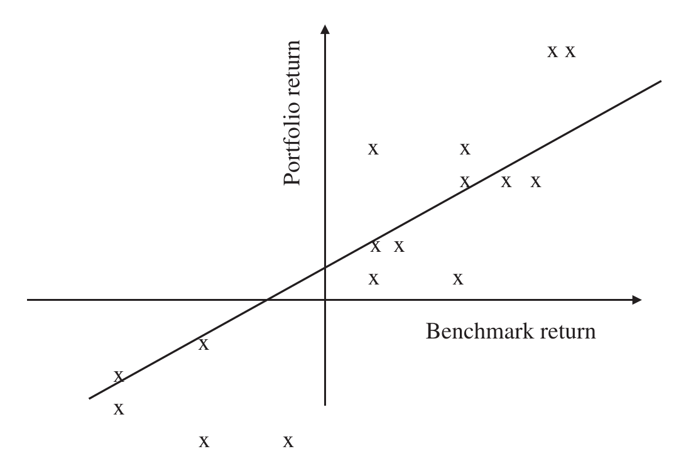
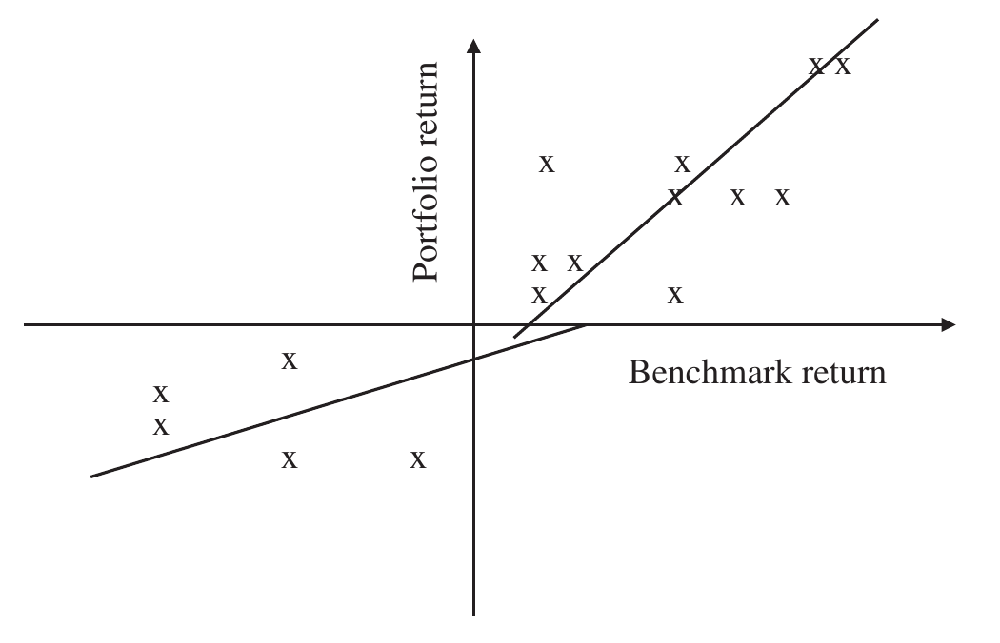
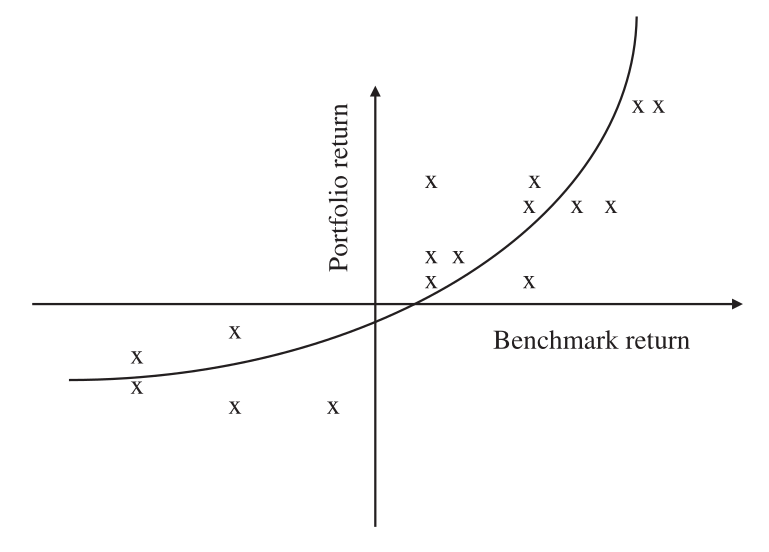
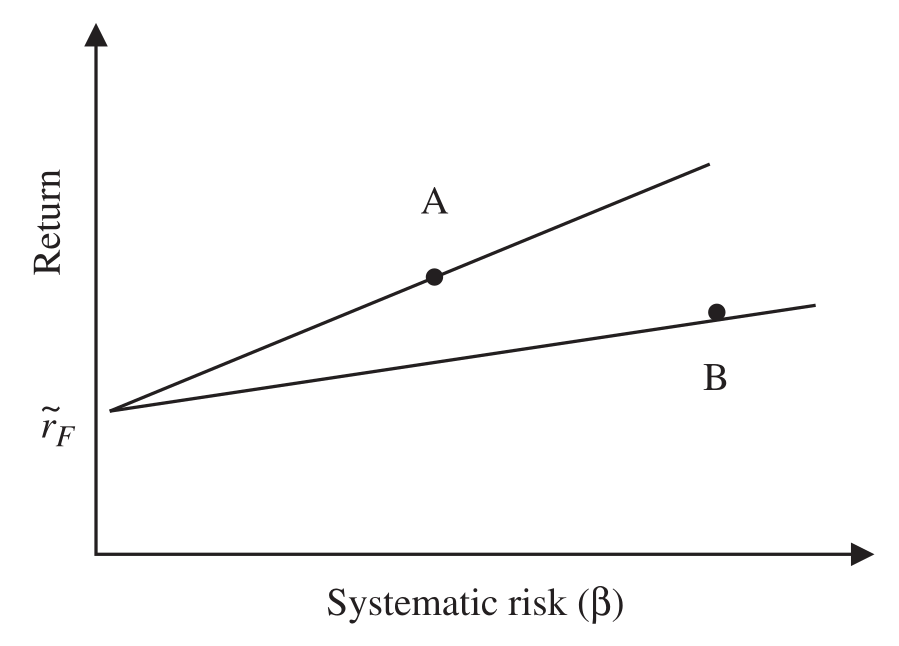
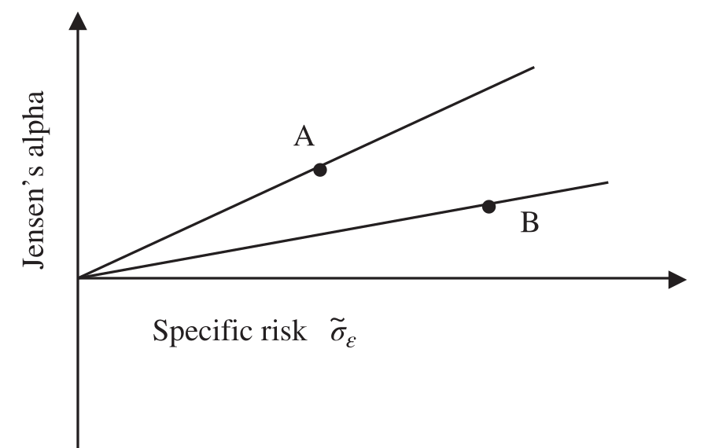

# 5 Risk (continued)

## REGRESSION ANALYSIS {#a}

Regression analysis is a statistical tool used for the investigation of relationships between variables. Regression analysis with a single explanatory variable is termed simple regression and multiple regression is a technique that allows additional factors to enter the analysis separately so that the effect of each can be estimated.

We can gain further information from a portfolio by plotting the portfolio returns against the corresponding benchmark returns in a scatter diagram; see Figure 5.12.

We might expect portfolio returns to move in line with benchmark returns. If so, we can draw a line of best fit through these points, the aim of which is to minimise the (squares of) vertical distances of any one point from this line.

### Regression equation {#b}

The formula of any straight line on a graph is given by the slope or gradient of the line plus the intercept with the vertical axis. Thus, the return of the portfolio might be described as:

$$r = \alpha_R + \beta_R \times b + \varepsilon_R \tag{5.35}$$

This equation is called the regression equation. The term *regression* was first coined by Francis Galton (Galton, "Kinship and Correlation" (reprinted 1989).) in the nineteenth century to describe the biological phenomenon of the heights of tall ancestors to *regress* down toward a more normal average.

### Regression alpha {#c}

The regression *alpha*, $\alpha_R$, is the intercept of the regression equation with the vertical axis:

$$\text{Regression alpha } \alpha_R = \bar{r} - \beta_R \times \bar{b} \tag{5.36}$$

### Regression beta {#d}

The regression *beta*, $\beta_R$, is the slope or gradient of the regression equation.

The slope of the regression equation is given by:

$$\beta_R = \frac{\displaystyle\sum_{i=1}^{i=n}[(r_i - \bar{r}) \times (b_i - \bar{b})]}{\displaystyle\sum_{i=1}^{i=n}(b_i - \bar{b})^2} = \frac{\text{Covariance}}{\sigma_b^2} \tag{5.37}$$

### Regression epsilon {#e}

The regression *epsilon*, $\varepsilon_R$, is an error term measuring the vertical distance between the return predicted by the equation and the real result.

$$\text{Regression epsilon } \varepsilon_{Ri} = r_i - \alpha_{Ri} - \beta_R \times b_i \tag{5.38}$$

The regression alpha and beta for the standard portfolio and benchmark data calculated in Exhibit 5.2 and Exhibit 5.6 are calculated in Exhibit 5.10.

### Exhibit 5.10 Regression alpha and beta {#f}

$$\text{Covariance} = \frac{\displaystyle\sum_{i=1}^{i=n}(r_i - \bar{r}) \times (b_i - \bar{b})}{n} = \frac{399.37\%}{36} = 11.09\%$$

$$\text{Benchmark variance } \sigma_b^2 = \frac{\displaystyle\sum_{i=1}^{i=n}(b_i - \bar{b})^2}{n} = \frac{406.92\%}{36} = 11.30\%$$

Regression beta

$$\beta_R = \frac{\displaystyle\sum_{i=1}^{i=n}[(r_i - \bar{r}) \times (b_i - \bar{b})]}{\displaystyle\sum_{i=1}^{i=n}(b_i - \bar{b})^2} = \frac{\text{Covariance}}{\sigma_b^2} = \frac{11.09\%}{11.30\%} = 0.9814$$

$$\text{Regression alpha } \alpha_R = \bar{r} - \beta_R \times \bar{b} = 1.1\% - 0.9814 \times 1.2\% = -0.078\%$$

### Capital asset pricing model (CAPM) {#g}

The capital asset pricing model (CAPM) links expected return with systematic risk. CAPM was published by Sharpe in 1964 (Sharpe, "Capital Asset Prices: A Theory of Market Equilibrium under Conditions of Risk" (1964).) and states that the expected return of the portfolio is:

$$r = r_F + \beta \times (b - r_F) \tag{5.39}$$

CAPM starts with the risk-free rate $r_F$, however described, to which is added the premium $(b - r_F)$ multiplied by volatility $\beta$ or systematic risk.

The CAPM model in Equation 5.39 describes theoretical return. Any return above this theoretical return, the intercept with the vertical access, is alpha and is the result of specific risk. Incorporating the risk-free rate, we can use the following revised regression equation to calculate beta and a new alpha (Jensen's alpha). (M. Jensen, "The Performance of Mutual Funds in the Period 1945–1964" (1968).)

$$r - r_F = \alpha + \beta \times (b - r_F) + \varepsilon \tag{5.40}$$

> **⚠ Caution**
>
> You may have noticed the underlying assumption of linearity in the CAPM. While some portfolios exhibit a linear relationship with their benchmarks (especially index tracking funds), many portfolios do not. This is a significant source of criticism of the CAPM and its biggest limitation.

### Beta ($\beta$) (systematic risk or volatility) {#h}

*Beta* was originally described as volatility and in some quarters may still be called volatility but these days volatility is more likely to refer to standard deviation, which is a real shame because I prefer the term variability in the context of standard deviation.

In the context of the CAPM model we should compare the excess return of the portfolio against the risk-free rate with the excess return of benchmark against the same risk-free rate as follows:

$$\beta = \frac{\displaystyle\sum_{i=1}^{i=n}\left[\left((r_i - r_{Fi}) - (\bar{r} - \bar{r}_F)\right) \times \left((b_i - r_{Fi}) - (\bar{b} - \bar{r}_F)\right)\right]}{\displaystyle\sum_{i=1}^{i=n}\left((b_i - r_{Fi}) - (\bar{b} - \bar{r}_F)\right)^2} \tag{5.41}$$

where:

$\widetilde{r}_F$ = mean risk-free rate

$r_{Fi}$ = risk-free rate in month $i$

$\bar{b}$ = mean benchmark return

The result will be not too different from the regression beta (and indeed regression betas are often calculated because calculating the CAPM beta is perhaps a little tedious for little added value, particularly in a low-interest-rate environment), but technically we should consider the risk-free rate.

### Jensen's alpha (Jensen's measure or Jensen's differential return or ex-post alpha) {#i}

Jensen's alpha is the intercept of the regression equation in the capital asset pricing model and is in effect the excess return adjusted for systematic risk.

Ignoring the error term for ex-post calculations and using Equation 5.40:

$$\text{Jensen's alpha } \alpha = \bar{r} - \bar{r}_F - \beta \times (\bar{b} - \bar{r}_F) \tag{5.42}$$

Portfolio managers often talk in terms of alpha to describe their added value; rarely are they referring to either the regression or even Jensen's alpha. In all probability they are referring to their excess return above the benchmark. Confusingly, academics also frequently refer to excess return as the return above the risk-free rate.

In fact, both these terms are frequently abused; beta is often used by the financial media and portfolio managers alike to describe market returns when of course it is in fact the systematic risk relative to the market.

Due to the rise of passive investments, this changing terminology has become even more frequent. Today, beta is often used to indicate passive investment returns that take no skill to generate while alpha is used to indicate manager skill, justifying the fees charged by active managers.

Subtracting the benchmark return from both sides of Equation 5.39 we can see that the arithmetic excess return can be expressed by:

$$r - b = \alpha + (\beta - 1) \times (b - r_F) \tag{5.43}$$

Note that $b = r_F + (b - r_F)$

### Annualised alpha {#j}

The alpha calculated in the regression equations is linked to the periodicity of the underlying data.

The annualised alpha can be calculated directly from annualised data as follows:

$$\text{Annualised regression alpha } \widetilde{\sigma}_R = \widetilde{r} - \beta_R \times \widetilde{b} \tag{5.44}$$

$$\text{Annualised Jensen's alpha } \widetilde{\alpha} = \widetilde{r} - \widetilde{r}_F - \beta(\widetilde{b} - \widetilde{r}_F) \tag{5.45}$$

Alternatively, and less accurately, alpha can be annualised either by multiplying by the periodicity of the data or by taking the power of the periodicity as follows:

$$\widetilde{\alpha} = t \times \alpha \tag{5.46}$$

or

$$\widetilde{\alpha} = (1 + \alpha)^t - 1 \tag{5.47}$$

Revised CAPM beta and Jensen's alpha are calculated in Exhibit 5.11 using data from Table 5.12 and Table 5.13. For completeness, the underlying data required to calculate the variability of portfolio returns above the risk-free rate is shown in Table 5.11.

### Exhibit 5.11 CAPM beta and Jensen's alpha {#k}

$$\text{Beta } \beta = \frac{\displaystyle\sum_{i=1}^{i=n}\left[\left((r_i - r_{Fi}) - (\bar{r} - \bar{r}_F)\right) \times \left((b_i - r_{Fi}) - (\bar{b} - \bar{r}_F)\right)\right]}{\displaystyle\sum_{i=1}^{i=n}\left((b_i - r_{Fi}) - (\bar{b} - \bar{r}_F)\right)^2} = \frac{398.66}{406.06} = 0.982$$

$$\text{Jensen's alpha} = \alpha = \bar{r} - \bar{r}_F - \beta \times (\bar{b} - \bar{r}_F) = 0.9 - 0.982 \times 1.0 = -0.082$$

**Table 5.11** Portfolio excess return variability

| Portfolio monthly return (%) $r_i$ | Risk-free rate (%) $r_{Fi}$ | Excess return $(r_i - r_{Fi})$ | Deviation $(r_i - r_{Fi}) - (\bar{r} - \bar{r}_F)$ | Deviation squared $[(r_i - r_{Fi}) - (\bar{r} - \bar{r}_F)]^2$ |
| --- | --- | --- | --- | --- |
| 0.3 | 0.1 | 0.8 | −0.7 | 0.49 |
| 2.6 | 0.1 | 1.5 | 1.6 | 2.56 |
| 1.1 | 0.2 | 0.0 | 0.0 | 0.00 |
| −0.9 | 0.2 | 2.0 | −2.0 | 4.00 |
| 1.4 | 0.2 | 0.3 | 0.3 | 0.09 |
| 2.4 | 0.2 | 1.3 | 1.3 | 1.69 |
| 1.5 | 0.2 | 0.4 | 0.4 | 0.16 |
| 6.6 | 0.3 | 5.5 | 5.4 | 29.16 |
| −1.4 | 0.3 | 2.5 | −2.6 | 6.76 |
| 3.9 | 0.4 | 2.8 | 2.6 | 6.76 |
| −0.5 | 0.4 | 1.6 | −1.8 | 3.24 |
| 8.1 | 0.3 | 7.0 | 6.9 | 47.61 |
| 4.0 | 0.3 | 2.9 | 2.8 | 7.84 |
| −3.7 | 0.3 | 4.8 | −4.9 | 24.01 |
| −6.1 | 0.3 | 7.2 | −7.3 | 53.29 |
| 1.4 | 0.4 | 0.3 | 0.1 | 0.01 |
| −4.9 | 0.2 | 6.0 | −6.0 | 36.00 |
| −2.1 | 0.2 | 3.2 | −3.2 | 10.24 |
| 6.2 | 0.2 | 5.1 | 5.1 | 26.01 |
| 5.8 | 0.1 | 4.7 | 4.8 | 23.04 |
| −6.4 | 0.1 | 7.5 | −7.4 | 54.76 |
| 1.7 | 0.1 | 0.6 | 0.7 | 0.49 |
| −0.4 | 0.1 | 1.5 | −1.4 | 1.96 |
| −0.2 | 0.1 | 1.3 | −1.2 | 1.44 |
| −2.1 | 0.1 | 3.2 | −3.1 | 9.61 |
| 1.1 | 0.1 | 0.0 | 0.1 | 0.01 |
| 4.7 | 0.1 | 3.6 | 3.7 | 13.69 |
| 2.4 | 0.1 | 1.3 | 1.4 | 1.96 |
| 3.3 | 0.1 | 2.2 | 2.3 | 5.29 |
| −0.7 | 0.2 | 1.8 | −1.8 | 3.24 |
| 4.7 | 0.2 | 3.6 | 3.6 | 12.96 |
| 0.6 | 0.2 | 0.5 | −0.5 | 0.25 |
| 1.0 | 0.2 | 0.1 | −0.1 | 0.01 |
| −0.2 | 0.2 | 1.3 | −1.3 | 1.69 |
| 3.4 | 0.2 | 2.3 | 2.3 | 5.29 |
| 1.0 | 0.2 | 0.1 | −0.1 | 0.01 |
| | | **Total** $\displaystyle\sum_{i=1}^{i=n}(r_i - r_{Fi}) = 32.4$ | | **Total 395.62** |

$$(\bar{r} - \bar{r}_F) = \frac{32.4}{36} = 0.9$$

**Table 5.12** Benchmark excess return variability

| Benchmark monthly return (%) $b_i$ | Risk-free rate (%) $r_{Fi}$ | Excess return $(b - r_{Fi})$ | Deviation $(b_i - r_{Fi}) - (\bar{b} - \bar{r}_F)$ | Deviation squared $[(b_i - r_{Fi}) - (\bar{b} - \bar{r}_F)]^2$ |
| --- | --- | --- | --- | --- |
| 0.2 | 0.1 | 0.1 | −0.9 | 0.81 |
| 2.5 | 0.1 | 2.4 | 1.4 | 1.96 |
| 1.8 | 0.2 | 1.6 | 0.6 | 0.36 |
| −1.1 | 0.2 | −1.3 | −2.3 | 5.29 |
| 1.4 | 0.2 | 1.2 | 0.2 | 0.04 |
| 2.3 | 0.2 | 2.1 | 1.1 | 1.21 |
| 1.4 | 0.2 | 1.2 | 0.2 | 0.04 |
| 6.5 | 0.3 | 6.2 | 5.2 | 27.04 |
| −1.5 | 0.3 | −1.8 | −2.8 | 7.84 |
| 4.2 | 0.4 | 3.8 | 2.8 | 7.84 |
| −0.3 | 0.4 | −0.7 | −1.7 | 2.89 |
| 8.3 | 0.3 | 8.0 | 7.0 | 49.00 |
| 3.9 | 0.3 | 3.6 | 2.6 | 6.76 |
| −3.8 | 0.3 | −4.1 | −5.1 | 26.01 |
| −6.2 | 0.3 | −6.5 | −7.5 | 56.25 |
| 1.5 | 0.4 | 1.1 | 0.1 | 0.01 |
| −4.8 | 0.2 | −5.0 | −6.0 | 36.00 |
| −2.0 | 0.2 | −2.2 | −3.2 | 10.24 |
| 6.0 | 0.2 | 5.8 | 4.8 | 23.04 |
| 5.6 | 0.1 | 5.5 | 4.5 | 20.25 |
| −6.7 | 0.1 | −6.8 | −7.8 | 60.84 |
| 1.9 | 0.1 | 1.8 | 0.8 | 0.64 |
| −0.3 | 0.1 | −0.4 | −1.4 | 1.96 |
| −0.1 | 0.1 | −0.2 | −1.2 | 1.44 |
| −2.6 | 0.1 | −2.7 | −3.7 | 13.69 |
| 0.7 | 0.1 | 0.6 | −0.4 | 0.16 |
| 4.3 | 0.1 | 4.2 | 3.2 | 10.24 |
| 2.9 | 0.1 | 2.8 | 1.8 | 3.24 |
| 3.8 | 0.1 | 3.7 | 2.7 | 7.29 |
| −0.2 | 0.2 | −0.4 | −1.4 | 1.96 |
| 5.1 | 0.2 | 4.9 | 3.9 | 15.21 |
| 1.4 | 0.2 | 1.2 | 0.2 | 0.04 |
| 1.3 | 0.2 | 1.1 | 0.1 | 0.01 |
| 0.3 | 0.2 | 0.1 | −0.9 | 0.81 |
| 3.4 | 0.2 | 3.2 | 2.2 | 4.84 |
| 2.1 | 0.2 | 1.9 | 0.9 | 0.81 |
| | | **Total** $\displaystyle\sum_{i=1}^{i=n}(b_i - r_{Fi}) = 36.0$ | | **Total 406.06** |

$$(\bar{b} - \bar{r}_F) = \frac{36.0}{36} = 1.0$$

**Table 5.13** CAPM covariance

| Portfolio monthly excess return (%) $(r_i - r_{Fi})$ | Deviation from average $(r_i - r_{Fi}) - (\bar{r} - \bar{r}_F)$ | Benchmark monthly excess return (%) $(b - r_{Fi})$ | Deviation from average $(b_i - r_{Fi}) - (\bar{b} - \bar{r}_F)$ | Portfolio deviation × Benchmark deviation |
| --- | --- | --- | --- | --- |
| 0.2 | −0.7 | 0.10 | −0.9 | 0.63 |
| 2.5 | 1.6 | 2.40 | 1.4 | 2.24 |
| 0.9 | 0.0 | 1.60 | 0.6 | 0.00 |
| −1.1 | −2.0 | −1.30 | −2.3 | 4.60 |
| 1.2 | 0.3 | 1.20 | 0.2 | 0.06 |
| 2.2 | 1.3 | 2.10 | 1.1 | 1.43 |
| 1.3 | 0.4 | 1.20 | 0.2 | 0.08 |
| 6.3 | 5.4 | 6.20 | 5.2 | 28.08 |
| −1.7 | −2.6 | −1.80 | −2.8 | 7.28 |
| 3.5 | 2.6 | 3.80 | 2.8 | 7.28 |
| −0.9 | −1.8 | −0.70 | −1.7 | 3.06 |
| 7.8 | 6.9 | 8.00 | 7.0 | 48.30 |
| 3.7 | 2.8 | 3.60 | 2.6 | 7.28 |
| −4.0 | −4.9 | −4.10 | −5.1 | 24.99 |
| −6.4 | −7.3 | −6.50 | −7.5 | 54.75 |
| 1.0 | 0.1 | 1.10 | 0.1 | 0.01 |
| −5.1 | −6.0 | −5.00 | −6.0 | 36.00 |
| −2.3 | −3.2 | −2.20 | −3.2 | 10.24 |
| 6.0 | 5.1 | 5.80 | 4.8 | 24.48 |
| 5.7 | 4.8 | 5.50 | 4.5 | 21.60 |
| −6.5 | −7.4 | −6.80 | −7.8 | 57.72 |
| 1.6 | 0.7 | 1.80 | 0.8 | 0.56 |
| −0.5 | −1.4 | −0.40 | −1.4 | 1.96 |
| −0.3 | −1.2 | −0.20 | −1.2 | 1.44 |
| −2.2 | −3.1 | −2.70 | −3.7 | 11.47 |
| 1.0 | 0.1 | 0.60 | −0.4 | −0.04 |
| 4.6 | 3.7 | 4.20 | 3.2 | 11.84 |
| 2.3 | 1.4 | 2.80 | 1.8 | 2.52 |
| 3.2 | 2.3 | 3.70 | 2.7 | 6.21 |
| −0.9 | −1.8 | −0.40 | −1.4 | 2.52 |
| 4.5 | 3.6 | 4.90 | 3.9 | 14.04 |
| 0.4 | −0.5 | 1.20 | 0.2 | −0.10 |
| 0.8 | −0.1 | 1.10 | 0.1 | −0.01 |
| −0.4 | −1.3 | 0.10 | −0.9 | 1.17 |
| 3.2 | 2.3 | 3.20 | 2.2 | 5.06 |
| 0.8 | −0.1 | 1.90 | 0.9 | −0.09 |
| | | | | **Total 398.66** |

### Bull beta ($\beta^+$) {#l}

We need not restrict ourselves to fitting lines of best fit to all benchmark (or market) returns, both positive and negative. If we calculate a regression for only positive benchmark returns, we gain information on the behaviour of the portfolio in positive or "bull" markets.

### Bear beta ($\beta^-$) {#m}

The beta for negative benchmark (or market) returns is described as the "bear" beta.

> **Note**
>
> Bull and bear betas are useful if you believe some stocks have persistently different betas depending on the direction of the market.

### Beta timing ratio {#n}

Ideally, we would prefer a portfolio manager with a beta greater than 1 in rising markets and less than 1 in falling markets. In all likelihood such a manager would be a good timer of asset allocation decisions. Figure 5.13 demonstrates these two lines of best fit with a steeper gradient for positive benchmark returns than for negative benchmark returns. One measure of this desirable property of convexity would be the beta timing ratio.

$$\text{Beta timing ratio} = \frac{\beta^+}{\beta^-} \tag{5.48}$$

Bull and bear betas and the beta timing ratio are calculated from the data in Tables 5.14, 5.15 and 5.16 in Exhibit 5.12.

### Exhibit 5.12 Beta timing ratio {#o}

$$\text{Bull beta } \beta^+ = \frac{104.17}{100.62} = 1.035$$

$$\text{Bear beta } \beta^- = \frac{59.11}{62.34} = 0.948$$

$$\text{Beta timing ratio} = \frac{\beta^+}{\beta^-} = \frac{1.035}{0.948} = 1.092$$

**Table 5.14** Bull and bear deviations

| Benchmark monthly excess return | Bull deviation | Bull deviation squared | Bear deviation | Bear deviation squared |
| --- | --- | --- | --- | --- |
| 0.10 | −2.74 | 7.49 | | |
| 2.40 | −0.44 | 0.19 | | |
| 1.60 | −1.24 | 1.53 | | |
| −1.30 | | | 1.38 | 1.89 |
| 1.20 | −1.64 | 2.68 | | |
| 2.10 | −0.74 | 0.54 | | |
| 1.20 | −1.64 | 2.68 | | |
| 6.20 | 3.36 | 11.31 | | |
| −1.80 | | | 0.87 | 0.77 |
| 3.80 | 0.96 | 0.93 | | |
| −0.70 | | | 1.98 | 3.90 |
| 8.00 | 5.16 | 26.65 | | |
| 3.60 | 0.76 | 0.58 | | |
| −4.10 | | | −1.43 | 2.03 |
| −6.50 | | | −3.83 | 14.63 |
| 1.10 | −1.74 | 3.02 | | |
| −5.00 | | | −2.33 | 5.41 |
| −2.20 | | | 0.47 | 0.23 |
| 5.80 | 2.96 | 8.78 | | |
| 5.50 | 2.66 | 7.09 | | |
| −6.80 | | | −4.13 | 17.02 |
| 1.80 | −1.04 | 1.08 | | |
| −0.40 | | | 2.28 | 5.18 |
| −0.20 | | | 2.48 | 6.13 |
| −2.70 | | | −0.03 | 0.00 |
| 0.60 | −2.24 | 5.01 | | |
| 4.20 | 1.36 | 1.86 | | |
| 2.80 | −0.04 | 0.00 | | |
| 3.70 | 0.86 | 0.74 | | |
| −0.40 | | | 2.28 | 5.18 |
| 4.90 | 2.06 | 4.25 | | |
| 1.20 | −1.64 | 2.68 | | |
| 1.10 | −1.74 | 3.02 | | |
| 0.10 | −2.74 | 7.49 | | |
| 3.20 | 0.36 | 0.13 | | |
| 1.90 | −0.94 | 0.88 | | |
| | **Total 100.62** | | | **Total 62.34** |

**Table 5.15** Bull covariance

| Month | Portfolio monthly excess return | Deviation from average | Benchmark monthly excess return | Deviation from average | Portfolio deviation × Benchmark deviation |
| --- | --- | --- | --- | --- | --- |
| 1 | 0.2 | −2.48 | 0.10 | −2.74 | 6.79 |
| 2 | 2.5 | −0.18 | 2.40 | −0.44 | 0.08 |
| 3 | 0.9 | −1.78 | 1.60 | −1.24 | 2.20 |
| 4 | | | | | |
| 5 | 1.2 | −1.48 | 1.20 | −1.64 | 2.42 |
| 6 | 2.2 | −0.48 | 2.10 | −0.74 | 0.35 |
| 7 | 1.3 | −1.38 | 1.20 | −1.64 | 2.26 |
| 8 | 6.3 | 3.62 | 6.20 | 3.36 | 12.18 |
| 9 | | | | | |
| 10 | 3.5 | 0.82 | 3.80 | 0.96 | 0.79 |
| 11 | | | | | |
| 12 | 7.8 | 5.12 | 8.00 | 5.16 | 26.44 |
| 13 | 3.7 | 1.02 | 3.60 | 0.76 | 0.78 |
| 14 | | | | | |
| 15 | | | | | |
| 16 | 1.0 | −1.68 | 1.10 | −1.74 | 2.92 |
| 17 | | | | | |
| 18 | | | | | |
| 19 | 6.0 | 3.32 | 5.80 | 2.96 | 9.84 |
| 20 | 5.7 | 3.02 | 5.50 | 2.66 | 8.04 |
| 21 | | | | | |
| 22 | 1.6 | −1.08 | 1.80 | −1.04 | 1.12 |
| 23 | | | | | |
| 24 | | | | | |
| 25 | | | | | |
| 26 | 1.0 | −1.68 | 0.60 | −2.24 | 3.76 |
| 27 | 4.6 | 1.92 | 4.20 | 1.36 | 2.62 |
| 28 | 2.3 | −0.38 | 2.80 | −0.04 | 0.01 |
| 29 | 3.2 | 0.52 | 3.70 | 0.86 | 0.45 |
| 30 | | | | | |
| 31 | 4.5 | 1.82 | 4.90 | 2.06 | 3.76 |
| 32 | 0.4 | −2.28 | 1.20 | −1.64 | 3.73 |
| 33 | 0.8 | −1.88 | 1.10 | −1.74 | 3.27 |
| 34 | −0.4 | −3.08 | 0.10 | −2.74 | 8.43 |
| 35 | 3.2 | 0.52 | 3.20 | 0.36 | 0.19 |
| 36 | 0.8 | −1.88 | 1.90 | −0.94 | 1.76 |
| | | | | | **Total 104.17** |

**Table 5.16** Bear covariance

| Month | Portfolio monthly excess return | Deviation from average | Benchmark monthly excess return | Deviation from average | Portfolio deviation × Benchmark deviation |
| --- | --- | --- | --- | --- | --- |
| 4 | −1.10 | 1.56 | −1.30 | 1.38 | 2.14 |
| 9 | −1.70 | 0.96 | −1.80 | 0.87 | 0.84 |
| 11 | −0.90 | 1.76 | −0.70 | 1.98 | 3.47 |
| 14 | −4.00 | −1.34 | −4.10 | −1.43 | 1.91 |
| 15 | −6.40 | −3.74 | −6.50 | −3.83 | 14.31 |
| 17 | −5.10 | −2.44 | −5.00 | −2.33 | 5.68 |
| 18 | −2.30 | 0.36 | −2.20 | 0.47 | 0.17 |
| 21 | −6.50 | −3.84 | −6.80 | −4.13 | 15.85 |
| 23 | −0.50 | 2.16 | −0.40 | 2.28 | 4.91 |
| 24 | −0.30 | 2.36 | −0.20 | 2.48 | 5.84 |
| 25 | −2.20 | 0.46 | −2.70 | −0.03 | −0.01 |
| 30 | −0.90 | 1.76 | −0.40 | 2.28 | 4.00 |
| | | | | | **Total 59.11** |

> **Note**
>
> The bull beta need not be greater than 1 to generate a desirable beta timing ratio greater 1, it is sufficient for the bull beta to be greater than the bear beta.

### Market timing {#p}

There are additional methods to calculate market timing skill that utilise multiple regression. Merton and Henriksson (Henriksson and Merton, "On Market Timing and Investment Performance II. Statistical Procedures for Evaluating Forecast Skills" (1981).) performed a multiple regression in which the portfolio excess return is regressed against the benchmark and up-market returns as follows:

$$r - r_F = \alpha_{MH} + \beta_{MH} \times (b - r_F) + \gamma_{MH} \times \max(0, b - r_F) + \varepsilon_{MH} \tag{5.49}$$

where: $\alpha_{MH}$ = intercept or alpha

$\beta_{MH}$ = market sensitivity

$\gamma_{MH}$ = market timing abilities

$\varepsilon_{MH}$ = error term

If $\gamma_{MH}$ is positive, then the portfolio manager is demonstrating good market timing ability.

Treynor and Mazuy (Treynor and Mazuy, "Can Mutual Funds Outguess the Market?" (1966).) also utilised multiple regression to analyse market timing skill with a quadratic extension of the CAPM model. The first term is again the benchmark, and the second term is the value of excess return squared as follows:

$$r - r_F = \alpha_{TM} + \beta_{TM} \times (b - r_F) + \gamma_{TM} \times (b - r_F)^2 + \varepsilon_{TM} \tag{5.50}$$

where: $\alpha_{TM}$ = intercept or alpha

$\beta_{TM}$ = market sensitivity

$\gamma_{TM}$ = market timing abilities

$\varepsilon_{TM}$ = error term

If $\gamma_{TM}$ is positive then the estimated equation describes a convex upward-sloping regression curve demonstrating good market timing skill; see Figure 5.14.

### Systematic risk {#q}

Michael Jensen (Jensen, "Risk, the Pricing of Capital Assets, and the Evaluation of Investment Portfolios" (1960).) described beta as systematic risk. If we multiply beta by market risk, we obtain a measure of systematic risk calculated in the same units as variability. In my view this is a better definition of systematic risk.

$$\text{Systematic risk } \sigma_S = \beta_R \times \sigma_b \tag{5.51}$$

Either the regression or CAPM beta can be used.

### Correlation {#r}

Correlation can also be derived by:

$$\rho_{r,b} = \frac{\text{Systematic risk}}{\text{Total risk}} \tag{5.52}$$

or

$$\rho_{r,b} = \frac{\beta \times \sigma_b}{\sigma}$$

Therefore, beta and correlation are linked by the formula:

$$\beta_R = \rho_{r,b} \times \frac{\sigma}{\sigma_b} \tag{5.53}$$

Correlation measures the variability in the portfolio that is systematic compared to the total variability.

If the correlation is high enough, we can approximate it with 1, leading to:

$$\beta_R \approx \frac{\sigma}{\sigma_b} \tag{5.54}$$

With sufficiently high correlation, a beta above 1 indicates that the portfolio is more volatile than the benchmark and a beta below 1 indicates it is less volatile. Note that this interpretation only holds if the correlation is very close to 1.

### $R^2$ (or coefficient of determination) {#s}

$R^2$ is the proportion of variance in fund returns that is related to the variance of benchmark returns; it is a measure of portfolio diversification. Variance is the square of standard deviation or variability.

The closer $R^2$ is to 1 the more portfolio variance is explained by benchmark variance. A low $R^2$ would indicate that returns are more scattered and would indicate a less reliable line of best fit leading to unstable alphas and betas. Therefore, if a portfolio has a low $R^2$, say much less than 0.7, then any alphas and betas and their derivative statistics should probably be ignored.

> **⚠ Caution**
>
> While alpha and beta are often calculated and quoted in reports, $R^2$ is often left out, possibly because it requires deeper understanding of regressions and statistics or possibly because analysts are concerned that the readers of the report will not know how to interpret $R^2$. In practice, this can lead (and has) to making portfolio decisions based on unsupported measures because of low $R^2$ values. I repeat the earlier warning: the only appropriate thing to do when $R^2$ is lower than about 0.7 is to ignore the associated alpha and beta measure and any appraisal measure derived from them.

$$R^2 = \frac{\sigma_S^2}{\sigma^2} = \frac{\beta_R^2 \times \sigma_b^2}{\sigma^2} = \rho_{r,b}^2 \tag{5.55}$$

$R^2$ in this context is correlation ($\rho$) squared.

Correlation and $R^2$ are calculated in Exhibit 5.13.

### Exhibit 5.13 Correlation and $R^2$ {#t}

$$\text{Correlation } \rho_{r,b} = \frac{\beta_R \times \sigma_b}{\sigma} = \frac{0.981 \times 3.36}{3.32} = 0.995$$

Or

$$\text{Correlation } \rho_{r,b} = \frac{\text{Covariance}}{\sigma \times \sigma_b} = \frac{11.09}{3.32 \times 3.36} = 0.995$$

$$R^2 = \frac{\sigma_S^2}{\sigma^2} = \frac{\beta_R^2 \times \sigma_b^2}{\sigma^2} = 0.989$$

### Specific (or residual) risk {#u}

Residual or specific risk is not attributed to general market movements but is unique to the particular portfolio under consideration. It is represented by the standard deviation of the error term in the regression equation $\sigma_\varepsilon$.

Since specific risk and systematic risk are by definition independent, we can calculate total risk by using Pythagoras's equation: (Formally, in a right-angled triangle: the square of the hypotenuse is equal to the sum of the squares of the other sides. Since specific risk and systematic risk are independent, we can assume a right-angled triangle.)

$$\text{Total risk}^2 = \text{Systematic risk}^2 + \text{Specific risk}^2$$

$$\sigma^2 = \sigma_S^2 + \sigma_\varepsilon^2 = \beta_R^2 \times \sigma_b^2 + \sigma_\varepsilon^2 \tag{5.56}$$

It follows that:

$$\widetilde{\sigma}^2 = \beta_R^2 \times \widetilde{\sigma}_b^2 + \widetilde{\sigma}_\varepsilon^2 \tag{5.57}$$

Rearranging Equation 5.56, specific risk and total risk can be calculated directly from:

$$\sigma_\varepsilon = \sqrt{\sigma^2 - \sigma_S^2} \tag{5.58}$$

$$\sigma = \sqrt{\sigma_S^2 + \sigma_\varepsilon^2} \tag{5.59}$$

Using the data in Table 5.17 we can demonstrate that Equation 5.59 holds for our standard portfolio and benchmark data from Table 5.1 in Exhibit 5.14.

### Exhibit 5.14 Specific risk, systematic risk and total risk {#v}

$$\text{Specific risk } \sigma_\varepsilon = \sqrt{\frac{\displaystyle\sum_{i=1}^{i=n}(\varepsilon_{Ri} - \bar{\varepsilon})^2}{n}} = \sqrt{\frac{\displaystyle\sum_{i=1}^{i=n}\varepsilon_{Ri}^2}{n}} = \sqrt{\frac{4.22}{36}} = 0.34$$

since $\bar{\varepsilon} = 0$

$$\text{Systematic risk } \sigma_S = \beta_R \times \sigma_b = 0.9814 \times 3.36 = 3.30$$

$$\text{Total risk } \sigma = \sqrt{\sigma_s^2 + \sigma_\varepsilon^2} = \sqrt{3.30^2 + 0.34^2} = 3.32$$

And

$$\text{Specific risk } \sigma_\varepsilon = \sqrt{\sigma^2 - \sigma_S^2} = \sqrt{3.32^2 - 3.30^2} = 0.34$$

**Table 5.17** Specific risk

| Portfolio monthly return $r_i$ | Regression residual or error term $\varepsilon_{Ri} = (r_i - \alpha_R - \beta_R \times b_i)$ | Residual squared $\varepsilon_{Ri}^2$ |
| --- | --- | --- |
| 0.3 | 0.18 | 0.03 |
| 2.6 | 0.22 | 0.05 |
| 1.1 | −0.59 | 0.35 |
| −0.9 | 0.26 | 0.07 |
| 1.4 | 0.10 | 0.01 |
| 2.4 | 0.22 | 0.05 |
| 1.5 | 0.20 | 0.04 |
| 6.6 | 0.30 | 0.09 |
| −1.4 | 0.15 | 0.02 |
| 3.9 | −0.14 | 0.02 |
| −0.5 | −0.13 | 0.02 |
| 8.1 | 0.03 | 0.00 |
| 4.0 | 0.25 | 0.06 |
| −3.7 | 0.11 | 0.01 |
| −6.1 | 0.06 | 0.00 |
| 1.4 | 0.01 | 0.00 |
| −4.9 | −0.11 | 0.01 |
| −2.1 | −0.06 | 0.00 |
| 6.2 | 0.39 | 0.15 |
| 5.8 | 0.38 | 0.15 |
| −6.4 | 0.25 | 0.06 |
| 1.7 | −0.09 | 0.01 |
| −0.4 | −0.03 | 0.00 |
| −0.2 | −0.02 | 0.00 |
| −2.1 | 0.53 | 0.28 |
| 1.1 | 0.49 | 0.24 |
| 4.7 | 0.56 | 0.31 |
| 2.4 | −0.37 | 0.14 |
| 3.3 | −0.35 | 0.12 |
| −0.7 | −0.43 | 0.18 |
| 4.7 | −0.23 | 0.05 |
| 0.6 | −0.70 | 0.48 |
| 1.0 | −0.20 | 0.04 |
| −0.2 | −0.42 | 0.17 |
| 3.4 | 0.14 | 0.02 |
| 1.0 | −0.98 | 0.97 |
| **Total** | **0.00** | **4.22** |

### Treynor ratio (reward to volatility) {#w}

The Treynor (Treynor, "How to Rate Management of Invested Funds" (1965).) ratio (see Figure 5.15) is a performance appraisal measure similar to, but pre-dating by one year, the Sharpe ratio; the numerator (or vertical axis, graphically speaking) is identical but in the denominator (horizontal axis) instead of total risk we have systematic risk as calculated by beta.

$$\text{Treynor ratio } TR = \frac{\widetilde{r} - \widetilde{r}_F}{\beta} \tag{5.60}$$

Presumably because it is included in most MBA studies the Treynor ratio is extremely well known but perhaps less frequently used because it ignores specific risk. If a portfolio is fully diversified with no specific risk the Treynor and Sharpe ratios will give the same ranking. Sharpe actually initially favoured the Treynor ratio because he felt any value gained from being not fully diversified was transitory. Unfortunately, the performance analyst does not have the luxury of ignoring specific risk when assessing historic returns, and of course active managers expect to generate *alpha* from specific risk.

### Appraisal ratio (or Treynor-Black ratio) {#x}

The appraisal ratio first suggested by Treynor and Black (Treynor and Black, "How to Use Security Analysis to Improve Portfolio Selection" (1973).) is similar in concept to the information ratio, but using Jensen's alpha, excess return adjusted for systematic risk in the numerator is divided by specific risk (standard deviation of the error term), not tracking error.

$$\text{Appraisal ratio} = \frac{\widetilde{\alpha}}{\widetilde{\sigma}_\varepsilon} \tag{5.61}$$

The appraisal ratio measures the systematic risk-adjusted reward for each unit of specific risk taken. Figure 5.16 demonstrates the consistency of design of all of these composite statistics, a measure of reward in the vertical axis, in this case Jensen's *alpha*, and a measure of risk along the horizontal axis, in this case specific risk. The gradient of the line, from the origin in this case, determines which combination of risk and reward is positioned further into the top left of the quadrant.

