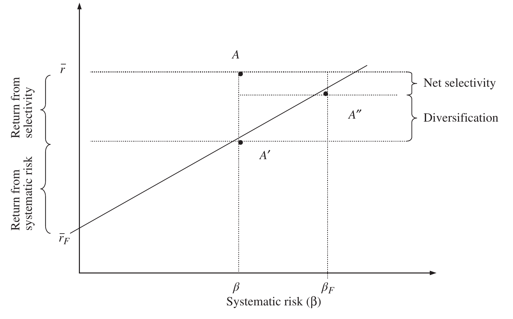

# 5 Risk (continued)

## FACTOR MODELS {#a}

### Fama decomposition {#b}

Fama (Fama, "Components of Investment Performance" (1972).) extended the concept of Treynor's ratio in his paper "Components of Investment Performance" to further break down the return of a portfolio.

The excess return above the risk-free rate can be expressed as the selectivity (or Jensen's alpha) plus the return due to systematic risk as follows:

$$\underbrace{\overline{r} - \overline{r}_F}_{\text{Excess return}} = \underbrace{\overline{r} - \beta \times (\overline{b} - \overline{r}_F)}_{\text{Selectivity}} - \overline{r}_F + \underbrace{\beta \times (\overline{b} - \overline{r}_F)}_{\text{Systematic risk}} \tag{5.62}$$

If a portfolio is completely diversified there is no specific risk and the total portfolio risk will equal the systematic risk. Portfolio managers will give up diversification seeking additional return. Selectivity can be broken down into net selectivity and the return required to justify the diversification given up.

### Selectivity {#c}

Isolating selectivity in Equation 5.62 we notice that it is equivalent to Jensen's alpha from Equation 5.42:

$$\alpha = \overline{r} - \overline{r}_F - \beta \times (\overline{b} - \overline{r}_F) \tag{5.42}$$

### Diversification {#d}

Diversification is the amount of return required to justify moving away from the benchmark and taking on specific risk. It calculates the return that would have been achieved simply by taking the same amount of systematic risk as the total risk of the portfolio. To calculate this return we first have to calculate the effective beta required so that the systematic risk is equivalent to the total portfolio risk. Call this the Fama beta, calculated as follows:

$$\beta_F = \frac{\sigma}{\sigma_b} \tag{5.63}$$

Therefore, the return required to justify not being fully diversified is calculated using the difference in the Fama beta from the portfolio beta as follows:

$$d = (\beta_F - \beta) \times (\overline{b} - \overline{r}_F) \tag{5.64}$$

Note the Fama beta will always be greater than or equal to the portfolio beta since total risk is greater than or equal to the systematic risk of the portfolio. If the benchmark return is greater than the risk-free rate the diversification required will be positive.

### Net selectivity {#e}

Net selectivity is the remaining selectivity after deducting the amount of return required to justify not being fully diversified.

$$\text{Net selectivity } S_{\text{Net}} = \alpha - d \tag{5.65}$$

Obviously, if net selectivity is negative the portfolio manager has not justified the loss of diversification.

Fama decomposition is useful analysis if we only have access to total fund returns and are unable to perform more detailed analysis on the components of return – the mutual funds of competitors, for example.

Figure 5.17 illustrates Fama's decomposition for portfolio $A$. $A'$ represents the return from systematic risk plus the risk-free rate and $A''$ represents the return from the Fama equivalent systematic risk plus the risk-free rate.

**Figure 5.17** Fama decomposition

### Fama-French three-factor model {#f}

The CAPM model uses just one factor, beta or systematic risk, to describe the relationship of portfolio returns to the benchmark. Eugene Fama and Kenneth French (Fama and French, "Common Risk Factors in the Returns of Stocks and Bonds" (1993).) observed that two classes of stocks tended to do better than the market as a whole: small-capitalisation stocks and value stocks. They added two factors to the CAPM model to reflect these exposures, resulting in the following Fama-French regression equation

$$r - r_F = \alpha_3 + \beta_3 \times (b - r_F) + \beta_S \times SMB + \beta_V \times HML + \varepsilon_3 \tag{5.66}$$

where:

- $\alpha_3$ = three-factor alpha
- $\beta_3$ = three-factor systematic risk
- $\varepsilon_3$ = three-factor error term
- $SMB$ = small minus big (market capitalisation)
- $HML$ = high minus low (book-to-market ratio)

$\beta_S$ and $\beta_V$ are coefficients determined by linear regression. $\beta_S$ or size beta measures the portfolio's sensitivity to small-capitalisation stocks, a coefficient greater than 1 indicating greater sensitivity to small-capitalisation stocks compared to large-capitalisation stocks. $\beta_V$ or value beta measures the portfolio's sensitivity to value stocks, a coefficient greater than 1 indicating greater sensitivity to value stocks rather than growth stocks.

> Note
>
> The historical series of returns for Fama and French's factors are available at https://mba.tuck.dartmouth.edu/pages/faculty/ken.french/data_library.html

### Three-factor alpha (or Fama-French alpha) {#g}

The resulting alpha from the Fama-French regression equation is analogous to the CAPM alpha and can be used in exactly the same way. $\beta_3$ is similar to but not identical to CAPM $\beta$.

### Carhart four-factor model {#h}

Carhart (Carhart, "On Persistence in Mutual Fund Performance" (1997).) extended the three-factor model to a four-factor model adding a momentum factor resulting in the following Carhart regression equation:

$$r - r_F = \alpha_4 + \beta_4 \times (b - r_F) + \beta_s \times SMB + \beta_V \times HML + \beta_m \times MOM + \varepsilon_4 \tag{5.67}$$

where:

- $\alpha_4$ = four-factor alpha
- $\beta_4$ = four-factor systematic risk
- $\varepsilon_4$ = four-factor error term
- $MOM$ = Momentum

$\beta_m$ is a coefficient determined by linear regression. $\beta_m$ or momentum beta measures a portfolio's sensitivity to momentum stocks.

### Four-factor alpha (or Carhart's alpha) {#i}

Again, the resulting alpha from the Carhart regression equation is analogous to the CAPM and three-factor alpha and can be used in exactly the same way.

### Multi-factor models {#j}

Further additional systematic risks or factors can be introduced with the objective of explaining the entire return and reducing any alpha to zero. Multi-factor models can be divided into three main categories:

1. Fundamental
2. Macroeconomic
3. Statistical

Fundamental models compare portfolio returns to underlying microeconomic factors such as industry classification, market capitalisation, style, and so forth.

Macroeconomic models compare portfolio returns to economic factors such as employment, inflation and interest rates.

Statistical models start with no assumption about factors but attempt to determine which factors best explain portfolio returns by using statistical methods such as principal component analysis. Assigning economic interpretation to these factors can be difficult.

> **⚠ Caution**
>
> Ex-post factor analysis is an additional useful tool to understand better how asset managers are adding (or subtracting) value. Care is required: portfolios change through time, factors change through time, and individual securities' sensitivity to factors change through time. If you torture numbers long enough, eventually they will tell you what you want to hear.
