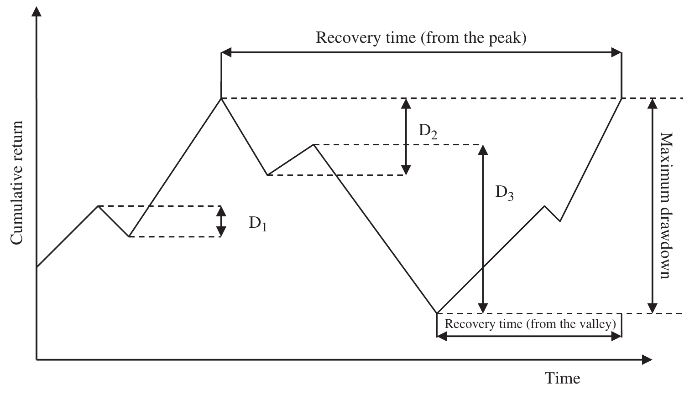
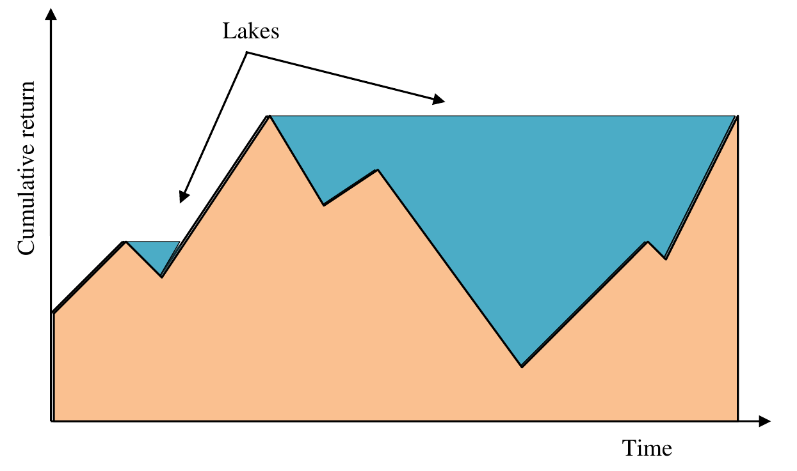
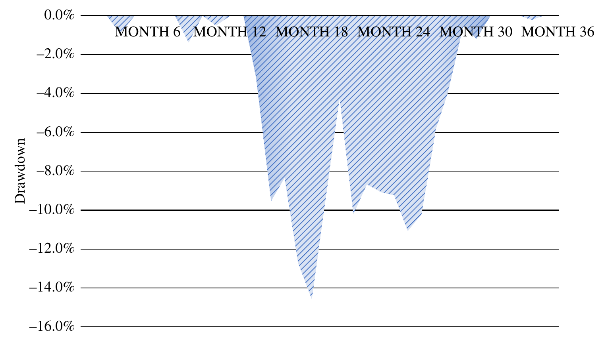

# 5 Risk (continued)

## DRAWDOWN {#a}

There are a surprisingly large number of appraisal measures based on drawdown and related concepts. Most in my view are fairly redundant, with the notable exception of maximum drawdown. Drawdown might be defined as either the peak-to-valley fall in performance or any continuous, uninterrupted losing return period. The choice of which definition to use will depend on the preferences of the asset owner, the time period and/or the periodicity of the data. Other definitions include active drawdown based on relative or active return rather than absolute return.

> **Note**
>
> High-net-worth investors typically using daily data would probably prefer a peak-to-valley definition, whereas institutional investors using monthly data might be more concerned by periods of continuous negative returns. Peak to valley is the most common.

### Average drawdown {#b}

As its name suggests, the average drawdown is the average continuous negative return (or peak-to-trough return) over an investment period, three years being a typical period of measurement.

$$\text{Average drawdown } \overline{D} = \left| \frac{\sum_{j=1}^{j=d} D_j}{d} \right| \tag{5.68}$$

where: $D_j$ = $j$th drawdown over entire period

$d$ = total number of drawdowns in entire period

Some investors take the view that only the largest drawdowns in the return series are of any consequence and therefore restrict $d$ to a predetermined maximum limit of, say, three or five, or even the single largest individual drawdown, thus enabling fair comparison between portfolios.

### Maximum drawdown {#c}

The maximum drawdown ($D_{\text{Max}}$), not to be confused with the largest individual drawdown, is the maximum loss over a specific time period, typically three years. Maximum drawdown represents the maximum loss an investor could have suffered in the fund buying at the highest point (the high-water mark) and selling at the lowest (the low-water mark). Like any other statistic it is essential to compare performance over the same time period and of course this measure will be heavily influenced by outliers. Mini-max (Note that the terms mini-max and maxi-min are used differently in decision theory and game theory. Mini-max is a decision rule for minimising the worst-case loss, and maxi-min for maximising the lowest gain.) is an alternative name for maximum drawdown. Maxi-min represents the maximum gain buying at the lowest point and selling at the highest.

### Largest individual drawdown {#d}

As its name suggests the largest individual drawdown ($D_{\text{Lar}}$) is the largest individual uninterrupted or peak-to-valley loss in a return series.

### Recovery time (or drawdown duration) {#e}

The recovery time or drawdown duration is the time taken to recover from an individual or maximum drawdown to the original level.

The recovery time may be measured from the peak or high-water mark or may also be measured from the subsequent valley or low-water mark.

> **⚠ Caution**
>
> I'm continually surprised how often drawdown and recovery statistics are requested without any guidance as to the time period in question; always disclose the basis of the analysis.

Individual and maximum drawdowns and recovery time from the high-water mark are illustrated in Figure 5.18 using the continuous interrupted loss definition. The largest individual loss is $D_3$. $D_2$ and $D_3$ would not be classified as separate drawdowns in the peak-to-trough definition since the high-water mark has not been recovered, just a small positive bump on the way down to a deeper trough.

### Drawdown deviation {#f}

Drawdown deviation calculates a standard deviation-type statistic using individual drawdowns as follows:

$$\text{Drawdown deviation } DD = \sqrt{\frac{\sum_{j=1}^{j=d} D_j^2}{n}} \tag{5.69}$$

### Ulcer index {#g}

The ulcer index, developed by Peter G. Martin in 1987, (Martin and McCann, *The Investor's Guide to Fidelity Funds* (1989).) (so called because of the worry suffered by both the portfolio manager and asset owner) is similar to drawdown deviation with the exception that the impact of time "under water" is combined with the depth of drawdown by selecting the negative return for each period below the previous peak or high-water mark. Deeper drawdowns will have a more significant impact since the calculation is squared. Naturally, in this index the definition of drawdown is peak to trough.

$$\text{Ulcer index } UI = \sqrt{\frac{\sum_{i=1}^{i=n} D_i'^2}{n}} \tag{5.70}$$

where: $D_i'$ = drawdown since previous peak in period $i$

### Pain index {#h}

If the drawdowns are not squared then the resulting pain index is very similar to the Zephyr pain index (Becker, "The Zephyr K-Ratio" (2010).) as proposed by Thomas Becker:

$$\text{Pain index } PI = \frac{\sum_{i=1}^{i=n} |D_i'|}{n} \tag{5.71}$$

This statistic combines the depth, duration and frequency of drawdowns in the portfolio manager's return series. Consider the manager's cumulative return series in Figure 5.19. The peaks or high-water marks in the return series act as dams holding back the lakes and increasing the volume of pain.

### Calmar ratio (or drawdown ratio) {#i}

The Calmar ratio proposed by Young in 1991 (Young, "Calmar Ratio: A Smoother Tool" (1991).) is a Sharpe-type measure that uses maximum drawdown rather than standard deviation to reflect the investor's risk. In the context of hedge fund performance, it is easy to understand why investors might prefer the maximum possible loss from peak to valley as an appropriate measure of risk. Calmar is an acronym of **Ca**lifornia **M**anaged **A**nnual **R**eports and is always measured over 36 months.

$$\text{Calmar ratio } CR = \frac{\tilde{r} - \tilde{r}_F}{D_{\text{Max}}} \tag{5.72}$$

> **Note**
>
> Early versions of Calmar exclude the risk-free rate in the numerator. Unlike negative Sharpe and negative information ratios, I don't see a great deal of value in negative Calmar ratios.

### MAR ratio {#j}

The MAR ratio promoted by a competitor newsletter to California Managed Annual Reports calculates the Calmar ratio since inception rather than over three years, which makes direct comparisons of portfolios with different inception dates difficult to evaluate.

### Sterling ratio {#k}

The Sterling ratio replaces maximum drawdown in the Calmar ratio with the average drawdown over the period of analysis.

There are multiple variations of the Sterling ratio in common usage, perhaps reflecting its use across a range of differing asset categories and outside the field of finance.

The original definition, attributed to Deane Sterling Jones, (McCafferty, *The Market Is Always Right* (2003).) a company no longer in existence, appears to be:

$$\text{Original Sterling ratio } OSR = \frac{\tilde{r}}{\overline{D_{\text{Lar}}} + 10\%} \tag{5.73}$$

where: $\overline{D_{\text{Lar}}}$ = average largest drawdown

The denominator is defined as the average largest drawdown plus 10%. The addition of 10% is arbitrary, compensating for the fact that the average largest drawdown is inevitably smaller than the maximum drawdown. Typically, only a fixed number of the largest drawdowns are averaged, for example, the largest three individual drawdowns over three years. Adding additional small drawdowns clearly dilutes the impact of the largest drawdowns. With apologies to Deane Sterling Jones, I suggest that the definition be standardised to exclude the 10% (which is redundant in terms of comparison) but in Sharpe form as follows:

$$\text{Sterling ratio } SR_d = \frac{\tilde{r} - \tilde{r}_F}{\overline{D_{\text{Lar}}}} = \frac{\tilde{r} - \tilde{r}_F}{\left| \frac{\sum_{j=1}^{j=d} D_j}{d} \right|} \tag{5.74}$$

The number of observations $d$ is fixed to the investor's preference, which could be the largest single drawdown ($d = 1$) or, more typically, 3 or 5.

### Sterling-Calmar ratio {#l}

Perhaps the most common variation of the Sterling ratio uses the average annual maximum drawdown in the denominator over three years. To avoid confusion and to encourage consistent use across the industry I suggest the following standardised definition, a combination of Sterling and Calmar concepts:

$$\text{Sterling-Calmar ratio } SCR = \frac{\tilde{r} - \tilde{r}_F}{\overline{D_{\text{max}}}} \tag{5.75}$$

where: $\overline{D_{\text{Max}}}$ = average annual maximum drawdown

> **⚠ Caution**
>
> Given the variety of Sterling ratio definitions, great care should be taken to ensure that the same definition is used over the same time period using the same frequency of data when ranking portfolio performance.

### Burke ratio {#m}

In his article "A Sharper Sharpe Ratio", (Burke, "A Sharper Sharpe Ratio" (1994).) Burke suggested using the familiar concept of the square root of the sum of the squares of each drawdown in order to penalise major drawdowns as opposed to many mild ones.

$$\text{Burke ratio } BR_d = \frac{\tilde{r} - \tilde{r}_F}{\sqrt{\sum_{j=1}^{j=d} D_j^2}} \tag{5.76}$$

Just like the Sterling ratio the number of drawdowns used can be restricted to a set number of the largest drawdowns.

### Modified Burke ratio {#n}

For consistency with other Sharpe-type statistics, it might be more appropriate to define the modified Burke ratio using drawdown deviation in the denominator as follows:

$$\text{Modified Burke ratio } MBR_d = \frac{\tilde{r} - \tilde{r}_F}{\sqrt{\frac{\sum_{j=1}^{j=d} D_j^2}{n}}} \tag{5.77}$$

Clearly, both the modified and standard Burke ratios will generate identical portfolio rankings.

### Martin ratio (or ulcer performance index) {#o}

If the duration of drawdowns is a concern for investors, the Martin ratio is similar to the modified Burke index but uses the ulcer index in the denominator:

$$\text{Martin ratio } MR = \frac{\tilde{r} - \tilde{r}_F}{\sqrt{\frac{\sum_{i=1}^{i=n} D_i'^2}{n}}} \tag{5.78}$$

### Pain ratio {#p}

The equivalent to the Martin ratio but using the pain index is the pain ratio:

$$\text{Pain ratio } PR = \frac{\tilde{r} - \tilde{r}_F}{\frac{\sum_{i=1}^{i=n} D_i'}{n}} \tag{5.79}$$

Both the pain and Martin ratios penalise managers with early high-water marks in their track record; therefore, it is far better to peak later rather than earlier when applying these ratios.

Peak-to-trough drawdown statistics are calculated for our standard portfolio data in Table 5.18 and used to calculate Calmar, Sterling, Burke, Sterling-Calmar, pain and ulcer ratios in Exhibit 5.15. Continuous, uninterrupted drawdown statistics are calculated in Exhibit 5.16. Figure 5.20 illustrates the drawdown for our standard portfolio data. This data is dominated by one large drawdown, month 14 to month 31, and a few smaller drawdowns. The maximum drawdown occurs through month 14 to month 18 in the manager's return series.

### Exhibit 5.15 — Drawdown (peak-to-trough definition) {#q}

$$\text{Calmar ratio } CR = \frac{\tilde{r} - \tilde{r}_F}{D_{\text{Max}}} = \frac{13.29\% - 2.43\%}{14.63\%} = 0.74$$

Largest individual drawdowns 14.6%, 1.4% and 0.9%

$$\text{Average drawdown } \overline{D_{\text{Lar}}} = \left| \frac{\sum_{j=1}^{j=d} D_j}{d} \right| = \frac{14.6\% + 1.4\% + 0.9\%}{3} = 5.64\%$$

Note that only the three largest drawdowns have been selected.

$$\text{Sterling ratio } SR_3 = \frac{\tilde{r} - \tilde{r}_F}{\left| \frac{\sum_{j=1}^{j=3} D_j}{3} \right|} = \frac{13.29\% - 2.43\%}{5.64\%} = 1.92$$

$$\text{Drawdown deviation } DD = \sqrt{\frac{\sum_{j=1}^{j=d} D_j^2}{n}} = \sqrt{\frac{214.04 + 1.96 + 0.81}{36}} = 2.45$$

$$\text{Modified Burke ratio } MBR_3 = \frac{\tilde{r} - \tilde{r}_F}{\sqrt{\frac{\sum_{j=1}^{j=3} D_j^2}{n}}} = \frac{13.29\% - 2.43\%}{2.45} = 4.43$$

$$\text{Average maximum drawdown: } \overline{D_{\text{Max}}} = \frac{1.4\% + 14.63\% + 2.1\%}{3} = 6.04\%$$

$$\text{Sterling-Calmar ratio } SCR = \frac{\tilde{r} - \tilde{r}_F}{\overline{D_{\text{max}}}} = \frac{13.29\% - 2.43\%}{6.04\%} = 1.80$$

$$\text{Pain index } PI = \frac{\sum_{i=1}^{i=n} |D_i'|}{n} = \frac{135.33}{36} = 3.76$$

$$\text{Pain ratio } PR = \frac{\tilde{r} - \tilde{r}_F}{\sum_{i=1}^{i=n} \frac{D_i'}{n}} = \frac{13.29\% - 2.43\%}{3.76} = 2.89$$

$$\text{Ulcer index } UI = \sqrt{\frac{\sum_{i=1}^{i=n} D_i'^2}{n}} = \sqrt{\frac{1285.19}{36}} = 5.97$$

$$\text{Martin ratio } MR = \frac{\tilde{r} - \tilde{r}_F}{\sqrt{\frac{\sum_{i=1}^{i=n} D_i'^2}{n}}} = \frac{13.29\% - 2.43\%}{5.97} = 1.82$$

**Table 5.18 — Drawdown statistics**

| Portfolio monthly return (%) | Continuous drawdown $D_j$ | Continuous drawdown squared $D_j^2$ | Drawdown from peak $D_i'$ | Drawdown from peak squared $D_i'^2$ |
| --- | --- | --- | --- | --- |
| 0.3 | | | | |
| 2.6 | | | | |
| 1.1 | | | | |
| −0.9 | −0.9 | 0.81 | −0.90 | 0.81 |
| 1.4 | | | | |
| 2.4 | | | | |
| 1.5 | | | | |
| 6.6 | | | | |
| −1.4 | −1.4 | 1.96 | −1.40 | 1.96 |
| 3.9 | | | | |
| −0.5 | −0.5 | 0.25 | −0.50 | 0.25 |
| 8.1 | | | | |
| 4.0 | | | | |
| −3.7 | | | −3.70 | 13.69 |
| −6.1 | −9.6 | 91.67 | −9.57 | 91.67 |
| 1.4 | | | −8.31 | 69.03 |
| −4.9 | | | −12.80 | 163.87 |
| −2.1 | −6.9 | 47.57 | −14.63 | 214.11 |
| 6.2 | | | −9.34 | 87.23 |
| 5.8 | | | −4.08 | 16.66 |
| −6.4 | −6.4 | 40.96 | −10.22 | 104.45 |
| 1.7 | | | −8.69 | 75.58 |
| −0.4 | | | −9.06 | 82.07 |
| −0.2 | | | −9.24 | 85.40 |
| −2.1 | −2.7 | 7.22 | −11.15 | 124.25 |
| 1.1 | | | −10.17 | 103.42 |
| 4.7 | | | −5.95 | 35.37 |
| 2.4 | | | −3.69 | 13.62 |
| 3.3 | | | −0.51 | 0.26 |
| −0.7 | −0.7 | 0.49 | −1.21 | 1.46 |
| 4.7 | | | | |
| 0.6 | | | | |
| 1.0 | | | | |
| −0.2 | −0.2 | 0.04 | −0.20 | 0.04 |
| 3.4 | | | | |
| 1.0 | | | | |

**Maximum drawdown: 14.63% (months 14 to 18)**

| | | |
| --- | --- | --- |
| **Maximum drawdown (year 1):** 1.4% (month 9) | Total $\sum_{i=1}^{i=n} D_i' = -135.33$ | Total $\sum_{i=1}^{i=n} D_i'^2 = 1258.19$ |
| **Maximum drawdown (year 2):** 14.63% | | |
| **Maximum drawdown (year 3):** 2.1% (month 25) | | |

### Exhibit 5.16 — Drawdown (continuous uninterrupted definition) {#r}

Largest individual drawdowns 9.6%, 6.9% and 6.4%

$$\text{Average drawdown } \overline{D_{\text{Lar}}} = \left| \frac{\sum_{j=1}^{j=d} D_j}{d} \right| = \frac{96\% + 6.9\% + 6.4\%}{3} = 7.62\%$$

Note that all three of these "individual and uninterrupted" drawdowns are part of a much longer peak-to-trough drawdown. This is best observed in Figure 5.20.

$$\text{Sterling ratio } SR_3 = \frac{\tilde{r} - \tilde{r}_F}{\left| \frac{\sum_{j=1}^{j=3} D_j}{3} \right|} = \frac{13.29\% - 2.43\%}{7.62\%} = 1.42$$

$$\text{Drawdown deviation } DD = \sqrt{\frac{\sum_{j=1}^{j=d} D_j^2}{n}} = \sqrt{\frac{91.67 + 47.57 + 40.96}{36}} = 2.24$$

$$\text{Modified Burke ratio } MBR_3 = \frac{\tilde{r} - \tilde{r}_F}{\sqrt{\frac{\sum_{j=1}^{j=3} D_j^2}{n}}} = \frac{13.29\% - 2.43\%}{2.24} = 4.85$$

