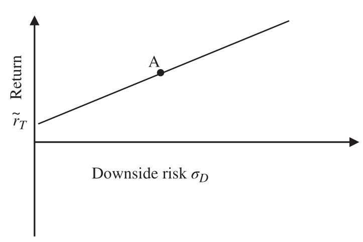

# 5 Risk (continued)

## Partial Moments {#a}

Standard deviation and the symmetrical normal distribution are the foundations of modern portfolio theory. Post-modern portfolio theory recognises that asset owners prefer upside risk (or, if you prefer, upside uncertainty) rather than downside risk and utilises semi-standard deviation. Partial or one-sided moment measures allow asset owners to ignore desirable risk and focus on undesirable risk.

### Downside risk (or semi-standard deviation) {#b}

Standard deviation and the symmetrical normal distribution are the foundations of modern portfolio theory. Post-modern portfolio theory recognises that asset owners prefer upside risk (or, if you prefer, upside uncertainty) rather than downside risk and utilises semi-standard deviation. Partial or one-sided moment measures allow asset owners to ignore desirable risk and focus on undesirable risk.

Semi-standard deviation measures the variability of underperformance below a minimum target rate. The minimum target rate could be the risk-free rate, the benchmark, zero or any other fixed threshold required by the asset owner. All positive returns, above the minimum target rate, are included as zero in the calculation of semi-standard deviation or downside risk as follows:

$$
\text{Downside risk } \sigma_D = \sqrt{\sum_{i=1}^{n} \frac{\min[(r_i - r_T), 0]^2}{n}}
\tag{5.80}
$$

where: $\quad r_T = \text{minimum target return}$

Clearly, since positive returns above the minimum target return are excluded there are potentially fewer or, in some cases, no observations less than the target return. Therefore, great care must be taken to ensure there are sufficient returns to ensure that the calculation is meaningful.

As should be expected downside variance is the square of downside risk:

$$
\text{Downside variance } \sigma_D^2 = \sum_{i=1}^{n} \frac{\min[(r_i - r_T), 0]^2}{n}
\tag{5.81}
$$

> **Note**
>
> The downside risk measure is not directly comparable to standard deviation. For a normal distribution with a standard deviation of 1.0, the semi-standard deviation will be about 0.6.

### Downside potential {#c}

Downside potential is the average sum of returns below target:

$$
\text{Downside potential } \mu_D = \sum_{i=1}^{i=n} \frac{\min[(r_i - r_T), 0]}{n}
\tag{5.82}
$$

By convention the minus sign of downside potential is ignored. Therefore, perhaps a better way of expressing downside potential is as follows:

$$
\text{Downside potential } \mu_D = \sum_{i=1}^{i=n} \frac{\max[(r_T - r_i), 0]}{n}
\tag{5.83}
$$

Note that the term $(r_i - r_T)$ has been reversed and replaced by $(r_T - r_i)$ and that:

$$
\sum_{i=1}^{i=n} \max[(r_T - r_i), 0] = -1 \times \sum_{i=1}^{i=n} \min[(r_i - r_T), 0]
\tag{5.84}
$$

Downside variance is the second lower partial moment of return, and downside potential is the first lower partial moment.

### Pure downside risk {#d}

Pure downside risk is the special case of $r_T = 0$; only returns less than zero are included in the calculation.

$$
\text{Pure downside risk } \sigma_P = \sqrt{\sum_{i=1}^{i=n} \frac{\min[r_i, 0]^2}{n}}
\tag{5.85}
$$

### Half variance (or semi-variance) {#e}

In half variance and half risk calculations, only returns lower than the mean are considered, i.e., $r_T = \bar{r}$.

$$
\text{Half variance } \sigma_H^2 = \sum_{i=1}^{i=n} \frac{\min[(r_i - \bar{r}), 0]^2}{n}
\tag{5.86}
$$

$$
\text{Half risk } \sigma_H = \sqrt{\sum_{i=1}^{i=n} \frac{\min[(r_i - \bar{r}), 0]^2}{n}}
\tag{5.87}
$$

### Upside risk (or upside uncertainty) {#f}

The term "upside risk" may be disconcerting, but it simply refers to the variability of returns that exceed a given target. The equivalent upside statistics are as expected:

$$
\text{Upside risk } \sigma_U = \sqrt{\sum_{i=1}^{i=n} \frac{\max[(r_i - r_T), 0]^2}{n}}
\tag{5.88}
$$

$$
\text{Upside variance } \sigma_U^2 = \sum_{i=1}^{i=n} \frac{\max[(r_i - r_T), 0]^2}{n}
\tag{5.89}
$$

$$
\text{Upside potential } \mu_U = \sum_{i=1}^{i=n} \frac{\max[(r_i - r_T), 0]}{0}
\tag{5.90}
$$

Note that in all the above equations the total number of observations, $n$, is always used irrespective of the number of observations above or below target.

Loss and gain standard deviation measure the variability of returns above or below target only and is typically not used in performance analysis.

$$
\text{Loss standard deviation } \sigma_L = \sqrt{\sum_{i=1}^{i=n} \frac{\min[(r_i - r_T), 0]^2}{n_d}}
\tag{5.91}
$$

$$
\text{Gain standard deviation } \sigma_G = \sqrt{\sum_{i=1}^{i=n} \frac{\max[(r_i - r_T), 0]^2}{n_U}}
\tag{5.92}
$$

where: $\quad n_d = \text{number of returns less than target}$
$\quad\quad\;\; n_U = \text{number of returns greater than target}$

### Mean absolute moment {#g}

Similarly, the mean absolute moment calculates the average of downside deviations or the average of upside deviations as follows:

$$
\text{Mean downside deviation } MAM_D = \sum_{i=1}^{n} \frac{\min[(r_i - r_T), 0]}{n_d}
\tag{5.93}
$$

$$
\text{Mean upside deviation } MAM_U = \sum_{i=1}^{n} \frac{\max[(r_i - r_T), 0]}{n_u}
\tag{5.94}
$$

### Omega ratio ($\Omega$) {#h}

In their article "A Universal Performance Measure", Shadwick and Keating (Shadwick and Keating, "A Universal Performance Measure" (2002).) suggest a gain–loss ratio that also captures the information in the higher moments of a return distribution as follows:

$$
\text{Omega ratio } \Omega = \frac{\text{Upside potential}}{\text{Downside potential}} = \frac{\frac{1}{n} \times \sum_{i=1}^{i=n} \max(r_i - r_T, 0)}{\frac{1}{n} \times \sum \max(r_T - r_i, 0)}
\tag{5.95}
$$

When used as a ranking statistic, the higher the omega ratio, the better. The omega ratio equals 1 when $r_T$ is the mean return.

Omega ratio implicitly adjusts for both skewness and kurtosis in the return distribution.

### Bernardo and Ledoit (or gain–loss) ratio {#i}

The Bernardo and Ledoit (Bernardo and Ledoit, *Gain, Loss and Asset Pricing* (1996).) ratio is a special case of the omega ratio with $r_T = 0$:

$$
\text{Bernardo–Ledoit ratio} = \frac{\frac{1}{n} \times \sum_{i=1}^{i=n} \max(r_i, 0)}{\frac{1}{n} \times \sum_{i=1}^{i=n} \max(0 - r_i, 0)}
\tag{5.96}
$$

## *d* ratio

The *d* ratio (Lavinio, *The Hedge Fund Handbook* (1999).) is similar to the Bernardo and Ledoit ratio but inverted and taking into account the frequency of positive and negative returns:

$$
d \text{ ratio} = \frac{n'_d \times \sum_{i=1}^{i=n} \max(0 - r_i, 0)}{n'_u \times \sum \max(r_i, 0)}
\tag{5.97}
$$

where: $\quad n'_d = \text{number of returns less than zero}$
$\quad\quad\;\; n'_u = \text{number of returns greater than zero}$

The *d* ratio will have values between zero and infinity and can be used to rank the performance of portfolios. The lower the *d* ratio the better the performance, a value of zero indicating that there are no returns less than zero and a value of infinity indicating that there are no returns greater than zero. Portfolio managers with positively skewed returns will have lower *d* ratios.

### Omega–Sharpe ratio {#j}

The omega ratio can be converted to a ranking statistic in familiar form to the Sharpe ratio. Clearly, the average portfolio return less the target return is equal to the sum of the upside and downside potential:

$$
\text{Omega–Sharpe ratio} = \frac{\tilde{r} - \tilde{r}_T}{\frac{1}{n} \times \sum_{i=1}^{i=n} \max(r_T - r_i, 0)}
\tag{5.98}
$$

$$
\tilde{r} - \tilde{r}_T \approx \bar{r} - \bar{r}_T = \frac{1}{n} \times \sum_{i=1}^{i=n} r_i - r_T = \frac{1}{n} \times \sum_{i=1}^{i=n} \max(r_i - r_T, 0) - \frac{1}{n} \times \sum_{i=1}^{i=n} \max(r_T - r_i, 0)
\tag{5.99}
$$

Substituting Equation 5.99 into Equation 5.98:

$$
= \frac{\frac{1}{n} \times \sum_{i=1}^{i=n} \max(r_i - r_T, 0) - \frac{1}{n} \times \sum_{i=1}^{i=n} \max(r_T - r_i, 0)}{\frac{1}{n} \times \sum_{i=1}^{i=n} \max(r_T - r_i, 0)}
\tag{5.100}
$$

$$
= \frac{\frac{1}{n} \times \sum_{i=1}^{i=n} \max(r_i - r_T, 0)}{\frac{1}{n} \times \sum_{i=1}^{i=n} \max(r_T - r_i, 0)} - \frac{\frac{1}{n} \times \sum_{i=1}^{i=n} \max(r_T - r_i, 0)}{\frac{1}{n} \times \sum_{i=1}^{i=n} \max(r_T - r_i, 0)} = \Omega - 1
\tag{5.101}
$$

$$
\text{Omega–Sharpe ratio} \approx \Omega - 1
\tag{5.102}
$$

> **Interpretation**
>
> The omega–Sharpe ratio will rank portfolios in the same order as the omega ratio. Although generating identical rankings, the omega–Sharpe ratio is at least in the familiar Sharpe-type format and therefore preferable.

### Sortino ratio {#k}

A natural extension of the Sharpe and omega–Sharpe ratios is the Sortino ratio (Sortino and van der Meer, "Downside Risk" (1991).) suggested by Brian Rom in 1986, which uses downside risk in the denominator as follows:

$$
\text{Sortino ratio} = \frac{(\tilde{r} - \tilde{r}_T)}{\tilde{\sigma}_D}
\tag{5.103}
$$

The Sortino ratio is shown graphically in Figure 5.21.

**Figure 5.21** Sortino ratio

Clearly, investors should be seeking returns greater than the risk-free rate (why take any risk otherwise?); therefore, the minimum accepted return in most cases should be greater than the risk-free rate.

### Reward to half-variance {#l}

Reward to half-variance, suggested by Ang and Chua in 1979, (Ang and Chua, "Composite Measures for the Evaluation of Investment Performance" (1979).) is similar to the Sortino ratio, in effect considering only returns less than the mean:

$$
\text{Reward to half-variance} = \frac{(\tilde{r} - \tilde{r}_F)}{\tilde{\sigma}_H^2}
\tag{5.104}
$$

where: $\quad \tilde{\sigma}_H^2 = \text{annualised half-variance}$

### Downside-risk Sharpe ratio {#m}

Similar to the Sortino ratio but far less common is the downside-risk Sharpe ratio suggested by Ziemba in 2005, (Ziemba, "The Symmetric Downside-Risk Sharpe Ratio" (2005).) which considers only losses less than zero or pure downside risk:

$$
\text{Downside-risk Sharpe ratio} = \frac{(\tilde{r} - \tilde{r}_F)}{\tilde{\sigma}_P}
\tag{5.105}
$$

where: $\quad \tilde{\sigma}_P = \text{annualised pure downside risk}$

### Sortino–Satchell ratio {#n}

Rachev, Stoyanov and Fabozzi, (Rachev, Stoyanov and Fabozzi, *Advanced Stochastic Models, Risk Assessment and Portfolio Optimization* (2008).) Eling, Farinelli, Rossello and Tibiletti, (Eling, Farinelli, Rossello and Tibiletti, "One-Size or Tailor-Made Performance Ratios for Ranking Hedge Funds" (2009).) and Biglova, Orotobelli, Rachev and Stoyanov (Biglova, Orotobelli, Rachev and Stoyanov, "Different Approaches to Risk Estimation in Portfolio Theory" (2004).) all describe the generalised downside risk-adjusted Sortino–Satchell ratio. Kaplan and Knowles, (Kaplan and Knowles, "Kappa: A Generalized Downside Risk-adjusted Performance Measure" (2004).) in their paper "Kappa: A Generalised Downside Risk-Adjusted Performance Measure," describe the same generalised ratio but name it kappa. They demonstrate that both the Sortino ratio and the omega–Sharpe ratio are special cases of kappa:

$$
\text{Sortino–Satchell} = K_l = \frac{\tilde{r} - \tilde{r}_T}{\sqrt[\large l]{\sum_{i=1}^{i=n} \frac{[(r_T - r_i), 0]^l}{n}}}
\tag{5.106}
$$

> **Interpretation**
>
> For $l = 1$, $K_1$ is the omega–Sharpe ratio and for $l = 2$, $K_2$ is the Sortino ratio. $l$ need not be an integer and is set according to investor preference; a greater $l$ suggests a higher penalty for more extreme results, suitable for more risk-averse investors than the kappa ratio.

In particular, $K_3$, the third lower partial moment, is known specifically as the kappa ratio. It perhaps makes most sense to use Sortino–Satchell to name the generalised ratio and kappa to describe $K_3$.

$$
\text{Kappa ratio} = K_3 = \frac{\tilde{r} - \tilde{r}_T}{\sqrt[\large 3]{\sum_{i=1}^{i=n} \frac{[(r_T - r_i), 0]^3}{n}}}
\tag{5.107}
$$

### Upside potential ratio {#o}

The upside potential ratio suggested by Sortino, Van de Meer and Plantinga (Sortino, van de Meer and Plantinga, "The Dutch Triangle: A Framework to Measure Upside Potential Relative to Downside Rsk" (1999).) can also be used to rank portfolio performance and combines upside potential with downside risk as follows:

$$
UPR = \frac{\text{Upside potential}}{\text{Downside risk}} = \frac{\mu_U}{\tilde{\sigma}_D} = \frac{\sum_{i=1}^{i=n} \frac{\max[(r_i - r_T), 0]}{n}}{\tilde{\sigma}_D}
\tag{5.108}
$$

> **Interpretation**
>
> By using the first partial moment on the upside and the second partial moment on the downside, investors are expressing a preference: they dislike the extreme losses on the downside more than they like the extreme gains on the upside.

> **Note**
>
> The Sortino ratio is conceptually more consistent with the Sharpe ratio in design and certainly in more common usage than the upside potential ratio and therefore is my preference of the two ratios.

### Volatility skewness {#p}

A similar measure to omega but using the second partial moment is volatility skewness, (Rom and Ferguson, "A Software Developer's View: Using Post-Modern Portfolio Theory to Improve Investment Performance Measurement" (2001).) the ratio of the upside variance compared to the downside variance. Values greater than 1 would indicate positive skewness and values less than 1 would indicate negative skewness:

$$
\text{Volatility skewness} = \frac{\tilde{\sigma}_U^2}{\tilde{\sigma}_D^2}
\tag{5.109}
$$

> **Interpretation**
>
> This measure, in particular, rewards extreme positive events and penalises extreme negative events. For those like me who are unsure about the merits of over-rewarding extreme (potentially one-off) positive events, but are still concerned by negative extreme events, then perhaps the upside potential ratio is more appropriate.

### Variability skewness {#q}

Although the rankings will be identical for consistency with other measures typically used with asset management, I prefer the square root of volatility skewness. To differentiate the term, I use the name variability skewness.

$$
\text{Variability skewness} = \frac{\text{Upside risk}}{\text{Downside risk}} = \frac{\sigma_U}{\sigma_D}
\tag{5.110}
$$

Portfolio downside risk, Sortino ratio, upside and downside potential, omega, omega–Sharpe ratio and upside potential ratio and variability skewness are calculated in Exhibit 5.17 based on data in Table 5.19.

### Exhibit 5.17 — Downside and upside partial moments {#r}

Downside potential:

$$
\mu_D = \sum_{i=1}^{n} \frac{\max[(r_T - r_i), 0]}{n} = \frac{36.3\%}{36} = 1.01\%
$$

Downside risk:

$$
\sigma_D = \sqrt{\sum_{i=1}^{n} \frac{\max[(r_T - r_i), 0]^2}{n}} = \sqrt{\frac{161.33}{36}} = 2.12\%
$$

Annualised downside risk:

$$
\tilde{\sigma}_D = \sqrt{t} \times \sigma_D = \sqrt{12} \times 2.12\% = 7.33\%
$$

Upside potential:

$$
\mu_U = \sum_{i=1}^{n} \frac{\max[(r_i - r_T), 0]}{n} = \frac{57.9\%}{36} = 1.61\%
$$

Upside risk:

$$
\sigma_U = \sqrt{\sum_{i=1}^{n} \frac{\max[(r_i - r_T), 0]^2}{n}} = \sqrt{\frac{247.81}{36}} = 2.62\%
$$

Annualised upside risk:

$$
\tilde{\sigma}_U = \sqrt{t} \times \sigma_U = \sqrt{12} \times 2.62\% = 9.09\%
$$

Omega ratio:

$$
\Omega = \frac{\text{Upside potential}}{\text{Downside potential}} = \frac{\frac{1}{n} \times \sum_{i=1}^{i=n} \max(r_i - r_T, 0)}{\frac{1}{n} \times \sum \max(r_T - r_i, 0)} = \frac{1.61\%}{1.01\%} = 1.6
$$

Sortino ratio:

$$
\text{Sortino ratio} = \frac{(\tilde{r} - \tilde{r}_T)}{\tilde{\sigma}_D} = \frac{13.29\% - 6.17\%}{7.33\%} = 0.97
$$

Upside potential ratio:

$$
UPR = \frac{\text{Upside potential}}{\text{Downside risk}} = \frac{\sum_{i=1}^{i=n} \max(r_i - r_T, 0) / n}{\tilde{\sigma}_D} = \frac{1.61\%}{7.33\%} = 0.22
$$

Variability skewness:

$$
\text{Variability skewness} = \frac{\text{Upside risk}}{\text{Downside risk}} = \frac{\tilde{\sigma}_U}{\tilde{\sigma}_D} = \frac{9.09\%}{7.33\%} = 1.24
$$

**Table 5.19 — Portfolio downside risk**

*Monthly minimum target return = 0.5%, annual minimum target return = 6.17%*

| Portfolio monthly return (%) $r_i$ | Deviation against target (downside only) $\min[(r_i - r_T), 0]$ | Squared deviation (downside only) $\min[(r_i - r_T), 0]^2$ | Upside only $\max[(r_i - r_T), 0]$ | Squared deviation (upside only) $\max[(r_i - r_T), 0]^2$ |
| --- | --- | --- | --- | --- |
| 0.3 | −0.2 | 0.04 | | |
| 2.6 | | | 2.1 | 4.41 |
| 1.1 | | | 0.6 | 0.36 |
| −0.9 | −1.4 | 1.96 | | |
| 1.4 | | | 0.9 | 0.81 |
| 2.4 | | | 1.9 | 3.61 |
| 1.5 | | | 1 | 1 |
| 6.6 | | | 6.1 | 37.21 |
| −1.4 | −1.9 | 3.61 | | |
| 3.9 | | | 3.4 | 11.56 |
| −0.5 | −1.0 | 1 | | |
| 8.1 | | | 7.6 | 57.76 |
| 4 | | | 3.5 | 12.25 |
| −3.7 | −4.2 | 17.64 | | |
| −6.1 | −6.6 | 43.56 | | |
| 1.4 | | | 0.9 | 0.81 |
| −4.9 | −5.4 | 29.16 | | |
| −2.1 | −2.6 | 6.76 | | |
| 6.2 | | | 5.7 | 32.49 |
| 5.8 | | | 5.3 | 28.09 |
| −6.4 | −6.9 | 47.61 | | |
| 1.7 | | | 1.2 | 1.44 |
| −0.4 | −0.9 | 0.81 | | |
| −0.2 | −0.7 | 0.49 | | |
| −2.1 | −2.6 | 6.76 | | |
| 1.1 | | | 0.6 | 0.36 |
| 4.7 | | | 4.2 | 17.64 |
| 2.4 | | | 1.9 | 3.61 |
| 3.3 | | | 2.8 | 7.84 |
| −0.7 | −1.2 | 1.44 | | |
| 4.7 | | | 4.2 | 17.64 |
| 0.6 | | | 0.1 | 0.01 |
| 1 | | | 0.5 | 0.25 |
| −0.2 | −0.7 | 0.49 | | |
| 3.4 | | | 2.9 | 8.41 |
| **Total** | **−36.3** | **161.33** | **57.9** | **247.81** |

### Farinelli–Tibiletti ratio {#s}

Farinelli and Tibiletti (Farinello and Tibiletti, "Sharpe Thinking in Asset Ranking with One-Sided Measures" (2008).) suggest a generalised measure similar to Sortino–Satchell but referencing both the upside and downside:

$$
F - T_l^u = \frac{\sqrt[\large u]{\frac{1}{n} \times \sum_{i=1}^{i=n} \max(r_i - r_T, 0)^u}}{\sqrt[\large l]{\frac{1}{n} \times \sum_{i=1}^{i=n} \max(r_T - r_i, 0)^l}}
\tag{5.111}
$$

> **Interpretation**
>
> When $u$ and $l$ are both equal to 1, the Farinelli–Tibiletti ratio is equivalent to the omega ratio and when $u$ and $l$ are both equal to 2, equivalent to variability skewness. $l = 2$ and $u = 1$ is the upside potential ratio. $u$ and $l$ need not be integers and can be set according to investor preference; $u < 1$ and $l > 1$ is risk averse and $l < 1$ and $u > 1$ is risk seeking.

Both the Farinelli–Tibiletti ratio and Sortino–Satchell offer significant flexibility to investors to design ratios that meet their particular requirements, although it requires considerable investment in time, experience and copious quantities of data to add value.

> **Caution**
>
> For asset managers these ratios offer significant opportunities to "data mine" (Data mine (or *data dredge*): the bad practice of analysing data for the exclusive purpose of identifying favourable outcomes.) in order to find favourable results. Like all appraisal ratios they are calculated ex-post but of course should be implemented ex-ante.

### Prospect ratio {#t}

Watanabe notes that people tend to feel loss more acutely than the equivalent gain, (Watanabe, "New Prospect Ratio: Application to Hedge Funds with Higher Order Moments." (2014).) a well-known phenomenon described by prospect theory. (Kahneman and Tversky, "Prospect Theory: An Analysis of Decision under Risk" (1979).) Watanabe suggests utilising a Sharpe-type ratio, really an adapted Sortino ratio, which penalises losses more than it rewards gains, as shown below.

$$
\text{Prospect ratio} = \frac{\frac{1}{n} \times \sum_{i=1}^{i=n} (\max[r_i, 0] + \lambda \times \min[r_i, 0]) - r_T}{\sigma_D}
\tag{5.112}
$$

$\lambda$ reflects investor preference and measures the extent of loss aversion and the greater weight given to losses than gains. If the investor does not exhibit loss aversion, $\lambda = 0$. $\lambda < 0$ implies gain-seeking behaviour. Based on empirical research, Watanabe suggests investors dislike losses two and a quarter times as much as they enjoy gains and sets $\lambda$ to 2.25. Users might wish to select their own preferences.

> **Note**
>
> In many ways the prospect ratio is similar to kappa but with investor preferences expressed in the numerator of the ratio rather than in the denominator in the form of higher partial moments.
