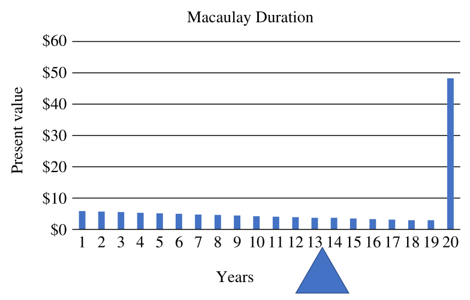
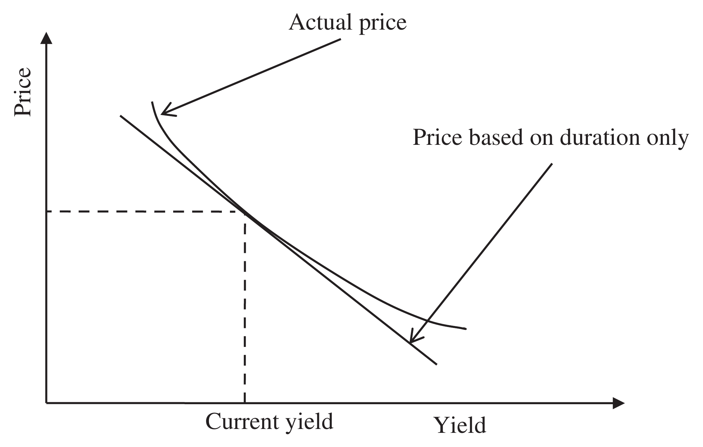

# 5 Risk (continued)

## FIXED INCOME RISK {#a}

### Pricing fixed income instruments {#b}

In many ways it is easier to measure the risk of fixed income instruments or bonds; they consist of (for the most part) predictable future cash flows in the form of coupon payments and a final redemption value.

The price of a bond is the sum of present value of the future cash flows:

$$P = \sum_{i=1}^{n} F_i \times d^{t_i} \tag{5.113}$$

where:

- $n$ = number of future coupon and capital repayments
- $F_i$ = $i$th future coupon and capital repayment(s)
- $t_i$ = time in years to the $i$th coupon or capital repayment
- $d$ = discount factor

### Redemption yield (yield to maturity) {#c}

The redemption yield of a bond is the internal rate of return (IRR), or the constant rate of return at which the current value of the bond is equal to the sum of discounted values (or present values) of each cash flow.

### Weighted average cash flow {#d}

Clearly, the price of a bond is influenced by discount rates, the amount of each cash flow and, crucially, the time over which these cash flows are discounted. Naturally, we are interested in the sensitivity to changes in the future discount rates or yields. Time is crucial because the change in yield will have a greater effect over longer time periods. One such measure is the weighted average cash flow of the bond:

$$\text{Weighted average cash flow} = \frac{\sum_{i=1}^{i=n} t_i \times F_i}{\sum_{i=1}^{i=n} F_i} \tag{5.114}$$

### Duration (effective mean term, discounted mean term or volatility) {#e}

A more accurate measure of sensitivity replaces the future cash flow with the present value of the cash flow and is called duration.

Duration is defined as the average life of the present values of all future cash flows, but it is interpreted as an estimate of the bond's price sensitivity to changes in interest rates. In other words, it expresses the bond's exposure to interest rate risk. For example, a bond with a duration of 13 years would be expected to gain approximately 13% in market value if interest rates fall by 1% (100 basis points) and to lose the same amount if interest rates rise by 1%. Duration is thus a systematic risk or volatility measure for bonds. In calculating the present value of the future cash flows, a discount rate equal to the redemption yield is used.

### Macaulay duration {#f}

Frederick Macaulay (Macaulay, "Some Theoretical Problems Suggested by the Movement of Interest Rates, Bond Yields and Stock Prices in the US since 1856" (1938).) was among the first to suggest the use of duration for studying the returns on bonds. Using present values in Equation 5.114 we get:

$$\text{Macaulay duration } D = \frac{\sum_{i=1}^{i=n} t_i \times F_i \times d^{t_i}}{\sum_{i=1}^{i=n} F_i \times d^{t_i}} \tag{5.115}$$

where:

$$d = \frac{1}{(1 + y)} \tag{5.116}$$

where: $y$ = yield to maturity or redemption yield

The denominator in Equation 5.115 is equal to the present value of future coupon and capital repayments of the bond or, in other words, the price $P$.

Substituting Equation 5.113 into Equation 5.115 we have the formula for Macaulay duration:

$$D = \frac{\sum_{i=1}^{n} F_i \times t_i \times d^{t_i}}{P} \tag{5.117}$$

### Macaulay–Weil duration {#g}

There is no reason the discount rate should be constant for all coupon payments; in fact, interest rates are likely to be different for different time periods. Macaulay–Weil duration uses the appropriate spot rate for each cash flow and is therefore slightly more accurate.

### Modified duration {#h}

Both Macaulay and Macaulay–Weil durations assume that coupon payments are reinvested continuously, which is not the case. Duration can be modified for the actual payment frequency as follows:

$$MD = \frac{D}{1 + \frac{y}{k}} \tag{5.118}$$

where: $k$ = number of cash flows or coupons per year.

Note that for $k = \infty$, i.e., continuous compounding, modified duration is equal to the Macaulay duration. For a normal bond the duration will always be between zero and the maturity of the bond. The duration will be equal to the time to maturity for a zero-coupon bond, a bond with a single cash flow. Clearly all normal bonds are simply a series of zero-coupon bonds.

Weighted average cash flow, Macaulay, modified and Macaulay–Weil durations for the simple 20-year bond with a 6% annual coupon payment shown in Table 5.20 are calculated in Exhibit 5.18. Macaulay duration is graphically illustrated in Figure 5.22. The fulcrum marks the balancing point.

### Exhibit 5.18 Duration {#i}

Weighted average cash flow $\frac{3260}{220} = 14.82$ years

Macaulay duration $\frac{1692.7}{128.91} = 13.13$ years

Modified duration $= \frac{D}{1 + \frac{y}{k}} = \frac{13.13}{1 + \frac{1.0389}{1}} = 12.64$ years

Macaulay–Weil duration $= \frac{1679.67}{128.91} = 13.03$ years

Modified Macaulay–Weil duration $= \frac{D}{1 + \frac{y}{k}} = \frac{13.03}{1 + \frac{1.0389}{1}} = 12.54$ years

**Figure 5.22 Macaulay duration**

**Table 5.20 Price, Macaulay, modified and Macaulay–Weil durations**

| Period | Cash flow | Time × Cash flow | Present value | Time × Present value | Spot rate | Present value (Weil) | Time × Present value (Weil) |
| --- | --- | --- | --- | --- | --- | --- | --- |
| 1 | 6 | 6 | 5.78 | 5.78 | 3.5% | 5.80 | 5.8 |
| 2 | 6 | 12 | 5.56 | 11.12 | 3.5% | 5.60 | 11.2 |
| 3 | 6 | 18 | 5.35 | 16.05 | 3.5% | 5.41 | 16.23 |
| 4 | 6 | 24 | 5.15 | 20.60 | 3.5% | 5.23 | 20.91 |
| 5 | 6 | 30 | 4.96 | 24.79 | 3.5% | 5.05 | 25.26 |
| 6 | 6 | 36 | 4.77 | 28.63 | 3.5% | 4.88 | 29.29 |
| 7 | 6 | 42 | 4.59 | 32.15 | 3.5% | 4.72 | 33.01 |
| 8 | 6 | 48 | 4.42 | 35.36 | 3.5% | 4.56 | 36.45 |
| 9 | 6 | 54 | 4.25 | 38.29 | 3.75% | 4.31 | 38.77 |
| 10 | 6 | 60 | 4.1 | 40.95 | 3.75% | 4.15 | 41.52 |
| 11 | 6 | 66 | 3.94 | 43.36 | 3.75% | 4.00 | 44.02 |
| 12 | 6 | 72 | 3.79 | 45.53 | 3.75% | 3.86 | 46.29 |
| 13 | 6 | 78 | 3.65 | 47.48 | 3.75% | 3.72 | 48.33 |
| 14 | 6 | 84 | 3.52 | 49.21 | 3.75% | 3.58 | 50.17 |
| 15 | 6 | 90 | 3.38 | 50.75 | 3.75% | 3.45 | 51.81 |
| 16 | 6 | 96 | 3.26 | 52.11 | 3.75% | 3.33 | 53.27 |
| 17 | 6 | 102 | 3.13 | 53.29 | 4.0% | 3.08 | 52.36 |
| 18 | 6 | 108 | 3.02 | 54.31 | 4.0% | 2.96 | 53.31 |
| 19 | 6 | 114 | 2.9 | 55.18 | 4.0% | 2.85 | 54.11 |
| 20 | 106 | 2120 | 49.39 | 987.75 | 4.0% | 48.38 | 967.54 |
| **Total** | **220** | **3260** | **128.91** | **1692.70** | **Price** | **128.91** | **1679.67** |
| IRR ($y$) | | 3.89% | | IRR ($y$) | 3.89% | | |

### Portfolio duration {#j}

Durations in a fixed income portfolio or benchmark are additive. The entire duration of the portfolio can be computed directly from the weighted sum of each bond in the portfolio:

$$\text{Portfolio duration } D_r = \sum_{i=1}^{i=n} w_i \times MD_i \tag{5.119}$$

### Effective duration (or option-adjusted duration) {#k}

Modified duration does not calculate the effective duration of the bond if there is any optionality in future payments. (Callable bonds, for example.) To calculate the effective duration, the estimated price must be calculated for both a positive and negative change in interest rates:

$$ED = \frac{P_- - P_+}{2 \times P \times \Delta y} \tag{5.120}$$

where:

- $\Delta y$ = change in interest rates
- $P_-$ = estimated price if interest rate is decreased by $\Delta y$
- $P_+$ = estimated price if interest rate is increased by $\Delta y$

If there is no optionality in future payments, effective duration will be identical to modified duration. Technically, although numerically similar to modified duration, effective duration is a direct measure of sensitivity and not measured in years.

The effective duration of the bond used in Table 5.20 is calculated in Exhibit 5.19 based on a parallel change of 25 basis points using the revised data in Table 5.21. Notice that the answer is close to modified Macaulay–Weil duration, as expected.

### Exhibit 5.19 Effective duration {#l}

$$\text{Effective duration } ED = \frac{P_- + P_+}{2 \times P \times \Delta y}$$

$$ED = \frac{133.04 - 124.96}{2 \times 128.91 \times 0.25\%} = 12.55$$

**Table 5.21 Effective duration**

| Cash flow | Spot rate (+0.25%) | Present value (+0.25%) | Spot rate (−0.25%) | Present value (−0.25%) |
| --- | --- | --- | --- | --- |
| 6 | 3.75% | 5.78 | 3.25% | 5.81 |
| 6 | 3.75% | 5.57 | 3.25% | 5.63 |
| 6 | 3.75% | 5.37 | 3.25% | 5.45 |
| 6 | 3.75% | 5.18 | 3.25% | 5.28 |
| 6 | 3.75% | 4.99 | 3.25% | 5.11 |
| 6 | 3.75% | 4.81 | 3.25% | 4.95 |
| 6 | 3.75% | 4.64 | 3.25% | 4.80 |
| 6 | 3.75% | 4.47 | 3.25% | 4.65 |
| 6 | 4.0% | 4.22 | 3.5% | 4.40 |
| 6 | 4.0% | 4.05 | 3.5% | 4.25 |
| 6 | 4.0% | 3.90 | 3.5% | 4.11 |
| 6 | 4.0% | 3.75 | 3.5% | 3.97 |
| 6 | 4.0% | 3.60 | 3.5% | 3.84 |
| 6 | 4.0% | 3.46 | 3.5% | 3.71 |
| 6 | 4.0% | 3.33 | 3.5% | 3.58 |
| 6 | 4.0% | 3.20 | 3.5% | 3.46 |
| 6 | 4.25% | 2.96 | 3.75% | 3.21 |
| 6 | 4.25% | 2.84 | 3.75% | 3.09 |
| 6 | 4.25% | 2.72 | 3.75% | 2.98 |
| 106 | 4.25% | 46.11 | 3.75% | 50.76 |
| **Price** | | **124.96** | **Price** | **133.04** |

### Duration to worst {#m}

Duration to worst is identical to modified duration except that if there is any optionality (for example, if the bond is callable) the cash flow used in the calculation will be that which results in the worst yield for the investor.

### Convexity {#n}

Duration is only the first-order approximation in the change of the bond's price. The approximation is due to the fact that a curved line represents the relationship between bond prices and interest rates (see Figure 5.23). Duration assumes there is a linear relationship. This approximation can be improved by using a second approximation, convexity:

$$C = \frac{\sum_{i=1}^{n} F_i \times t_i \times (t_i + 1) \times d^{t_i}}{P} \tag{5.121}$$

**Figure 5.23 Convexity**

### Modified convexity {#o}

Convexity can be modified just like duration for the actual payment frequency of coupons as follows:

$$MC = \left(\frac{1}{1 + \frac{y}{k}}\right)^2 \times \frac{\sum_{i=1}^{n} F_i \times t_i \times (t_i + 1) \times d^{t_i}}{P} \tag{5.122}$$

Modified convexity is often erroneously just called convexity.

### Effective convexity {#p}

Again, modified convexity does not calculate the effective convexity of the bond if there is any optionality in future payments. Using estimated prices to calculate effective convexity:

$$EC = \frac{P_- + P_+ - 2 \times P}{P \times (\Delta y)^2} \tag{5.123}$$

Convexity, modified convexity, and effective convexity based on the same 25-basis-point change in yield are shown in Table 5.22 and calculated in Exhibit 5.20.

**Table 5.22 Convexity**

| Period | Cash flow | Present value | $t \times (t+1)$ | $t \times (t+1) \times$ Present value |
| --- | --- | --- | --- | --- |
| 1 | 6 | 5.80 | 2 | 11.59 |
| 2 | 6 | 5.60 | 6 | 33.61 |
| 3 | 6 | 5.41 | 12 | 64.94 |
| 4 | 6 | 5.23 | 20 | 104.57 |
| 5 | 6 | 5.05 | 30 | 151.56 |
| 6 | 6 | 4.88 | 42 | 205.00 |
| 7 | 6 | 4.72 | 56 | 264.09 |
| 8 | 6 | 4.56 | 72 | 328.07 |
| 9 | 6 | 4.31 | 90 | 387.70 |
| 10 | 6 | 4.15 | 110 | 456.73 |
| 11 | 6 | 4.00 | 132 | 528.27 |
| 12 | 6 | 3.86 | 156 | 601.75 |
| 13 | 6 | 3.72 | 182 | 676.67 |
| 14 | 6 | 3.58 | 210 | 752.55 |
| 15 | 6 | 3.45 | 240 | 828.97 |
| 16 | 6 | 3.33 | 272 | 905.55 |
| 17 | 6 | 3.08 | 306 | 942.55 |
| 18 | 6 | 2.96 | 342 | 1,012.92 |
| 19 | 6 | 2.85 | 380 | 1,082.18 |
| 20 | 106 | 48.38 | 420 | 20,318.35 |
| | | **Price 128.91** | | **Total 29,657.64** |

### Exhibit 5.20 Convexity {#q}

$$\text{Convexity } C = \frac{\sum_{i=1}^{n} F_i \times t_i \times (t_i + 1) \times d^{t_i}}{P}$$

$$C = \frac{29657.64}{128.91} = 230.06 \text{ years}$$

$$\text{Modified convexity } MC = \left(\frac{1}{1 + \frac{y}{k}}\right)^2 \times \frac{\sum_{i=1}^{n} F_i \times t_i \times (t_i + 1) \times d^{t_i}}{P}$$

$$MC = \left(\frac{1}{1 + \frac{3.89\%}{1}}\right)^2 \times 230.06 = 213.14 \text{ years}$$

$$\text{Effective convexity } EC = \frac{P_- + P_+ - 2 \times P}{P \times (\Delta y)^2} = \frac{133.04 + 124.96 - 2 \times 128.91}{128.91 \times (0.0025)^2} = 213.00$$

### Portfolio convexity {#r}

Just like duration, convexity in a fixed income portfolio or benchmark is additive. The convexity of the portfolio can be computed directly from the weighted sum of each bond in the portfolio:

$$\text{Portfolio convexity } C_r = \sum_{i=1}^{i=n} w_i \times C_i \tag{5.124}$$

### Bond returns {#s}

Duration measures the sensitivity of a bond's price to changes in yield. Price changes can be estimated by:

$$\Delta P = -MD \times \Delta y \tag{5.125}$$

A better estimate of the return of a bond would include return from income through time, duration and convexity as follows:

$$r_B = y \times \Delta t - MD \times \Delta y + \frac{C}{2} \times (\Delta y)^2 \tag{5.126}$$

The price return for the bond in Table 5.20 is estimated in Exhibit 5.21 using both modified and effective duration and convexity for both a 25-basis-point increase and decrease in yields.

### Exhibit 5.21 Estimated bond returns {#t}

Actual price change

$$\frac{133.04}{128.91} - 1 = 3.2\% \quad -0.25\% \text{ change in yield}$$

$$\frac{124.96}{128.91} - 1 = -3.07\% \quad +0.25\% \text{ change in yield}$$

Using modified duration and modified convexity

For a $-0.25\%$ change in yield:

$$r_B = -MD \times \Delta y + \frac{C}{2} \times (\Delta y)^2 = -12.54 \times (-0.25\%) + \frac{213.14}{2} \times (-0.25\%)^2 = 3.2\%$$

For a $0.25\%$ change in yield:

$$r_B = -MD \times \Delta y + \frac{C}{2} \times (\Delta y)^2 = -12.54 \times (0.25\%) + \frac{213.14}{2} \times (0.25\%) = -3.07\%$$

Using effective duration and effective convexity

For a $-0.25\%$ change in yield:

$$r_B = -MD \times \Delta y + \frac{C}{2} \times (\Delta y)^2 = -12.55 \times (-0.25\%) + \frac{213.00}{2} \times (-0.25\%)^2 = 3.2\%$$

For a $0.25\%$ change in yield:

$$r_B = -MD \times \Delta y + \frac{C}{2} \times (\Delta y)^2 = -12.55 \times (0.25\%) + \frac{213.00}{2} \times (0.25\%)^2 = -3.07\%$$

Both the modified and effective calculations are good estimates of the actual return of bond.

### Duration beta {#u}

The ratio of the portfolio's duration with that of the benchmark duration provides a measure equivalent to a regression beta:

$$D_\beta = \frac{D_r}{D_b} \tag{5.127}$$

where:

- $D_r$ = portfolio duration
- $D_b$ = benchmark duration

### Reward to duration {#v}

Reward to duration is the Treynor ratio for fixed income portfolios with modified duration replacing beta as the measure of systematic risk.

$$\text{Reward to duration} = \frac{\tilde{r} - \tilde{r}_F}{MD} \tag{5.128}$$
