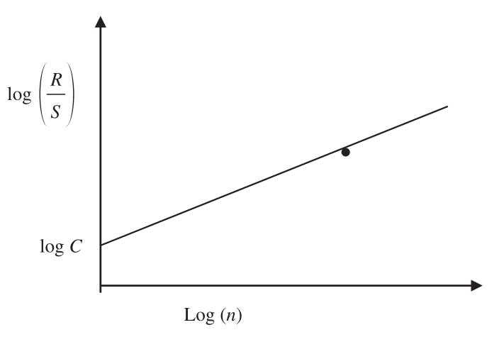
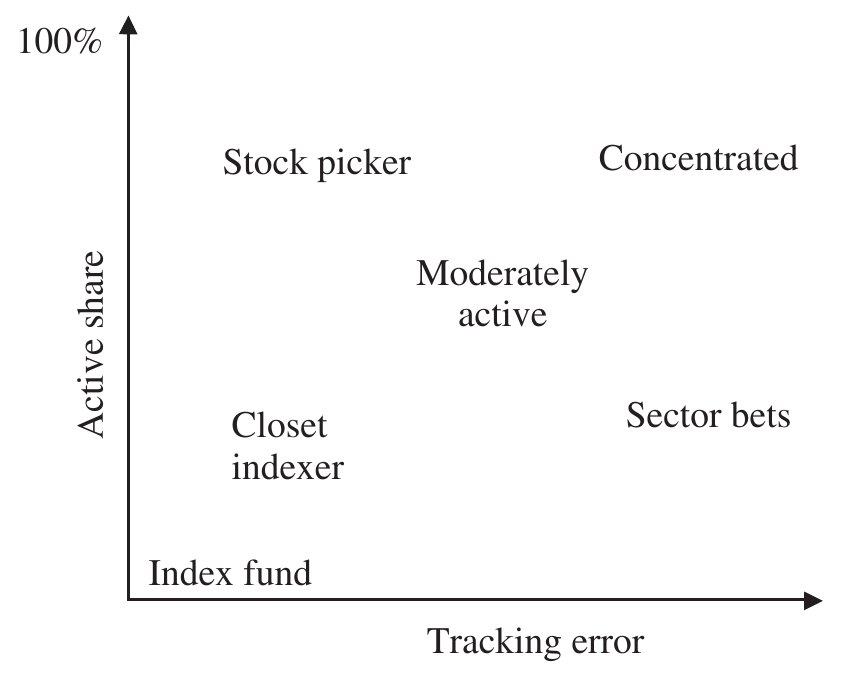

# 5 Risk (continued)

## MISCELLANEOUS RISK MEASURES {#a}

### Hurst index (or Hurst exponent) {#b}

The Hurst index (R. Clarkson, "FARM: A Financial Actuarial Risk Model" (2001).) is a useful statistic for detecting whether a portfolio manager's returns are mean reverting (anti-persistent), totally random or persistent. It is estimated as follows:

$$\text{Hurst index } H = \frac{\log(R/S)}{\log(n)} \tag{5.129}$$

where:

$$\frac{R}{S} = \frac{[\max(kr) - \min(kr)]}{\sigma} \tag{5.130}$$

$n$ = number of observations

$$_{k}r = \sum_{i=1}^{i=k}(r_i - \bar{r}) \tag{5.131}$$

$(R/S)$ is the range of the maximum cumulative deviation from the mean to the minimum cumulative deviation from the mean divided by the standard deviation of portfolio returns, otherwise known as the rescaled range or simply $(R/S)$.

H. E. Hurst originally developed the Hurst index to help in the difficult task of establishing optimal water storage along the Nile. (B. Qian and K. Rasheed, "Hurst Exponent and Financial Market Predictability," *Proceedings of the Second IASTED International Conference on Financial Engineering and Applications* (1 January 2004).) He noted that $(R/S)$ scales by a power law as time increases:

$$\frac{R}{S} = C \times n^H \tag{5.132}$$

Taking logarithms, we can obtain an estimate of the Hurst index as follows:

$$\log\left(\frac{R}{s} = \log C + H \times \log(n)\right) \tag{5.133}$$

The Hurst index is the gradient of the plot of $\log(R/S)$ against $\log(n)$; the intercept with the vertical axis is the constant $\log C$, which for most time periods shorter than four or five years we can assume is zero, as shown in Figure 5.24.

A Hurst index between 0 and 0.5 would suggest that a portfolio manager's series of returns is mean-reverting (anti-persistent).

A Hurst index of 0.5 would suggest that the series of returns was totally random.

A Hurst index between 0.5 and 1 would suggest that the series of returns are persistent, i.e., there is memory in the return series.

> **Interpretation**
>
> Clearly, persistent positive returns or excess returns would be a desirable property for any asset manager; a Hurst index close to 1 would suggest either exceptional performance or fraud. Nile floods are extremely persistent as evidenced by a Hurst index of 0.9; equity markets have a Hurst index of around 0.7.

**Figure 5.24** Hurst index

### Bias ratio {#c}

The bias ratio is a simple but ingenious ratio devised by Adil Abdulali (A. Abdulali, "The Bias Ratio™, Measuring the Shape of Fraud" (2006).) of Protégé Partners, published in 2006 to provide some insight into the distribution of returns near zero. It is defined as the number of returns equal to and closely exceeding zero, divided by the number of returns close to but less than zero. The definition of close is set to the investor's preference but is typically within one standard deviation.

$$\text{Bias ratio } BR = \frac{\text{Count}\langle r_i | r_i \in [0, \sigma]\rangle}{1 + \text{Count}\langle r_i + | r_i \in [-\sigma, 0]\rangle} \tag{5.134}$$

The bias ratio is a useful indicator of stale prices associated with illiquid assets and perhaps a subjective pricing policy. Hedge fund, real estate and private equity managers are very keen to deliver constant positive returns and may be reluctant to crystallise negative returns, potentially leading to an element of smoothing, avoiding if possible small negative revaluations and only "biting the bullet" if a negative write-down is unavoidable. Apart from the obvious impact of hiding volatility, such activity may be an indicator of outright fraud.

A bias ratio of less than 1 would certainly not be an indicator of fraud but would be undesirable nevertheless. Equity indexes tend to generate bias ratios between 1 and 1.5; Ponzi schemes would in all likelihood exhibit very high bias ratios.

> **Note**
>
> Interestingly, I calculate the bias ratio for the Fairfield Sentry Hedge Fund Ltd, a feeder fund for the well-known Bernie Madoff Ponzi scheme, ("The Madoff Case: A Timeline," *Wall Street Journal*, 6 March 2009.) over the period 31/12/1990 to 31/10/2008 to be 5.2!

> **⚠ Caution**
>
> Bias ratios should not be analysed in isolation or out of context but used as an additional measure by comparison to an appropriate benchmark that reflects the underlying investment strategy. Cash and near cash strategies will naturally lead to a large number of small positive returns and few or no negative returns. If genuine, a high bias ratio is desirable.

### Active share {#d}

Active share is a descriptive risk measure suggested by Cremers and Petajisto (Cremers and Petajisto, "How Active Is Your Fund Manager? A New Measure That Predicts Performance" (2006).) (Cremers and Petajisto, "How Active Is Your Fund Manager? A New Measure That Predicts Performance" (2009).) in 2006 that is perhaps easy to dismiss as being too simple to be of any value or perhaps should not be described as a risk measure at all. Active share is a measure of the percentage difference of security holdings in the portfolio as opposed to the benchmark defined as:

$$\text{Active share} = \frac{1}{2} \times \sum_{j=1}^{j=n}|PW_j - IW_j| \tag{5.135}$$

where: $PW_j$ = weight in portfolio of security $j$, $IW_j$ = weight in the index (or benchmark) of security $j$

An active share of 0% represents full replication between the portfolio and index and 100% represents no overlap.

Cremers and Petajisto analysed some 2,647 US mutual funds from 1980 to 2003 and concluded:

1. Manager active share is persistent.
2. Funds with high active share tend to outperform.
3. Funds with low active share tend to underperform.

Using active share and tracking error, they classified managers into four groups as shown in Table 5.23 and illustrated in Figure 5.25.

**Table 5.23** Active share and tracking error

| Active share | Tracking error | Classification |
| --- | --- | --- |
| High | High | Concentrated |
| High | Low | Stock pickers |
| Low | High | Factor bets |
| Low | Low | Closet indexers |

Not unsurprisingly, portfolios with high active share and low tracking error (stock pickers), for example portfolio managers prepared to take big bets yet nevertheless controlling relative risk, were the best-performing group. Portfolios with high active share and high tracking error (concentrated portfolios) also performed well, but portfolios with low active share and low tracking error (pejoratively described as closet indexers) tend to underperform and portfolios with low active share and high tracking error (portfolios betting on systematic factors generating high tracking error without taking big individual stock bets against the index, described as factor bet portfolios) also underperform.

**Figure 5.25** Active share versus tracking error

> **Interpretation**
>
> Suggesting that active share is a good predictor of outperformance is perhaps a little optimistic, and as such, has been criticised; see Morrison (Morrison, "Key Insight or Flawed Measure?" (2016).) and Frazzini, Friedman and Pomorski. (Frazzini, Friedman and Pomorski, "Deactivating Active Share" (2016).) However, using active share as a filter rather than a predictor of performance seems reasonable. Regulators are increasingly using active share as a measure to determine whether investment strategies are active (and hence justify charging active fees). The Danish Investment Funds Association requires the publication of both active share and tracking error in UCITS (Undertakings for Collective Investment in Transferable Securities) annual reports and recommends funds with active share less than 50% and tracking error less than 3% to justify their investment strategies. (Finanstilsynet "Active/Passive Management in Danish UCITS," The Danish FSA (2016).)

In subsequent analysis Cremers, Fulkerson and Riley (Cremers, Fulkerson and Riley, "Active Share and the Predictability of the Performance of Separate Accounts" (2022).) suggest that for separate accounts with high active share there is evidence of positive performance persistence. In other words, a combination of good past performance and active share can be used to identify asset managers who might be expected to outperform.

### Value at risk (VaR) {#e}

Value at risk, usually abbreviated as VaR, is an extreme risk measure originally developed in the 1990s by investment banks to manage their daily trading risk. (Sir Dennis Weatherstone, former CEO of J. P. Morgan, requested a 4:15 report that aggregated the firm's risk on one page within 15 minutes of market close at 4 p.m. VaR was developed to satisfy his request.) VaR measures the worst expected loss over a given time interval under normal market conditions at a given confidence level. For example, an annual value of risk of £5 million at a 95% confidence level for a portfolio would suggest that only once in 20 years would the annual loss exceed £5 million.

VaR, like tracking error and variability, can be calculated both ex-post and ex-ante. Typically, VaR is forecast ex-ante although again, like tracking error, it is useful to also calculate ex-post to provide a comparison and monitor risk efficiency. (See risk efficiency ratio Equation 8.5.) Recall that ex-post measures rely on the realised historical total returns of the portfolio, whereas ex-ante measures rely on a snapshot of the current holdings of securities and instruments within a portfolio and, based on their historic relationship with each other, forecast the prospective risk.

In the context of portfolio returns, return at risk or performance at risk is perhaps a more appropriate term, although the term VaR is used universally to represent both values and returns at risk.

> **Note**
>
> Although we are concerned with extreme losses and negative returns, VaR by convention is presented as a positive number.

> **⚠ Caution**
>
> Both the time horizon and confidence levels will impact the interpretation of VaR significantly and consistency is essential for comparison.

The appealing simplicity of VaR has led to its adoption as the standard risk measure for many trading institutions, retail banks, insurance companies, pension funds and regulators.
