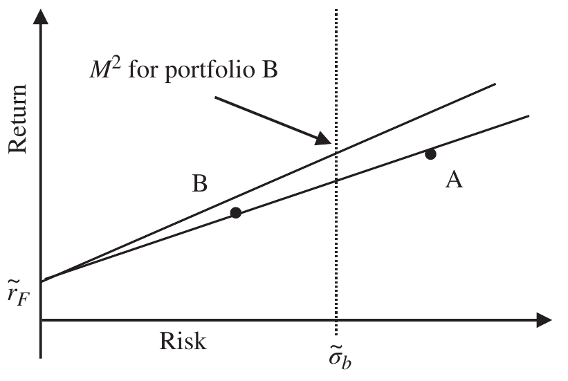
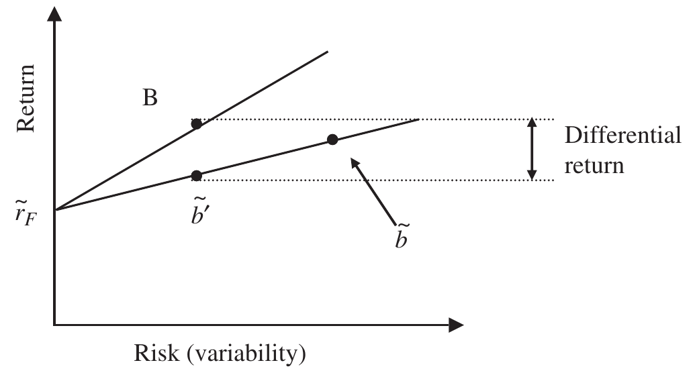
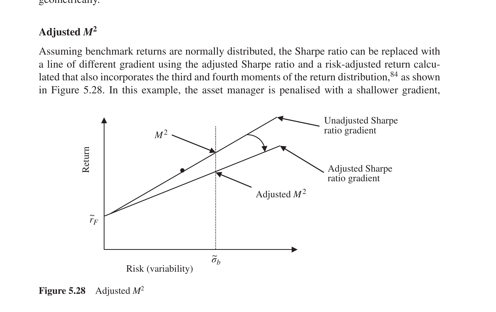

# 5 Risk (continued)

## Risk-Adjusted Return {#a}

The Sharpe ratio is sometimes erroneously described as a risk-adjusted return, but the clue is in its name — it is a ratio, not a return. We can rank portfolios in order of preference with the Sharpe ratio, but it is difficult to judge the size of relative performance. We need a risk-adjusted return measure to gain a better feel of risk-adjusted outperformance. Ratios all suffer the same problem: they allow us to rank portfolios in order of preference but do not inform in terms of the quantity of relative performance. Risk-adjusted returns, on the other hand, convert ratios to a return metric we fully understand and can freely use to make a judgement about relative performance.

### $M^2$ {#b}

$M^2$ is perhaps the most commonly used and easiest to calculate risk-adjusted return. $M^2$ is graphically represented in Figure 5.26. A straight line is drawn vertically through the risk of the benchmark $\tilde{\sigma}_b$; the intercept with the Sharpe ratio line of portfolio B would give the return of the portfolio with the same Sharpe ratio of portfolio B but at the risk of the benchmark. This return is called $M^2$, a genuinely risk-adjusted return, extremely useful for comparing portfolios with various levels of risk.

In Figure 5.26, $M^2$ for portfolio B is clearly higher than for portfolio A, even though portfolio A has a higher absolute return. This is a crucial point captured by the $M^2$ measure: it adjusts each portfolio's returns to what it *would have been* had the portfolio managers taken the same amount of risk. In Figure 5.26, portfolio B's return is adjusted up (because it did not take as much risk as the benchmark) while portfolio A's return is adjusted down (because it has taken more risk than the benchmark).

$$M^2 = \tilde{r} + SR \times (\tilde{\sigma}_b - \tilde{\sigma}) \tag{5.136}$$

where: $\sigma_b$ = market risk (variability, standard deviation of benchmark return)

$M^2$ is so called not because any element of the calculation is squared, but because it was first proposed by the partnership of Leah Modigliani and her grandfather, Professor Franco Modigliani. (Modigliani, "Risk-Adjusted Performance, Part 1: The Time for Risk Measurement Is Now" (1997).)

Alternatively, you might see the equation for $M^2$ expressed as:

$$M^2 = (\tilde{r} - \tilde{r}_F) \times \frac{\tilde{\sigma}_b}{\tilde{\sigma}} + \tilde{r}_F \tag{5.137}$$

Although Equations 5.136 and 5.137 will give the same answer, I prefer the presentation of Equation 5.136, which is directly linked to the geometry of Figure 5.26 and very clearly captures the penalty if portfolio risk is greater than the benchmark risk and the reward if portfolio risk is less than benchmark risk (assuming of course the Sharpe ratio is positive).

> **Note**
> Of course, $M^2$ can be calculated using a variety of different measures of risk, simply relabelling the horizontal access. Return adjusted for both systematic and extreme risks are obvious examples, although variability is certainly the most common.

Using the data from Table 5.6, $M^2$ is calculated in Table 5.24.

### $M^2$ excess return {#c}

Exactly the same arguments apply to geometric or arithmetic $M^2$ excess returns as they do to normal excess returns. Simple geometry from Figure 5.26 might suggest that arithmetic excess return would be more appropriate; however, it is easy to argue that continuously compounded returns should be used. For consistency I prefer the geometric definition.

$$M^2 \text{ excess return} = \frac{(1 + M^2)}{(1 + \tilde{b})} - 1 \tag{5.138}$$

or, arithmetically:

$$M^2 \text{ excess return} = M^2 - \tilde{b} \tag{5.139}$$

**Table 5.24** $M^2$

| | Portfolio A | Portfolio B |
| --- | --- | --- |
| Annualised return | 7.9% | 6.9% |
| Annualised risk | 5.5% | 3.2% |
| Sharpe ratio | 1.07 | 1.53 |
| Risk-free rate | 2.0% | 2.0% |
| $M^2 = \tilde{r} + SR \times (\tilde{\sigma}_b - \tilde{\sigma})$ | $7.9\% + 1.07 \times (4.5\% - 5.5\%)$ $= 6.83\%$ | $6.9\% + 1.53\% \times (4.5\% - 3.2\%)$ $= 8.89\%$ |
| $M^2 = (\tilde{r} - \tilde{r}_F) \times \dfrac{\tilde{\sigma}_b}{\tilde{\sigma}} + r_F$ | $(7.9\% - 2.0\%) \times \dfrac{4.5\%}{5.5\%} + 2.0\%$ $= 6.83\%$ | $(6.9\% - 2.0\%) \times \dfrac{4.5\%}{3.2\%} + 2.0\%$ $= 8.89\%$ |

### Differential return {#d}

The differential return is similar in concept to $M^2$ excess return except that the benchmark return is adjusted to the risk of the portfolio. The differential return is the difference between the portfolio return and the adjusted benchmark return. For the same portfolio, the $M^2$ excess return and the differential return will differ because the Sharpe ratio lines of the portfolio and benchmark will diverge over time.

The adjusted benchmark return $\tilde{b}'$ is calculated as follows:

$$\tilde{b}' = \tilde{r}_F + \left( \frac{\tilde{b} - \tilde{r}_F}{\tilde{\sigma}_b} \right) \times \tilde{\sigma} \tag{5.140}$$

Therefore, subtracting the adjusted benchmark return from the portfolio return we derive the differential return (see Figure 5.27):

$$\text{Differential return } DR = \tilde{r} - \tilde{r}_F - \left( \frac{\tilde{b} - \tilde{r}_F}{\tilde{\sigma}_b} \right) \times \tilde{\sigma} \tag{5.141}$$

Differential returns are calculated in Table 5.25.

**Table 5.25** Differential return

| | Portfolio A | Portfolio B |
| --- | --- | --- |
| Annualised return | 7.9% | 6.9% |
| Annualised risk | 5.5% | 3.2% |
| $M^2$ | 6.83% | 8.89% |
| $M^2$ excess return | $6.83\% - 7.5\% = -0.67\%$ | $8.89\% - 7.5\% = 1.39\%$ |
| (Arithmetic) $M^2 - \tilde{b}$ | | |
| Differential return | $7.9\% - 2.0\% - \dfrac{7.5\% - 2.0\%}{4.5\%} \times 5.5\%$ $= -0.82\%$ | $6.9\% - 2.0\% - \dfrac{7.5\% - 2.0\%}{4.5\%} \times 3.2\%$ $= +0.99\%$ |
| $\tilde{r} - \tilde{r}_F - \left( \dfrac{\tilde{b} - \tilde{r}_F}{\tilde{\sigma}_b} \right) \times \tilde{\sigma}$ | | |

Differential return is less useful for comparing multiple portfolios because multiple risk-adjusted benchmark returns are required to be calculated; for $M^2$ the benchmark returns are consistent for all portfolios. $M^2$ is a demonstrably better measure than either the Sharpe ratio from which it is derived or differential return. It is possible to calculate differential return geometrically.

### Adjusted $M^2$ {#e}

Assuming benchmark returns are normally distributed, the Sharpe ratio can be replaced with a line of different gradient using the adjusted Sharpe ratio and a risk-adjusted return calculated that also incorporates the third and fourth moments of the return distribution, (Bacon, "Introducing Adjusted $M^2$" (2013).) as shown in Figure 5.28. In this example, the asset manager is penalised with a shallower gradient, represented by an adjusted Sharpe ratio reflecting less desirable skewness and kurtosis. Therefore, the intercept with the variability of the benchmark is that bit lower, producing a lower risk-adjusted return.

$$\text{Adjusted } M^2 = \tilde{r} + ASR \times (\tilde{\sigma}_b - \sigma) \tag{5.142}$$

> **Interpretation**
> Adjusted $M^2$ is a very appealing statistic that incorporates all four moments of the return distribution and converts to a readily understood single return metric.

### Skew-adjusted $M^2$ {#f}

Skew-adjusted $M^2$, as its name suggests, incorporates just the third moment (skewness) and not the fourth moment (kurtosis).

$$\text{Skew-adjusted } M^2 = \tilde{r} + SASR \times (\tilde{\sigma}_b - \sigma) \tag{5.143}$$

$M^2$, adjusted $M^2$ and skew-adjusted $M^2$ for the standard portfolio are calculated in Exhibit 5.22 using data from Exhibit 5.7.

### Exhibit 5.22 $M^2$, skew-adjusted $M^2$ and adjusted $M^2$ {#g}

$$M^2 = \tilde{r} + SR \times (\tilde{\sigma}_b - \tilde{\sigma}) = 13.29\% + 0.94 \times (11.65\% - 11.49\%) = 13.44\%$$

Skew-adjusted

$$M^2 = \tilde{r} + SASR \times (\tilde{\sigma}_b - \tilde{\sigma}) = 13.29\% + 0.91 \times (11.65\% - 11.49\%) = 13.43\%$$

$$\text{Adjusted } M^2 = \tilde{r} + ASR \times (\tilde{\sigma}_b - \tilde{\sigma}) = 13.29\% + 0.91 \times (11.65\% - 11.49\%) = 13.43\%$$

There is only a tiny difference, lost in rounding, in this example because the distribution is close to normal.
