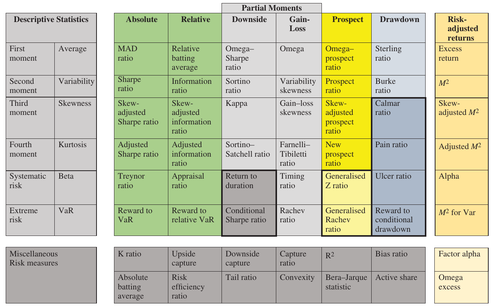

# 5 Risk (continued)

## A PERIODIC TABLE OF RISK MEASURES {#a}

Dimitri Mendeleev first published his periodic table of chemical elements in 1869. (Mendeleev, "Uber die Beziehungen der Eigenschaften zu den Atomgewichten der Elemente" (1869).) This extremely useful table, familiar to all students of science, orders chemical elements according to atomic number, electron configuration and chemical properties. Mendeleev wasn't the first to publish such a table, but his table received recognition because it left gaps in the table and predicted the properties of then-undiscovered elements that would eventually fill those gaps.

A periodic table for risk measures is such a good idea I wish I'd thought of it first, but sadly I can't claim credit as the initial inspiration resulted from a rare invasion of my son's bedroom in which I found and studied a wall chart detailing a periodic table of cocktail drinks. This basic idea, applying the concept of the periodic table to anything other than chemical elements, was further reinforced in a presentation by Bruce Feibel at a CFA conference in 2012. (CFA GIPS Conference, Boston September 2012.) There are so many different risk measures available to performance analysts that to fully appreciate the relative merits of each measure and their relationship with each other, it makes sense to attempt to categorise them into some sort of logical structure. To be fair, Cogneau and Hubner attempt with some success to do this, (Cogneau and Hubner, "The (more than) 100 ways to Measure Portfolio Performance Part 1" (2009).) (Cogneau and Hubner, "The (more than) 100 ways to Measure Portfolio Performance Part 2" (2009).) classifying over 100 performance appraisal measures based on their objectives, properties and degree of generalisation. The periodic table shown in Table 5.27 is my attempt to build on Bruce's idea. This is the third version of a periodic table of risk measures that I have attempted; the second was published in the *Journal of Performance Measurement*. (Bacon, "A Periodic Table of Risk Measures – Version 2" (2015).) I used the first attempt to clarify my own ideas, and, just like the original Mendeleev periodic table, to identify new measures and gaps in my own knowledge worthy of further research.

**Table 5.27 — Periodic table of risk measures**

| Descriptive Statistics | | Absolute | Relative | Downside (Partial Moments) | Gain–Loss (Partial Moments) | Prospect (Partial Moments) | Drawdown (Partial Moments) | Risk-adjusted returns |
| --- | --- | --- | --- | --- | --- | --- | --- | --- |
| First moment | Average | MAD ratio | Relative batting average | Omega–Sharpe ratio | Omega | Omega–prospect ratio | Sterling ratio | Excess return |
| Second moment | Variability | Sharpe ratio | Information ratio | Sortino ratio | Variability skewness | Prospect ratio | Burke ratio | $M^2$ |
| Third moment | Skewness | Skew-adjusted Sharpe ratio | Skew-adjusted information ratio | Kappa | Gain–loss skewness | Skew-adjusted prospect ratio | Calmar ratio | Skew-adjusted $M^2$ |
| Fourth moment | Kurtosis | Adjusted Sharpe ratio | Adjusted information ratio | Sortino–Satchell ratio | Farnelli–Tibiletti ratio | New prospect ratio | Pain ratio | Adjusted $M^2$ |
| Systematic risk | Beta | Treynor ratio | Appraisal ratio | Return to duration | Timing ratio | Generalised Z ratio | Ulcer ratio | Alpha |
| Extreme risk | VaR | Reward to VaR | Reward to relative VaR | Conditional Sharpe ratio | Rachev ratio | Generalised Rachev ratio | Reward to conditional drawdown | $M^2$ for VaR |

| Miscellaneous Risk measures | | | | | | | | |
| --- | --- | --- | --- | --- | --- | --- | --- | --- |
| | | K ratio | Upside capture | Downside capture | Capture ratio | $R^2$ | Bias ratio | Factor alpha |
| | | Absolute batting average | Risk efficiency ratio | Tail ratio | Convexity | Bera–Jarque statistic | Active share | Omega excess |

### Periodic table design {#b}

The main body of the table contains most, but not all, of the performance appraisal measures or composite ratios used to assess the performance of asset managers. They are either in typical Sharpe form, the acknowledged grandfather of all appraisal measures, "reward to risk" or in a "gain to loss" format.

Vertically the main body of the table is split into six columns based on different types of appraisal measures:

1. **Absolute:** Measures based on the absolute return of the portfolio.
2. **Relative:** Measures based on the relative return against a benchmark.
3. **Downside:** Using partial moments, measures based on downside risk.
4. **Gain–loss:** Measures reflecting upside in the numerator and downside in the denominator.
5. **Prospect:** Measures based on prospect theory (or other asset owner preference measures).
6. **Drawdown:** Measures based on drawdown.

Horizontally, the key descriptive statistics are shown in six rows, the four moments of the return distribution in descending order of importance:

- The first moment or average return
- The second moment, variability or standard deviation
- The third moment, skewness
- The fourth moment, kurtosis
- Systematic risk
- And finally risk measures focusing on the tail of the return distribution (extreme risk)

In earlier versions I included extreme risk measures as an additional column, which to be honest always felt a little uncomfortable. I've attempted in this third iteration to construct a table that extreme risk measures can be catered for in an additional row of the table, not a column.

### Why measure ex-post risk? {#c}

Many commentators would argue that there is little value and obviously no uncertainty when measuring ex-post or historic risk, so why bother? I maintain there are good reasons to measure risk ex-post:

1. Ex-post portfolio performance is two-dimensional. It is simply not acceptable to focus only on return; risk must also be assessed. If an asset manager achieved a reasonable but unexciting return, but took very high risk to achieve this return, then the asset owner should be very disappointed. The return achieved should justify the risk taken. Virtually all performance fee arrangements are based on return only; theoretically they should be calculated using risk-adjusted return.

2. Asset owners must articulate their risk preferences in advance: they should determine which risk measure they want their asset manager to maximise and then they should monitor performance against that chosen risk measure ex-post.

3. Both asset owners and asset managers should compare realised or ex-post risk against the forecast or ex-ante risk. It is essential that forecasts of risk are consistently compared against actual realised risk. Risk controllers need to be grounded in reality; it is essential that they compare realised risk with their previous forecasts of risk.

### Which risk measures to use? {#d}

Risk, like beauty, is very much in the eye of the beholder. The objectives and preferences of the asset owner should determine which risk measure to use. Although most ex-post risk measures are easy to calculate, they are not all easy to interpret and are often contradictory.

There is little value in monitoring multiple risk measures. The ideal measure is determined in advance, consistent with investment objectives and easily understood by all parties. Additional descriptive statistics can be useful, but asset managers should be allowed to focus and maximise a single reward-to-risk appraisal measure.

Most appraisal measures are fundamentally the same structure: a ratio, the numerator of which is a measure of reward desired by the asset owner corresponding to the vertical axis of a two-dimensional graph and the denominator of which is a measure of risk that most concerns the asset owner corresponding to the horizontal axis. The reward-to-risk ratio corresponds to the slope of the line from a starting point on the vertical axis to the combined reward and risk of the portfolio.

Reward-to-risk ratios are most suitable for ranking portfolio performance. The most appropriate ratios take account of asset owners' risk tolerances. For downside risk measures, the minimum acceptable or target return should be consistent with the asset manager's investment objectives and strategy. There is relatively little value in using a range of minimum target returns to analyse portfolio performance if the asset manager is targeting relative return.

Ratios all suffer the same problem: they allow us to rank portfolios in order of preference but do not inform in terms of the quantity of relative performance. Risk-adjusted returns, on the other hand, convert ratios to a return metric we do understand.

### Hedge funds {#e}

The more complex risk measures tend to be reserved for alternative investment strategies such as hedge funds that expect non-normal return distributions.

There are numerous definitions of hedge funds. My favourite is from Ineichen:

> A hedge fund constitutes an investment program whereby the managers or partners seek absolute returns by exploiting investment opportunities while protecting principal from potential financial loss. (Ineichen, *Absolute Returns: The Risk and Opportunities of Hedge Fund Investing* (2003).)

Predominately hedge fund management styles are designed to be asymmetric in their return patterns. If successful, this leads to variability of returns on the upside but not on the downside. Investors are less concerned with variability on the upside but of course are extremely concerned about variability on the downside. This leads to an extended family of risk-adjusted measures reflecting the downside risk tolerances of investors seeking absolute, not relative, returns. Investors should prefer high average returns, lower variance or standard deviation, positive skewness and lower kurtosis.

Hedge funds can be further differentiated by:

1. More flexible investment strategies and the ability to employ leverage.
2. Substantial personal holding by the portfolio manager and performance fees.
3. Lighter regulation.
4. Restricted liquidity – investors are typically subject to a lock-up period.

### Smoothing {#f}

All these return measures assume accurate valuations of portfolios. Of course, if valuations are inaccurate then the risk calculations will be incorrect; if there is any smoothing employed in the valuation process then volatility will be hidden and lower than it should be. (Some risk measures can be adjusted for smoothing. See Lo, "The Statistics of Sharpe Ratios" (2002) and Bacon, *Practical Risk-adjusted Performance Measurement* (2022).) This is an obvious issue for real estate and private equity investment strategies but also for some less liquid hedge fund strategies. Investors should be cognisant of this issue and should take care not to compare liquid and illiquid investment strategies. Care should also be taken when using measures that attempt to adjust for smoothing. Smoothing is one issue when comparing illiquid and liquid investment strategies; there are others. Adjusting for smoothing offers yet another opportunity for asset managers to self-select favourable measures.

> **⚠ Caution**
>
> Avoid comparing performance appraisal measures of liquid and illiquid strategies. Always compare like with like.

### Outliers {#g}

In engineering or agriculture, it may be appropriate to ignore extreme results assuming they are measurement errors and not real returns. This is almost never appropriate for finance: extreme results represent real extreme losses. It may represent an unlikely event (such as Porsche building an undisclosed stake in VW using options and literally catching many short sellers desperately short of stock (W. Boston, "Hedge Funds Shorting VW Stung by Porsche," *Time* magazine, 29 October 2008.)), but this extreme event resulted in real losses.

> **⚠ Caution**
>
> Outliers should never be excluded from portfolio risk calculations.

### Data mining {#h}

Clearly with such a large number of risk measures available it is extremely tempting to data mine after the fact and find the appraisal measure that favours the asset manager in the best possible way. This of course is not useful; appraisal measures will generate different rankings according to asset owner preferences. These preferences must be established in advance and articulately expressed and documented. The asset manager's role is to maximise the chosen appraisal measure. Normally one measure, expressed over time, will suffice; multiple measures will lead to potential conflicts of objectives.

> **⚠ Caution**
>
> Avoid the temptation to present multiple appraisal measures.

### Time period {#i}

Performance appraisal is a compromise: we must find a balance between long measurement periods that are more informative but slow to reflect structural changes and short recent measurement periods that reflect performance in recent market conditions but are less accurate. Three years is probably the minimum period to judge the performance of an asset manager (retaining a zero tolerance for breaching any investment mandate), but five years, seven years or longer is better.

Most performance appraisal measures should be compared over the same time period, assessing asset managers in the same market environment. Some "skill" measures, such as information ratio, appraisal ratio and alpha, that adjust for the relevant benchmark allow, with caution, assessment over different time periods. We can use statistical measures, such as the $t$-statistic, (Shorthand for "hypothesis test statistic.") to determine the probability that an asset manager is skilled. If we begin with the null hypothesis that the asset manager is not skilled, the asset manager will have a low $t$-statistic. With a $t$-statistic greater than 1.96 (say 2 as a rule of thumb), there is only a 2.5% chance that the asset manager is not skilled.

The $t$-statistic for alpha is:

$$t = \frac{\alpha}{\sigma \times \sqrt{n}} \qquad (5.144)$$

The $t$-statistic for the information ratio is (Blatt, "An In-Depth Look at the Information Ratio" (2004).):

$$t = \sqrt{n} \times \frac{\widetilde{g}}{\widetilde{\sigma}_G} \qquad (5.145)$$

The $t$-statistics for three asset managers using the data in Table 5.28 are calculated in Exhibit 5.23.

**Table 5.28 — $t$-statistic**

| | Information ratio | Length of track record (years) |
| --- | --- | --- |
| Manager A | 1.0 | 3 |
| Manager B | 0.75 | 5 |
| Manager C | 0.5 | 16 |

### Exhibit 5.23 — $t$-statistic {#j}

$$t = \sqrt{n} \times \frac{\widetilde{g}}{\widetilde{\sigma}_G}$$

| Manager | Calculation | Result |
| --- | --- | --- |
| Manager A | $t = \sqrt{3} \times 1.0$ | 1.73 |
| Manager B | $t = \sqrt{5} \times 0.75$ | 1.67 |
| Manager C | $t = \sqrt{16} \times 0.5$ | 2.0 |

We have the greatest statistical confidence in manager C; in fact, with an information ratio of 0.5 we need a 16-year track record before rejecting the null hypothesis the asset manager is not skilled.

> **⚠ Caution**
>
> Statistical confidence in an asset manager's track record is one thing, but comparison of asset manager performance across the same market conditions, a full understanding of the drivers of risk and return and evidence of a sustainable investment decision process in the future are more important.

> **⚠ Caution**
>
> Typically, fundamental changes in market conditions, major changes in investment decision processes, changes in regulation and structural changes in asset management firms occur in shorter time periods than the time required to obtain statistical confidence. Unfortunately, statistical confidence is a luxury that rarely exists in performance appraisal.

> **⚠ Caution**
>
> If you are comparing asset managers with different length track records, compare directly over the same time period. If an asset manager's track record is too short, eliminate them from the selection process.
