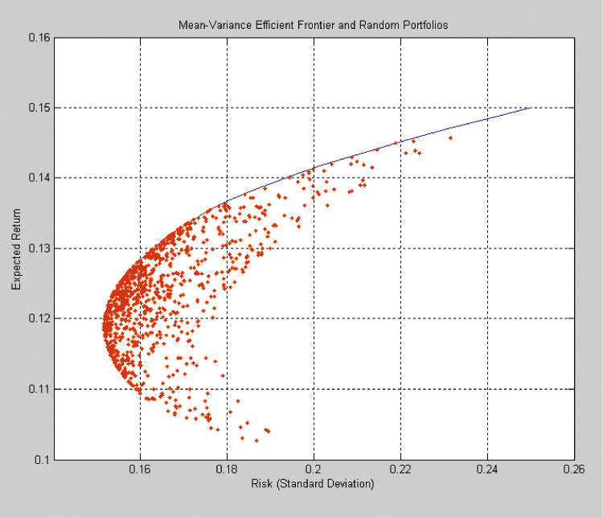
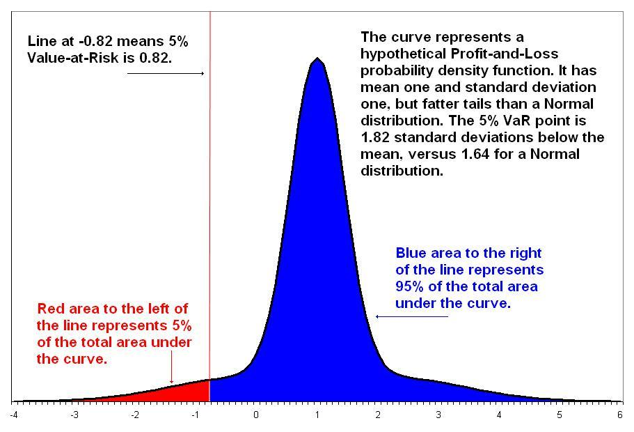
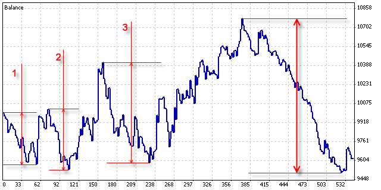

# Measures of Risk-adjusted Return

- **Author:** StuartReid
- **Date:** September 1, 2013
- **Original URL:** http://www.turingfinance.com/computational-investing-with-python-week-one/

---

This article is a supplement to some of the topics presented in Dr. Tucker Balch's online MOOC, *Computational Investing*. Financial markets are complex adaptive systems which are almost always indistinguishable from random processes. That said markets do exhibit quantifiable factors such as the value, mean-reversion, firm-size, and momentum factors, which are believed to drive the returns in the market. Fundamentally this is because they drive supply and demand for securities. Computational finance is about building computational models which can be used to predict, with some error margin, what the markets are likely to do given a number of inputs.

Most machine learning models are optimization models. A simple optimization problem will consist of input variables (model parameters), and output quantities, and constraints on either the inputs, outputs, or both. Essentially the problem becomes, how can we adjust the model parameters in such a way that the output quantity is optimized. For most financial models the quantity being optimized is a measure of risk-adjusted return.

Risk-adjusted returns measure how many units of excess return are expected to be generated from however many units of risk. Excess return is the return of the investment above either a benchmark, risk-free rate of return, or some minimum required rate of return. Risk has many faces and most measures of risk-adjusted return will differ only in their definition and treatment of risk popular measures include beta, volatility, shortfall risk, draw-down risk, and lower partial moments. That said, generally speaking risk in any investment is the probability of loss.

Note that the rest of this article refers specifically to portfolio risks and returns.

## Portfolio Optimization

Portfolio optimization is the problem of allocating capital between the constituent assets of the portfolio. For example, given a simple two-stock $100 portfolio which is invested in Apple and Google, how many dollars should be allocated to Apple and how many should be allocated to Google. In the 1950's Harry Markowitz proposed mean-variance optimization as the solution to this problem. Mean-variance optimization seeks to maximize the expected return for any given level of risk (risk tolerance) or minimize the risk for any given level of expected return. Another approach is to maximize the risk-adjusted expected return of the portfolio.

The inputs into the portfolio optimization problem are the expected returns for each asset, the risk of each asset, and correlations between the assets. Correlation measures the linear relationship between variables and relates to diversification. The set of non-dominated optimal portfolios (portfolios which optimize risk and return) is called the efficient frontier. For more information about the portfolio optimization problem click here and for information about the problems associated with financial modelling (such as the use of historical correlations) click here.



## Expected Return

A portfolio can have multiple sources of return including interest received on fixed income, dividends received on shares or preference shares, and capital gains from the disposal of securities (fixed income and equities). Capital gains are affected by the market returns, changes in interest rates, and possibly foreign exchange rate fluctuations. All of these factors need to be incorporated into one or more financial models which can be used to estimate what the expected return on a portfolio i.e. the weighted sum of the expected returns of the portfolio's constituent assets. For this an investor could use traditional equity and fixed income valuation models (discounted cash flow models), statistical valuation models, or even computational models such as neural networks.

## Definitions of Risk

Different definitions of risk have been proposed over the years including volatility of historical returns, expected shortfalls, lower partial moments, and drawdown risk. Volatility assumes that the riskiness of a security is how much much it moves around i.e. it's volatility. The most common volatility based measure of risk is the standard deviation of historical returns. Expected shortfall argues that the risk of a portfolio is the dollar value which could reasonably be expected to be lost over a specified period of time given a pre-specified confidence interval. The most popular measure of expected shortfall risk is Value at Risk (VaR). Lower partial moments argue that risk is only captured in the downside of the historical volatility of the portfolio. An example of a lower partial moment would be the standard deviation of negative returns. Lastly, drawdown risk is the maximum historical 'drawdown' of the portfolio. A drawdown is the percentage loss between peak and trough.

### Volatility

For a given period of time standard deviation, $\sigma$, measures the historical variance (average of the squared deviations) of the returns from the mean return, $\bar{R}$, over that period of time. The formula for this is:

$$\sigma = \sqrt{\frac{1}{N}\sum_{i=1}^{N}(R_i - \bar{R})^2}$$

where $R_i$ is the return at time $i$ and $\bar{R}$ is the mean return.

**Beta** $\beta$ measures the relationship between the security returns, $R_i$, and the market, $R_m$. High beta stocks are considered to be more risk whereas low beta stocks are considered to be less risky. The formula for this is:

$$\beta = \frac{Cov(R_i, R_m)}{Var(R_m)}$$

where $Cov(R_i, R_m)$ is the covariance of $R_i$ and $R_m$ and $Var(R_m)$ is the variance of the $R_m$.

```python
import numpy
import numpy.random as nrand


def vol(returns):
    # Return the standard deviation of returns
    return numpy.std(returns)


def beta(returns, market):
    # Create a matrix of [returns, market]
    m = numpy.matrix([returns, market])
    # Return the covariance of m divided by the standard deviation of the market returns
    return numpy.cov(m)[0][1] / numpy.std(market)


# Example usage
r = nrand.uniform(-1, 1, 50)
m = nrand.uniform(-1, 1, 50)
print("vol =", vol(r))
print("beta =", beta(r, m))
```

### Expected Shortfall

**Value at Risk (VaR)** is the most popular measure of expected shortfall. Expected shortfall works as follows: given a specific time period, $T$, and confidence interval, $\alpha$, expected shortfall tells us what the maximum probable loss scenario is over that period of time (usually one day a.k.a. 1-day VaR) with a probability of $\alpha$. There are three approaches to calculating VaR, historical simulation VaR, delta-normal VaR, and Monte Carlo VaR.

**Historical simulation VaR** takes historical $T$ period returns, orders them, and takes the loss at the point in the list which corresponds to $\alpha$. For example, if $T = 1$, $\alpha = 0.9$, and we have the following 10 returns: $[1.0\%, -1.5\%, -2.0\%, 0.5\%, -3.0\%, -4.5\%, 2.0\%, -0.5\%, 1.5\%, -1.0\%]$, then the item in the list which corresponds to $\alpha$ is $-4.5\%$. This can be interpreted as us either being 90% sure that $-4.5\%$ is our expected 1-day shortfall for the portfolio or, alternatively, that 90% of the time a 1-day loss experienced by the portfolio won't exceed $-4.5\%$.

**Delta-normal VaR** assumes that the returns generated by the assets in the portfolio follow a pre-specified distribution. Unfortunately a popular assumption is that returns are normally distributed despite the fact that in reality portfolio returns exhibit fatter tails meaning that the probability of outliers (significant gains and losses) is higher. Given these assumptions it is possible to calculate what the returns and standard deviation of the portfolio should be as a whole. From this the worst-case loss is calculated as follows:

$$VaR = \mu - \alpha \cdot \sigma$$

**Monte Carlo VaR** works by simulating the portfolio using stochastic processes. This can be done in two ways. Either a stochastic process is calibrated to the historical returns and then used to generate a large number of future return scenarios or, alternatively, the asset returns are assumed to follow a particular stochastic process such as Geometric Brownian Motion.

There are many problems with Value at Risk. One problem with VaR is that it violates the sub-additive rule of risk which requires that the risk of a portfolio should be less than or equal to the sum of the risks of the individual assets in the portfolio. This is because VaR is not a coherent risk measure.



```python
import numpy
import numpy.random as nrand


"""
Note - for some of the metrics the absolute value is returns. This is because if the risk (loss) is higher we want to
discount the expected excess return from the portfolio by a higher amount. Therefore risk should be positive.
"""


def var(returns, alpha):
    # This method calculates the historical simulation var of the returns
    sorted_returns = numpy.sort(returns)
    # Calculate the index associated with alpha
    index = int(alpha * len(sorted_returns))
    # VaR should be positive
    return abs(sorted_returns[index])


def cvar(returns, alpha):
    # This method calculates the condition VaR of the returns
    sorted_returns = numpy.sort(returns)
    # Calculate the index associated with alpha
    index = int(alpha * len(sorted_returns))
    # Calculate the total VaR beyond alpha
    sum_var = sorted_returns[0]
    for i in range(1, index):
        sum_var += sorted_returns[i]
    # Return the average VaR
    # CVaR should be positive
    return abs(sum_var / index)


# Example usage
r = nrand.uniform(-1, 1, 50)
print("VaR(0.05) =", var(r, 0.05))
print("CVaR(0.05) =", cvar(r, 0.05))
```

### Lower Partial Moments

Whereas measures of risk-adjusted return based on volatility treat all deviations from the mean as risk, measures of risk-adjusted return based on lower partial moments consider only deviations below some predefined minimum return threshold, $\tau$ as risk. For example, negative deviations from the mean is risky whereas positive deviations are not. A lower partial moment of order $n$ can be estimated from a sample of $N$ returns as follows:

$$LPM_n(\tau) = \frac{1}{N}\sum_{i=1}^{N}\max(\tau - R_i, 0)^n$$

where $R_i$ is historical returns.

A useful classification of measures of risk-adjusted returns based on lower partial moments is by their order. The larger the order the greater the weight given to large deviations from the threshold. When $n = 0$ the lower partial moment is equivalent to the probability that the return is below the threshold. When $n = 1$ the lower partial moment is equivalent to the expected shortfall below the threshold. When $n = 2$ the lower partial moment is equivalent to the variance of the returns below the threshold.

In some ways, Value at Risk (VaR) is similar to a lower partial moment, except that VaR is of order 2 only and is a more probabilistic view of loss as opposed to a more statistical view of loss. VaR is also calculated using the inverse of the cumulative distribution function, whereas lower partial moments are calculated using the sum of the differences between the threshold and the returns.

```python
import numpy
import numpy.random as nrand


def lpm(returns, threshold, order):
    # This method returns a lower partial moment of the returns
    # Create an array he same length as returns containing the minimum return threshold
    threshold_array = numpy.empty(len(returns))
    threshold_array.fill(threshold)
    # Calculate the difference between the threshold and the returns
    diff = threshold_array - returns
    # Set the minimum of each to 0
    diff = diff.clip(min=0)
    # Return the sum of the different to the power of order
    return numpy.sum(diff ** order) / len(returns)


def hpm(returns, threshold, order):
    # This method returns a higher partial moment of the returns
    # Create an array he same length as returns containing the minimum return threshold
    threshold_array = numpy.empty(len(returns))
    threshold_array.fill(threshold)
    # Calculate the difference between the returns and the threshold
    diff = returns - threshold_array
    # Set the minimum of each to 0
    diff = diff.clip(min=0)
    # Return the sum of the different to the power of order
    return numpy.sum(diff ** order) / len(returns)


# Example Usage
r = nrand.uniform(-1, 1, 50)
print("hpm(0.0)_1 =", hpm(r, 0.0, 1))
print("lpm(0.0)_1 =", lpm(r, 0.0, 1))
```

### Drawdowns

The final measure of risk is the drawdown. A drawdown is the maximum decrease in the value of the portfolio over a specific period of time. Given the historical prices (values) for a portfolio, $P$, and a period of time, $\tau$, the drawdown of length $\tau$ over that period of time is the maximum distance between a previous two values $P_t$ and $P_{t-\tau}$:

$$DD(\tau) = \max_{t \in [0, T]} \left( \frac{P_{t-\tau} - P_t}{P_{t-\tau}} \right)$$

The maximum drawdown can be thought of as a list of drawdowns calculated from the same historical portfolio values, $P$, but for different time periods. The maximum drawdown of a portfolio is the maximum decrease in portfolio value from a previous high to a new low. This is illustrated below:



```python
import numpy
import numpy.random as nrand


"""
Note - for some of the metrics the absolute value is returns. This is because if the risk (loss) is higher we want to
discount the expected excess return from the portfolio by a higher amount. Therefore risk should be positive.
"""


def dd(returns, tau):
    # Returns the draw-down given time period tau
    values = prices(returns, 100)
    pos = len(values) - 1
    pre = pos - tau
    drawdown = float('+inf')
    # Find the maximum drawdown given tau
    while pre >= 0:
        dd_i = (values[pos] / values[pre]) - 1
        if dd_i < drawdown:
            drawdown = dd_i
        pos, pre = pos - 1, pre - 1
    # Drawdown should be positive
    return abs(drawdown)


def max_dd(returns):
    # Returns the maximum draw-down for any tau in (0, T) where T is the length of the return series
    max_drawdown = float('-inf')
    for i in range(0, len(returns)):
        drawdown_i = dd(returns, i)
        if drawdown_i > max_drawdown:
            max_drawdown = drawdown_i
    # Max draw-down should be positive
    return abs(max_drawdown)


def average_dd(returns, periods):
    # Returns the average maximum drawdown over n periods
    drawdowns = []
    for i in range(0, len(returns)):
        drawdown_i = dd(returns, i)
        drawdowns.append(drawdown_i)
    drawdowns = sorted(drawdowns)
    total_dd = abs(drawdowns[0])
    for i in range(1, periods):
        total_dd += abs(drawdowns[i])
    return total_dd / periods


def average_dd_squared(returns, periods):
    # Returns the average maximum drawdown squared over n periods
    drawdowns = []
    for i in range(0, len(returns)):
        drawdown_i = math.pow(dd(returns, i), 2.0)
        drawdowns.append(drawdown_i)
    drawdowns = sorted(drawdowns)
    total_dd = abs(drawdowns[0])
    for i in range(1, periods):
        total_dd += abs(drawdowns[i])
    return total_dd / periods


# Example Usage
r = nrand.uniform(-1, 1, 50)
print("Drawdown(5) =", dd(r, 5))
print("Max Drawdown =", max_dd(r))
```

## Measures of Risk-adjusted Return

When we "discount" expected return generated from our valuation model, $E[R_p]$ by different quantities of risk we get measures of risk-adjusted return. Some measures of risk adjusted return are discussed below. If you find any mistakes in either the formula's or the code please let me know in the comment section below, thanks!

### Measures of Risk-adjusted Return based on Volatility

The **Treynor ratio** was one of the first measures of risk-adjusted return. It was originally published in 1965 in the Harvard Business Review as a metric for rating the performance of investment funds. Given a risk-free rate of return, $R_f$, the Treynor ratio calculates the excess returns generated by a portfolio, $E[R_p]$, and discounts it by the portfolio's beta, $\beta_p$:

$$T = \frac{E[R_p] - R_f}{\beta_p}$$

The **Sharpe ratio**, originally called the reward-to-variability ratio, was introduced in 1966 by William Sharpe as an extension of the Treynor ratio. The Sharpe ratio discounts the excess return of a portfolio above the risk-free rate by the standard deviation (volatility) of the portfolio's returns, $\sigma_p$:

$$S = \frac{E[R_p] - R_f}{\sigma_p}$$

The **information ratio** is an extension of the Sharpe ratio which replaces the risk-free rate of return with the scalar expected return of a benchmark portfolio, $E[R_b]$:

$$IR = \frac{E[R_p - R_b]}{\sigma(R_p - R_b)}$$

Last, but not least, the **Modigliani ratio** a.k.a the M2 ratio, is a combination the Sharpe and information ratio in that it adjusts the expected excess returns of the portfolio above the risk free rate by the expected excess returns of a benchmark portfolio, $R_b$, or the market, $R_m$, above the risk free rate:

$$M^2 = (E[R_p] - R_f) \cdot \frac{\sigma_m}{\sigma_p} + R_f$$

```python
"""
Note that this Gist uses functions made available in another Gist -
https://gist.github.com/StuartGordonReid/67a1ec4fbc8a84c0e856
"""


def treynor_ratio(er, returns, market, rf):
    return (er - rf) / beta(returns, market)


def sharpe_ratio(er, returns, rf):
    return (er - rf) / vol(returns)


def information_ratio(returns, benchmark):
    diff = returns - benchmark
    return numpy.mean(diff) / vol(diff)


def modigliani_ratio(er, returns, benchmark, rf):
    np_rf = numpy.empty(len(returns))
    np_rf.fill(rf)
    rdiff = returns - np_rf
    bdiff = benchmark - np_rf
    return (er - rf) * (vol(rdiff) / vol(bdiff)) + rf
```

### Measure of Risk-adjusted Return based on Value at Risk

The excess return on Value at Risk discounts the excess return of the portfolio above the risk-free rate by the Value at Risk of the portfolio, $VaR$:

$$\text{Excess VaR} = \frac{E[R_p] - R_f}{VaR}$$

And the "conditional Sharpe ratio" discounts the excess return of the portfolio above the risk-free rate by the Conditional Value at Risk of the portfolio, $CVaR$:

$$\text{Conditional Sharpe Ratio} = \frac{E[R_p] - R_f}{CVaR}$$

### Measures of Risk-adjusted Return based on Partial Moments

The **Omega ratio** discounts the excess returns of a portfolio above the target threshold, usually the risk-free rate, by the first-order lower partial moment of the portfolio's returns:

$$\Omega = \frac{E[R_p] - R_f}{LPM_1(\tau)}$$

The **Sortino ratio** was proposed as a modification to the Sharpe ratio by Sortino and van der Meer in 1991. The Sortino ratio discounts the excess return of a portfolio above a target threshold by the volatility of downside returns, $\sigma_d$, instead of the volatility of all returns, $\sigma$. The volatility of downside returns is equivalent to the square-root second-order lower partial moment of returns:

$$Sortino = \frac{E[R_p] - \tau}{\sqrt{LPM_2(\tau)}}$$

The **Kappa ratio** is a generalization of Omega and Sortino ratios first proposed in 2004 by Kaplan and Knowles. It was shown that when the parameter $n$ of the Kappa ratio is set to one or two you get the Omega or Sortino ratio. The Kappa ratio is most often used with $n = 3$ which is why it is often referred to as the Kappa 3 ratio:

$$Kappa_n = \frac{E[R_p] - \tau}{LPM_n(\tau)^{1/n}}$$

The **gain-loss ratio** was first presented by Bernardo Ledoit in 2000. It discounts the first-order higher partial moment of a portfolio's returns, upside potential, by the first-order lower partial moment of the portfolio's returns:

$$\text{Gain-Loss} = \frac{HPM_1(\tau)}{LPM_1(\tau)}$$

The **upside-potential ratio** was first presented by Sortino van der Meer and Plantinga in 1999. It discounts the first-order higher partial moment of a portfolio's returns, upside potential, by the square-root second-order lower partial moment of the portfolio's returns:

$$\text{Upside Potential} = \frac{HPM_1(\tau)}{\sqrt{LPM_2(\tau)}}$$

```python
"""
Note that this Gist uses functions made available in another Gist -
https://gist.github.com/StuartGordonReid/67a1ec4fbc8a84c0e856
"""


def omega_ratio(er, returns, rf, target=0):
    return (er - rf) / lpm(returns, target, 1)


def sortino_ratio(er, returns, rf, target=0):
    return (er - rf) / math.sqrt(lpm(returns, target, 2))


def kappa_three_ratio(er, returns, rf, target=0):
    return (er - rf) / math.pow(lpm(returns, target, 3), float(1/3))


def gain_loss_ratio(returns, target=0):
    return hpm(returns, target, 1) / lpm(returns, target, 1)


def upside_potential_ratio(returns, target=0):
    return hpm(returns, target, 1) / math.sqrt(lpm(returns, target, 2))
```

### Measures of Risk-adjusted Return based on Drawdown Risk

The **Calmar ratio** discounts the expected excess return of a portfolio by the worst expected maximum draw down for that portfolio:

$$\text{Calmar} = \frac{E[R_p] - R_f}{\max DD}$$

The **Sterling ratio** discounts the expected excess return of a portfolio by the average of the worst expected maximum drawdowns for that portfolio:

$$\text{Sterling} = \frac{E[R_p] - R_f}{\overline{DD}}$$

The **Burke ratio** is similar to the Sterling ratio except that it is less sensitive to outliers. It discounts the expected excess return of a portfolio by the square root of the average of the worst expected maximum drawdowns squared for that portfolio:

$$\text{Burke} = \frac{E[R_p] - R_f}{\sqrt{\overline{DD^2}}}$$

```python
"""
Note that this Gist uses functions made available in another Gist -
https://gist.github.com/StuartGordonReid/67a1ec4fbc8a84c0e856
"""


def calmar_ratio(er, returns, rf):
    return (er - rf) / max_dd(returns)


def sterling_ration(er, returns, rf, periods):
    return (er - rf) / average_dd(returns, periods)


def burke_ratio(er, returns, rf, periods):
    return (er - rf) / math.sqrt(average_dd_squared(returns, periods))
```

## Python Code for Everything

The Gist below contains all the code presented in this article plus two example usage methods.

```python
import math
import numpy
import numpy.random as nrand


"""
Note - for some of the metrics the absolute value is returns. This is because if the risk (loss) is higher we want to
discount the expected excess return from the portfolio by a higher amount. Therefore risk should be positive.
"""


def vol(returns):
    # Return the standard deviation of returns
    return numpy.std(returns)


def beta(returns, market):
    # Create a matrix of [returns, market]
    m = numpy.matrix([returns, market])
    # Return the covariance of m divided by the standard deviation of the market returns
    return numpy.cov(m)[0][1] / numpy.std(market)


def lpm(returns, threshold, order):
    # This method returns a lower partial moment of the returns
    # Create an array he same length as returns containing the minimum return threshold
    threshold_array = numpy.empty(len(returns))
    threshold_array.fill(threshold)
    # Calculate the difference between the threshold and the returns
    diff = threshold_array - returns
    # Set the minimum of each to 0
    diff = diff.clip(min=0)
    # Return the sum of the different to the power of order
    return numpy.sum(diff ** order) / len(returns)


def hpm(returns, threshold, order):
    # This method returns a higher partial moment of the returns
    # Create an array he same length as returns containing the minimum return threshold
    threshold_array = numpy.empty(len(returns))
    threshold_array.fill(threshold)
    # Calculate the difference between the returns and the threshold
    diff = returns - threshold_array
    # Set the minimum of each to 0
    diff = diff.clip(min=0)
    # Return the sum of the different to the power of order
    return numpy.sum(diff ** order) / len(returns)


def var(returns, alpha):
    # This method calculates the historical simulation var of the returns
    sorted_returns = numpy.sort(returns)
    # Calculate the index associated with alpha
    index = int(alpha * len(sorted_returns))
    # VaR should be positive
    return abs(sorted_returns[index])


def cvar(returns, alpha):
    # This method calculates the condition VaR of the returns
    sorted_returns = numpy.sort(returns)
    # Calculate the index associated with alpha
    index = int(alpha * len(sorted_returns))
    # Calculate the total VaR beyond alpha
    sum_var = sorted_returns[0]
    for i in range(1, index):
        sum_var += sorted_returns[i]
    # Return the average VaR
    # CVaR should be positive
    return abs(sum_var / index)


def prices(returns, base):
    # Converts returns into prices
    s = [base]
    for i in range(len(returns)):
        s.append(base * (1 + returns[i]))
    return numpy.array(s)


def dd(returns, tau):
    # Returns the draw-down given time period tau
    values = prices(returns, 100)
    pos = len(values) - 1
    pre = pos - tau
    drawdown = float('+inf')
    # Find the maximum drawdown given tau
    while pre >= 0:
        dd_i = (values[pos] / values[pre]) - 1
        if dd_i < drawdown:
            drawdown = dd_i
        pos, pre = pos - 1, pre - 1
    # Drawdown should be positive
    return abs(drawdown)


def max_dd(returns):
    # Returns the maximum draw-down for any tau in (0, T) where T is the length of the return series
    max_drawdown = float('-inf')
    for i in range(0, len(returns)):
        drawdown_i = dd(returns, i)
        if drawdown_i > max_drawdown:
            max_drawdown = drawdown_i
    # Max draw-down should be positive
    return abs(max_drawdown)


def average_dd(returns, periods):
    # Returns the average maximum drawdown over n periods
    drawdowns = []
    for i in range(0, len(returns)):
        drawdown_i = dd(returns, i)
        drawdowns.append(drawdown_i)
    drawdowns = sorted(drawdowns)
    total_dd = abs(drawdowns[0])
    for i in range(1, periods):
        total_dd += abs(drawdowns[i])
    return total_dd / periods


def average_dd_squared(returns, periods):
    # Returns the average maximum drawdown squared over n periods
    drawdowns = []
    for i in range(0, len(returns)):
        drawdown_i = math.pow(dd(returns, i), 2.0)
        drawdowns.append(drawdown_i)
    drawdowns = sorted(drawdowns)
    total_dd = abs(drawdowns[0])
    for i in range(1, periods):
        total_dd += abs(drawdowns[i])
    return total_dd / periods


def treynor_ratio(er, returns, market, rf):
    return (er - rf) / beta(returns, market)


def sharpe_ratio(er, returns, rf):
    return (er - rf) / vol(returns)


def information_ratio(returns, benchmark):
    diff = returns - benchmark
    return numpy.mean(diff) / vol(diff)


def modigliani_ratio(er, returns, benchmark, rf):
    np_rf = numpy.empty(len(returns))
    np_rf.fill(rf)
    rdiff = returns - np_rf
    bdiff = benchmark - np_rf
    return (er - rf) * (vol(rdiff) / vol(bdiff)) + rf


def excess_var(er, returns, rf, alpha):
    return (er - rf) / var(returns, alpha)


def conditional_sharpe_ratio(er, returns, rf, alpha):
    return (er - rf) / cvar(returns, alpha)


def omega_ratio(er, returns, rf, target=0):
    return (er - rf) / lpm(returns, target, 1)


def sortino_ratio(er, returns, rf, target=0):
    return (er - rf) / math.sqrt(lpm(returns, target, 2))


def kappa_three_ratio(er, returns, rf, target=0):
    return (er - rf) / math.pow(lpm(returns, target, 3), float(1/3))


def gain_loss_ratio(returns, target=0):
    return hpm(returns, target, 1) / lpm(returns, target, 1)


def upside_potential_ratio(returns, target=0):
    return hpm(returns, target, 1) / math.sqrt(lpm(returns, target, 2))


def calmar_ratio(er, returns, rf):
    return (er - rf) / max_dd(returns)


def sterling_ration(er, returns, rf, periods):
    return (er - rf) / average_dd(returns, periods)


def burke_ratio(er, returns, rf, periods):
    return (er - rf) / math.sqrt(average_dd_squared(returns, periods))


def test_risk_metrics():
    # This is just a testing method
    r = nrand.uniform(-1, 1, 50)
    m = nrand.uniform(-1, 1, 50)
    print("vol =", vol(r))
    print("beta =", beta(r, m))
    print("hpm(0.0)_1 =", hpm(r, 0.0, 1))
    print("lpm(0.0)_1 =", lpm(r, 0.0, 1))
    print("VaR(0.05) =", var(r, 0.05))
    print("CVaR(0.05) =", cvar(r, 0.05))
    print("Drawdown(5) =", dd(r, 5))
    print("Max Drawdown =", max_dd(r))


def test_risk_adjusted_metrics():
    # Returns from the portfolio (r) and market (m)
    r = nrand.uniform(-1, 1, 50)
    m = nrand.uniform(-1, 1, 50)
    # Expected return
    e = numpy.mean(r)
    # Risk free rate
    f = 0.06
    # Risk-adjusted return based on Volatility
    print("Treynor Ratio =", treynor_ratio(e, r, m, f))
    print("Sharpe Ratio =", sharpe_ratio(e, r, f))
    print("Information Ratio =", information_ratio(r, m))
    # Risk-adjusted return based on Value at Risk
    print("Excess VaR =", excess_var(e, r, f, 0.05))
    print("Conditional Sharpe Ratio =", conditional_sharpe_ratio(e, r, f, 0.05))
    # Risk-adjusted return based on Lower Partial Moments
    print("Omega Ratio =", omega_ratio(e, r, f))
    print("Sortino Ratio =", sortino_ratio(e, r, f))
    print("Kappa 3 Ratio =", kappa_three_ratio(e, r, f))
    print("Gain Loss Ratio =", gain_loss_ratio(r))
    print("Upside Potential Ratio =", upside_potential_ratio(r))
    # Risk-adjusted return based on Drawdown risk
    print("Calmar Ratio =", calmar_ratio(e, r, f))
    print("Sterling Ratio =", sterling_ration(e, r, f, 5))
    print("Burke Ratio =", burke_ratio(e, r, f, 5))


if __name__ == "__main__":
    test_risk_metrics()
    test_risk_adjusted_metrics()
```

---

## Source

This content was originally published at:
- **Archived URL**: https://web.archive.org/web/20260209060500/http://www.turingfinance.com/computational-investing-with-python-week-one/
- **Original URL**: http://www.turingfinance.com/computational-investing-with-python-week-one/

## BibTeX

@misc{turingfinance2013,
  author = {Stuart Reid},
  title = {Measures of Risk-adjusted Return},
  year = {2013},
  month = {September},
  howpublished = {\url{http://www.turingfinance.com/computational-investing-with-python-week-one/}},
  note = {Accessed: 2026-02-09},
  url = {http://www.turingfinance.com/computational-investing-with-python-week-one/}
}
